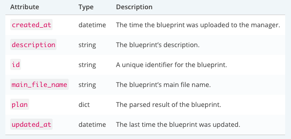
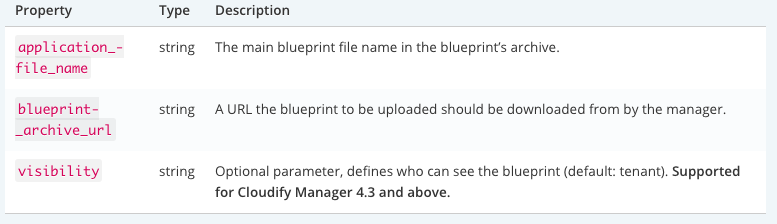
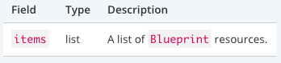
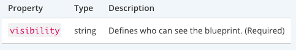
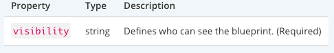

REST API Reference
====================

Welcome to F5 VNFM REST API documentation. The base URI for the v3.1 REST API is: /api/v3.1.

**NOTE**: This section describes various API features that apply to all resources

Starting from F5 VNFM 1.0, all communication to the server requires:

-  Authentication using user credentials.
-  Tenant name, representing the scope of the request.

Every F5 VNF Manager has a default tenant, called ``default_tenant``. The ``default_tenant`` tenant is created during bootstrap.

In addition to the ``default_tenant``, every F5 VNF Manager includes a bootstrap Admin. The bootstrap Admin is the Admin user that created during the bootstrap.

In addition to the user credentials, every request must also specify a tenant in the header.

In the case of using the F5 VNFM community edition or if you have not created any new tenant, you can use the ``default_tenant`` as the tenant for the request.

**Parameters**

-  ``<manager-ip>``: Replace with the IP of your F5 VNF Manager
-  ``<manager-username>``: Replace with a username for the F5 VNF Manager instance username
-  ``<manager-password>``: Replace with the password for the user specified in
-  ``<manager-tenant>``: Replace with the tenant on which to perform the request
-  ``<manager-token>``: Replace with a token obtained using the tokens endpoint (see the authentication_ section)

.. code-block:: console

   Basic usage
   $ curl -X GET \
    --header "Tenant: <manager-tenant>" \
    -u <manager-username>:<manager-pasword> \
    "http://<manager-ip>/api/v3.1/<endpoint>"


Response Fields Filtering (Projection)
--------------------------------------

You can choose to have only specific fields in the response by using the ``_include`` query parameter.

The parameter value is a comma separated list of fields to include in the response, e.g. ``_include=field1,field2,field3``

**NOTE**: that specified field names must be part of the resource schema, otherwise an error is raised.

.. code-block:: console

   Request Example (receive only the id and created_at fields)
   $ curl -X GET \
    --header "Tenant: <manager-tenant>" \
    -u <manager-username>:<manager-password> \
    "http://<manager-api>/api/v3.1/blueprints?_include=id,created_at"

   Response Example
   {
     "items": [
    {
      "created_at": "2017-04-17T12:12:36.626Z",
      "id": "hello-world"
    }
   ],
   "metadata": {
    "pagination": {
      "total": 1,
      "offset": 0,
      "size": 1
         }
      }
   }

Query Filtering (Selection)
---------------------------

You can make your query more specific by using filters. Filters are query parameters where the key is a field name and the value is a field value, e.g. ``id=my-specific-id``
Filters also accept multiple values (OR) by using multiple parameters of the same key, e.g. ``id=my-specific-id&id=another-id``.

**IMPORTANT**:  _include, _sort, _size, _offset and _range are reserved keywords and cannot be used as filters.

.. code-block:: console

   Request Example (requesting only blueprints which id is _myblueprint1 or _myblueprint2)
   $ curl -X GET \
    --header "Tenant: <manager-tenant>" \
    -u <manager-username>:<manager-pasword> \
    "http://<manager-ip>/api/v3.1/blueprints?_include=id,created_at&id=my-blueprint-1&id=my-blueprint-2"

   Response Example
   {
      "items": [
      {
      "created_at": "2017-04-17T12:34:52.911Z",
      "id": "my-blueprint-1"
      },
      {
      "created_at": "2017-04-17T12:34:57.256Z",
      "id": "my-blueprint-2"
      }
      ],
      "metadata": {
      "pagination": {
      "total": 2,
      "offset": 0,
      "size": 2
      }
     }
   }


Sorting
-------

Sort resources by using the ``_sort`` query parameter, e.g. ``_sort=id``.

The default sort order is ascending; to make it descending, prefix the field with a minus sign, e.g. ``_sort=-id`` (example #1).

Sorting also works on multiple fields by using multiple ``_sort`` parameters, where the sort sequence corresponds to the order of ``_sort`` parameters in the request (example #2).

.. code-block:: console

   Request Example #1 (sort deployments by id descending)
   $ curl -X GET \
       --header "Tenant: <manager-tenant>" \
       -u <manager-username>:<manager-password> \
       "http://<manager_ip>/api/v3.1/deployments?_include=id,blueprint_id&_sort=-id"
   Response Example #1
   {
      "items": [
       {
         "id": "hello1",
         "blueprint_id": "hello-world"
       },
       {
         "id": "dep4",
         "blueprint_id": "my-blueprint-2"
       },
       {
         "id": "dep3",
         "blueprint_id": "my-blueprint-1"
       },
       {
         "id": "dep2",
         "blueprint_id": "my-blueprint-2"
       },
       {
         "id": "dep1",
         "blueprint_id": "my-blueprint-1"
       }
     ],
     "metadata": {
       "pagination": {
       "total": 5,
       "offset": 0,
       "size": 5
       }
     }
   }

   Request Example #2 (sort deployments by blueprint_id ascending and id descending)
   $ curl -X GET \
    --header "Tenant: <manager-tenant>" \
    -u <manager-username>:<manager-password> \
    "http://<manager_ip>/api/v3.1/deployments?_include=id,blueprint_id&_sort=blueprint_id&_sort=-id"

   Response Example #2
   {
        "items": [
          {
             "id": "hello1",
             "blueprint_id": "hello-world"
          },
          {
             "id": "dep3",
             "blueprint_id": "my-blueprint-1"
          },
          {
             "id": "dep1",
             "blueprint_id": "my-blueprint-1"
          },
          {
             "id": "dep4",
             "blueprint_id": "my-blueprint-2"
          },
          {
             "id": "dep2",
             "blueprint_id": "my-blueprint-2"
          }
   ],
   "metadata": {
     "pagination": {
      "total": 5,
      "offset": 0,
      "size": 5
          }
      }
   }

Pagination
----------
If the response includes too many items for the client to handle at once, use pagination to get only a subset of the results, defined by two parameters:

-  ``_size`` the max size of the result subset to receive.
-  ``_offset`` (default: 0) the number of resources to skip, i.e. ``_offset=1`` means you skip the first resource.

* both parameters are optional.

* in any case, with or without pagination, max size of the result will be less than max_results parameters, which is 1000 by default. max_results parameters is part of the manager_rest config.

The response metadata returns the requested parameters, and a ``total`` field which indicates the size of the full set.

.. code-block:: console

   Request Example (skip 1 resource, get size of 4)
   $ curl -X GET \
    --header "Tenant: <manager-tenant>" \
    -u <manager-username>:<manager-password> \
    "http://<manager-ip>/api/v3.1/events?_size=4&_offset=1&_include=timestamp"

   Response Example
   {
     "items": [
       {
         "timestamp": "2017-04-17T13:53:22.570Z"
       },
       {
         "timestamp": "2017-04-17T13:53:10.558Z"
       },
       {
         "timestamp": "2017-04-17T13:53:09.799Z"
       },
       {
         "timestamp": "2017-04-17T13:52:54.549Z"
       }
   ],
     "metadata": {
       "pagination": {
         "total": 20,
         "offset": 1,
         "size": 4
       }
     }
   }


.. _authentication:

Authentication
--------------
Authentication headers should be added to every request sent to a secured manager.
Any header can be used, as long as it’s support by one of the manager’s authentication providers. The default manager configuration supports basic HTTP authentication (examples #1, #2) and tokens (example #3).
Valid credentials do not affect the returned response, but invalid credentials return a “User Unauthorized” error.

.. code-block:: console

   Request Example #1 (Get the server’s status, authenticate with username and password)
   $ curl -X GET \
    --header "Tenant: <manager-tenant>" \
    -u <manager-username>:<manager-pasword> \
    "http://<manager-ip>/api/v3.1/status?_include=status"

   Response Example #1
   {
   "status": "running"
   }

   Request Example #2 (Get a token, authenticate with username and password)
   $ curl -X GET \
    --header "Tenant: <manager-tenant>" \
    -u <manager-username>:<manager-pasword> \
    "<manager-ip>/api/v3.1/tokens"

   Response Example #2
   {
   "role": "admin",
   "value": "WyIwIiwiMzE0OTNmNWFjOTE1MzdhM2IyZWM4NTFhYWY4NzU0NWEiXQ.C9Z82w.dlVgLkkyeWZgZP06xMxe8Omht90"
   }

   Request Example #3 (Get all the blueprints, authenticate with a token)
   $ curl -X GET \
    --header "Tenant: <manager-tenant>" \
    --header "Authentication-Token: <manager-token>" \
    "http://<manager-ip>/api/v3.1/blueprints?_include=id"

   Response Example #3
   {
      "items": [
       {
         "id": "my-blueprint-1"
       },
       {
         "id": "my-blueprint-2"
       },
       {
         "id": "hello-world"
       }
     ],
     "metadata": {
       "pagination": {
         "total": 3,
         "offset": 0,
         "size": 3
       }
     }
   }

Blueprints
----------

The Blueprint Resource

**Attributes**




Get Blueprint
`````````````

``GET "{manager-ip}/api/v3.1/blueprints?id={blueprint-id}"``

**URI Parameters**

-  ``blueprint-id``: The id of the blueprint to retrieve.

**Response**

A ``Blueprint`` resource.

.. code-block:: console

   Request Example

   $ curl -X GET \
    --header "Tenant: <manager-tenant>" \
    -u <manager-username>:<manager-password> \
    "http://<manager-ip>/api/v3.1/blueprints?id=<blueprint-id>&_include=id"

   Response Example
   {
   "items": [
    {
      "id": "hello-world"
    }
   ],
   "metadata": {
    "pagination": {
      "total": 1,
      "offset": 0,
      "size": 1
     }
    }
   }

Upload Blueprint
`````````````````

``PUT "{manager-ip}/api/v3.1/blueprints/{blueprint-id}?application_file_name={blueprint-id}.yaml&blueprint_archive_url=https://url/to/archive/master.zip&visibility=<visibility>"``

Uploads a blueprint to F5 VNF’s manager. The call expects an “application/octet-stream” content type where the content is a zip/tar.gz/bz2 archive. It is possible to upload a blueprint from a URL by specifying the URL in the ``blueprint_archive_url`` request body property.

**URI Parameters**

blueprint-id: The id of the uploaded blueprint.

**Request Body**



Valid visibility values are:

-  ``private``: The resource is visible to the user that created the resource, the tenant’s managers and the system’s admins.
-  ``tenant``: The resource is visible to all users in the current tenant. (Default value)
-  ``global``: The resource is visible to all users in all tenants across the manager.

**Response**
A Blueprint resource.

.. code-block:: console

   Request Example
   $ curl -X PUT \
    --header "Tenant: <manager-tenant>" \
    -u <manager-username>:<manager-password> \
    "http://<manager-ip>/api/v3.1/blueprints/<blueprint-id>?application_file_name=<blueprint-id>.yaml&blueprint_archive_url=https://url/to/archive/master.zip&visibility=<visibility>"

   Response Example
   {
      "main_file_name": "singlehost-blueprint.yaml",
      "description": "This blueprint installs a simple web server on the manager VM using F5 VNF's script plugin.\n",
      "tenant_name": "default_tenant",
      "created_at": "2017-04-19T10:56:06.267Z",
      "updated_at": "2017-04-19T10:56:06.267Z",
      "created_by": "admin",
      "private_resource": false,
      "visibility": "tenant",
      "plan": {
       ...
     },
     "id": "hello-world"
   }

List Blueprints
```````````````

``GET "{manager-ip}/api/v3.1/blueprints"``

Lists all blueprints.

**Response**



.. code-block:: console

   Request Example
   $ curl -X GET \
       --header "Tenant: <manager-tenant>" \
       -u <manager-username>:<manager-password> \
       "<manager-ip>/api/v3.1/blueprints?_include=id"

   Response Example
   {
     "items": [
       {
         "id": "hello-world"
       },
       {
         "id": "hello-world-2"
       },
       {
         "id": "hello-world-3"
       }
     ],
     "metadata": {
       "pagination": {
         "total": 3,
         "offset": 0,
         "size": 3
       }
     }
   }

Delete Blueprint
````````````````

``DELETE "{manager-ip}/api/v3.1/blueprints/{blueprint-id}"``

Deletes a specific blueprint.

**URI Parameters**

blueprint-id: The id of the blueprint to delete.

**Response**

A Blueprint resource.

.. code-block:: console

   Request Example
   $ curl -X DELETE \
    --header "Tenant: <manager-tenant>" \
    -u <manager-username>:<manager-password> \
    "<manager-ip>/blueprints/<blueprint-id>"

   Response Example
   {
     "tenant_name": "default_tenant",
     "created_at": "2017-04-19T13:35:13.971Z",
     "updated_at": "2017-04-19T13:35:13.971Z",
     "created_by": "admin",
     "private_resource": false,
     "visibility": "tenant",
     "plan": {
       ...
     },
     "id": "hello-world"
   }

Download Blueprint
``````````````````

Downloads a specific blueprint as an archive.
``GET "{manager-ip}/api/v3.1/blueprints/{blueprint-id}/archive"``

.. _uri-parameters-3:

**URI Parameters**

``blueprint-id``: The id of the blueprint to download.

**Response**

The blueprint as an archive using an ``application/octet-stream`` content type.


.. code-block:: console

   Request Example
       $ curl -X GET \
          --header "Tenant: <manager-tenant>" \
          -u <manager-username>:<manager-password> \
          "http://<manager-ip>/api/v3.1/blueprints/<blueprint-id>/archive" > <blueprint-archive-filename>.tar.gz

.. code-block:: console

   # Using F5 VNFClient
      client.blueprints.download(blueprint_id='<blueprint-id>')

      # Using requests
      url = 'http://<manager-ip>/api/v3.1/blueprints/<blueprint-id>/archive'
      headers = {'Tenant': '<manager-tenant>'}
      response = requests.get(
          url,
          auth=HTTPBasicAuth('<manager-username>', '<manager-password>'),
          headers=headers,
      )
      with open('<blueprint-archive-filename>.tar.gz', 'wb') as blueprint_archive:
          blueprint_archive.write(response.content)

.. code-block:: console

   $ curl -X GET \
       --header "Tenant: <manager-tenant>" \
       -u <manager-username>:<manager-password> \
       "http://<manager-ip>/api/v3.1/blueprints/<blueprint-id>/archive" > <blueprint-archive-filename>.tar.gz
      Response Example

      {
        "main_file_name": "singlehost-blueprint.yaml",
        "description": "This blueprint installs a simple web server on the manager VM using F5 VNF's script plugin.\n",
        "tenant_name": "default_tenant",
        "created_at": "2017-04-19T10:56:06.267Z",
        "updated_at": "2017-04-19T10:56:06.267Z",
        "created_by": "admin",
        "private_resource": false,
        "visibility": "global",
        "plan": {
          ...
        },
        "id": "hello-world"
      }

Set Global Blueprint
````````````````````

``PATCH "{manager-ip}/api/v3.1/blueprints/{blueprint-id}/set-global"``

Set the blueprint’s visibility to global. Will be deprecated soon. For
F5 VNF Manager 1.0 and above, use ‘set-visibility’.

.. _uri-parameters-4:

**URI Parameters**

-  ``blueprint-id``: The id of the blueprint to update.

**Response**

A Blueprint resource.

.. code-block:: console

   Request Example
      $ curl -X PATCH -H "Content-Type: application/json" -H "tenant: <tenant-name>"
          -u user:password "http://<manager-ip>/api/v3.1/blueprints/<blueprint-id>/set-global"

      Response Example

      {
        "main_file_name": "singlehost-blueprint.yaml",
        "description": "This blueprint installs a simple web server on the manager VM using F5 VNF's script plugin.\n",
        "tenant_name": "default_tenant",
        "created_at": "2017-04-19T10:56:06.267Z",
        "updated_at": "2017-04-19T10:56:06.267Z",
        "created_by": "admin",
        "private_resource": false,
        "visibility": "global",
        "plan": {
          ...
        },
        "id": "hello-world"
      }

Set Blueprint Visibility
````````````````````````

``PATCH "<manager-ip>/api/v3.1/blueprints/{blueprint-id}/set-visibility"``

Update the visibility of the blueprint. Supported for F5 VNF Manager 1.0 and above.

**URI Parameters**

-  ``blueprint-id``: The id of the blueprint to update.

**Request Body**



Valid values are ``tenant`` or ``global``.

**Response**

A Blueprint resource.

.. code-block:: console

   Request Example
      $ curl -X PATCH \
          -H "Content-Type: application/json" \
          -H "Tenant: <manager-tenant>" \
          -u <manager-username>:<manager-password> \
          -d '{"visibility": "<visibility>"}' \
          "http://<manager-ip>/api/v3.1/blueprints/<blueprint-id>/set-visibility"

      Response Example
      {
        "main_file_name": "singlehost-blueprint.yaml",
        "description": "This blueprint installs a simple web server on the manager VM using F5 VNF's script plugin.\n",
        "tenant_name": "default_tenant",
        "created_at": "2017-04-19T10:56:06.267Z",
        "updated_at": "2017-04-19T10:56:06.267Z",
        "created_by": "admin",
        "private_resource": false,
        "visibility": "global",
        "plan": {
          ...
        },
        "id": "hello-world"
        }

Set Blueprint Visibility
````````````````````````

``PATCH "<manager-ip>/api/v3.1/blueprints/{blueprint-id}/set-visibility"``

Update the visibility of the blueprint. Supported for F5 VNF Manager 1.0 and above.

**URI Parameters**

-  ``blueprint-id``: The id of the blueprint to update.

**Request Body**



Valid values are tenant or global.

**Response**

A Blueprint resource.

.. code-block:: console

   Request Example
   $ curl -X PATCH \
          -H "Content-Type: application/json" \
          -H "Tenant: <manager-tenant>" \
          -u <manager-username>:<manager-password> \
          -d '{"visibility": "<visibility>"}' \
          "http://<manager-ip>/api/v3.1/blueprints/<blueprint-id>/set-visibility"

   Response Example

      {
        "main_file_name": "singlehost-blueprint.yaml",
        "description": "This blueprint installs a simple web server on the manager VM using F5 VNFM's script plugin.\n",
        "tenant_name": "default_tenant",
        "created_at": "2017-04-19T10:56:06.267Z",
        "updated_at": "2017-04-19T10:56:06.267Z",
        "created_by": "admin",
        "private_resource": false,
        "visibility": "global",
        "plan": {
          ...
        },
        "id": "hello-world"
      }

Cluster
-------------------------

This section describes the API features that are included with the F5 VNFM.

The ClusterState Resource
`````````````````````````
The ClusterState resource represents the current state of a F5 VNF Manager cluster.

**Attributes**

+-----------------------+-----------------------+-----------------------+
| Attribute             | Type                  | Description           |
+=======================+=======================+=======================+
| ``consul``            | dict                  | Detailed state of the |
|                       |                       | consul cluster being  |
|                       |                       | part of the manager   |
|                       |                       | infrastructure.       |
+-----------------------+-----------------------+-----------------------+
| ``error``             | string                | Description of a      |
|                       |                       | fatal error that      |
|                       |                       | occured during        |
|                       |                       | cluster configuration |
|                       |                       | or operation, if any. |
+-----------------------+-----------------------+-----------------------+
| ``initialized``       | boolean               | Whether this node is  |
|                       |                       | part of a cluster.    |
+-----------------------+-----------------------+-----------------------+
| ``logs``              | list                  | Logs of the cluster   |
|                       |                       | operations on the     |
|                       |                       | current node.         |
+-----------------------+-----------------------+-----------------------+

Get Cluster State
`````````````````

``GET "{manager-ip}/api/v3.1/cluster"``

Retrieves the current cluster state. The logs and error fields are hidden by default, but can be added to the response if specified using the _include query parameter.

**Response**

A ClusterState resource.

**URI Parameters**
since: When including logs, fetch only logs that are more recent than this cursor value.

.. code-block:: console

   Request Example
   $ curl -u user:password "http://<manager-ip>/api/v3.1/cluster"
   Response Example (cluster not initialized)

   {
       "initialized": false
   }
   Response Example
   {
       "initialized": true,
       "consul": {
        "leader": "172.20.0.3:8300"
       },
       "error": null,
       "logs": [
           {
            "message": "HA Cluster configuration complete",
            "timestamp": 1485778546965628,
            "cursor": "opaque cursor value"
           }
       ]
   }

Put Cluster State
`````````````````

``PUT "{manager-ip}/api/v3.1/cluster"``

Starts the cluster mechanisms on the current F5 VNF Manager. If the ``join_addrs`` parameter is provided, joins an existing cluster, otherwise bootstraps a new cluster. When joining a cluster, the “credentials” parameter is required. To generate credentials for use by a new node, use the “Add cluster node” endpoint first. Only admin users can execute this operation.

**Request Body**

+-----------------------+-----------------------+-----------------------+
| Property              | Type                  | Description           |
+=======================+=======================+=======================+
| host_ip               | string                | The externally        |
|                       |                       | accessible IP of this |
|                       |                       | node.                 |
+-----------------------+-----------------------+-----------------------+
| node_name             | string                | A unique name for     |
|                       |                       | this node to be used  |
|                       |                       | internally within the |
|                       |                       | cluster.              |
+-----------------------+-----------------------+-----------------------+
| credentials           | string                | When joining a node,  |
|                       |                       | provide the           |
|                       |                       | credentials received  |
|                       |                       | from the cluster      |
|                       |                       | active node.          |
+-----------------------+-----------------------+-----------------------+
| join_addrs            | list                  | IPs of the nodes to   |
|                       |                       | connect with. If not  |
|                       |                       | provided, a new       |
|                       |                       | cluster will be       |
|                       |                       | created.              |
+-----------------------+-----------------------+-----------------------+

**Response**

A ClusterState resource.

.. code-block:: console

   Request Example
   $ curl -X PUT -H "Content-Type: application/json" -u user:password -d '{"host_ip": "172.20.0.2", "node_name": "manager", "credentials": "<REDACTED>"}' "http://<manager-ip>/api/v3.1/cluster"

   Response Example
   {
    "initialized": false
   }

Patch Cluster State
```````````````````

``PATCH "{manager-ip}/api/v3.1/cluster"``
Updates the cluster configuration. The request body is a mapping containing arbitrary settings, which can be used by either the core cluster mechanisms, or user-specific extensions, if any. Only admin users can execute this operation.

**Response**

A ``ClusterState`` resource.

.. code-block:: console

   Request Example
   $ curl -X PATCH -H "Content-Type: application/json" -d '{"config_key": "config_value"}' -u user:password "http://<manager-ip>/api/v3.1/cluster"

   Response Example
   {
    "initialized": true,
    "error": null
   }

The ClusterNode resource
````````````````````````

The ClusterNode resource represents the state of a node in the cluster

**Attributes**

+-----------------------+-----------------------+-----------------------+
| Attribute             | Type                  | Description           |
+=======================+=======================+=======================+
| ``master``            | boolean               | Whether this node is  |
|                       |                       | the current cluster   |
|                       |                       | master.               |
+-----------------------+-----------------------+-----------------------+
| ``name``              | string                | The name of this      |
|                       |                       | node.                 |
+-----------------------+-----------------------+-----------------------+
| ``host_ip``           | string                | The externally        |
|                       |                       | accessible IP of this |
|                       |                       | node.                 |
+-----------------------+-----------------------+-----------------------+
| ``online``            | boolean               | Whether this node is  |
|                       |                       | currently online.     |
+-----------------------+-----------------------+-----------------------+
| ``initialized``       | boolean               | Whether the node has  |
|                       |                       | been successfully     |
|                       |                       | joined to the         |
|                       |                       | cluster.              |
+-----------------------+-----------------------+-----------------------+
| ``credentials``       | dict                  | Credentials used by   |
|                       |                       | this node to join the |
|                       |                       | cluster.              |
+-----------------------+-----------------------+-----------------------+

List Cluster Nodes
``````````````````

``GET "{manager-ip}/api/v3.1/cluster/nodes"``

Lists all nodes in the cluster.

**Response**

+-----------+------+-------------------------------------+
| Field     | Type | Description                         |
+===========+======+=====================================+
| ``items`` | list | A list of ``ClusterNode`` resources |
+-----------+------+-------------------------------------+

.. code-block:: console

   Request Example
   $ curl --header -u user:password "http://<manager-ip>/api/v3.1/cluster/nodes"

   Response Example
   {
       "items":
       [
           {
            "initialized": true,
            "online": true,
            "master": true,
            "host_ip": "172.20.0.2",
            "name": "vnf_manager_LMJZA2",
            "credentials": "<REDACTED>"
           }
       ]
   }

Get Cluster Node
````````````````

``GET "{manager-ip}/api/v3.1/cluster/nodes/{node-id}"``

Fetches the details of a node in the cluster.

**URI Parameters**

-  ``node-id``: The ID of the node to remove from the cluster

**Response**
A ``ClusterNode`` resource.

.. code-block:: console

   Request Example
   $ curl --header -u user:password "http://<manager-ip>/api/v3.1/cluster/nodes/<node-id>"

   Response Example
   {
       "initialized": true,
       "online": true,
       "master": true,
       "host_ip": "172.20.0.2",
       "name": "vnf_manager_LMJZA2",
       "credentials": "<REDACTED>"
   }

Add Cluster Node
````````````````

``PUT "{manager-ip}/api/v3.1/cluster/nodes/{node-name}"``

Adds a node to the cluster. This prepares the cluster for contacting the new node, runs validations and generates credentials for use by a new node. The received credentials are passed in the “Join cluster” (“Put Cluster State”) API call.

.. code-block:: console

   Request Example
   $ curl -u user:password -d '{"host_ip": "172.20.0.3", "node_name": "second-manager"}' "http://<manager-ip>/api/v3.1/cluster/nodes"
   var headers = {
      'content-type': 'application/json',
      'authorization': 'Basic ' + new Buffer(username + ':' + password).toString('base64')
   }

   var settings = {
     "url": "http://<manager-ip>/api/v3.1/cluster/nodes",
     "method": "GET",
     "headers": headers,
     "contentType": "application/json"
     "data": JSON.stringify({
      "host_ip": "172.20.0.3",
      "node_name": "second-manager"
     })
   }

   $.ajax(settings).done(function (response) {
     console.log(response);
   });

Delete Cluster Node
```````````````````

``DELETE "{manager-ip}/api/v3.1/cluster/nodes/{node-id}"``

Removes a node from the cluster. The node disconnects from the cluster and disables all cluster mechanisms. You cannot rejoin it to the cluster. Only admin users can execute this operation.

**URI Parameters**

-  ``node-id``: The ID of the node to remove from the cluster

**Response**

A ``ClusterNode`` resource representing the node that was removed from the cluster.

.. code-block:: console

   Request Example
   $ curl -X DELETE -u user:password "http://<manager-ip>/api/v3.1/cluster/nodes/<node-id>"
   Response Example

   {
    "initialized": true,
    "online": true,
    "master": true,
    "host_ip": "172.20.0.2",
    "name": "vnf_manager_LMJZA2"
   }

Deployments
-----------

The Deployment Resource

**Attributes**

+-----------------------+-----------------------+-----------------------+
| Attribute             | Type                  | Description           |
+=======================+=======================+=======================+
| ``blueprint_id``      | string                | The id of the         |
|                       |                       | blueprint the         |
|                       |                       | deployment is based   |
|                       |                       | on.                   |
+-----------------------+-----------------------+-----------------------+
| ``created_at``        | datetime              | The time when the     |
|                       |                       | deployment was        |
|                       |                       | created.              |
+-----------------------+-----------------------+-----------------------+
| ``created_by``        | string                | The name of the user  |
|                       |                       | that created the      |
|                       |                       | deployment.           |
+-----------------------+-----------------------+-----------------------+
| ``description``       | string                | Deployment            |
|                       |                       | description.          |
+-----------------------+-----------------------+-----------------------+
| ``groups``            | object                | A dictionary          |
|                       |                       | containing the groups |
|                       |                       | definition of         |
|                       |                       | deployment.           |
+-----------------------+-----------------------+-----------------------+
| ``id``                | string                | A unique identifier   |
|                       |                       | for the deployment.   |
+-----------------------+-----------------------+-----------------------+
| ``inputs``            | object                | A dictionary          |
|                       |                       | containing key value  |
|                       |                       | pairs which           |
|                       |                       | represents a          |
|                       |                       | deployment input and  |
|                       |                       | its provided value.   |
+-----------------------+-----------------------+-----------------------+
| ``outputs``           | object                | A dictionary          |
|                       |                       | containing an outputs |
|                       |                       | definition of a       |
|                       |                       | deployment.           |
+-----------------------+-----------------------+-----------------------+
| ``policy_triggers``   | object                | A dictionary          |
|                       |                       | containing policy     |
|                       |                       | triggers of a         |
|                       |                       | deployment.           |
+-----------------------+-----------------------+-----------------------+
| ``policy_types``      | object                | A dictionary          |
|                       |                       | containing policies   |
|                       |                       | of a deployment.      |
+-----------------------+-----------------------+-----------------------+
| ``tenant_name``       | string                | The name of the       |
|                       |                       | tenant that owns the  |
|                       |                       | deployment.           |
+-----------------------+-----------------------+-----------------------+
| ``updated_at``        | datetime              | The time the          |
|                       |                       | deployment was last   |
|                       |                       | updated at.           |
+-----------------------+-----------------------+-----------------------+
| ``workflows``         | list                  | A list of workflows   |
|                       |                       | that can be executed  |
|                       |                       | on a deployment.      |
+-----------------------+-----------------------+-----------------------+

List Deployments
````````````````

``GET "{manager-ip}/api/v3.1/deployments"``

Lists all deployments.

**Response**

+-----------+------+-------------------------------------+
| Field     | Type | Description                         |
+===========+======+=====================================+
| ``items`` | list | A list of ``Deployment`` resources. |
+-----------+------+-------------------------------------+

.. code-block:: console

   Request Example
   $ curl -X GET \
       --header "Tenant: <manager-tenant>" \
       -u <manager-username>:<manager-password> \
       "<manager-ip>/api/v3.1/deployments?_include=id"

   Response Example
   {
     "items": [
       {
         "id": "hello1"
       },
       {
         "id": "hello2"
       },
       {
         "id": "hello3"
       }
     ],
     "metadata": {
       "pagination": {
         "total": 3,
         "offset": 0,
         "size": 0
       }
     }
   }

Create Deployment
`````````````````

``PUT -d '{"blueprint_id": "<blueprint-id>", "inputs": {...}}' "{manager-ip}/api/v3.1/deployments/{deployment-id}"``

Creates a new deployment.

**URI Parameters**

-  ``deployment-id``: The id of the new deployment.

**Request Body**

+-----------------------+-----------------------+-----------------------+
| Property              | Type                  | Description           |
+=======================+=======================+=======================+
| ``blueprint_id``      | string                | The id of the         |
|                       |                       | blueprint the new     |
|                       |                       | deployment will be    |
|                       |                       | based on (required).  |
+-----------------------+-----------------------+-----------------------+
| ``inputs``            | object                | The dictionary        |
|                       |                       | containing key value  |
|                       |                       | pairs which           |
|                       |                       | represents the        |
|                       |                       | deployment inputs.    |
+-----------------------+-----------------------+-----------------------+
| ``private_resource``  | boolean               | Optional parameter,   |
|                       |                       | if set to True the    |
|                       |                       | uploaded resource     |
|                       |                       | will only be          |
|                       |                       | accessible by its     |
|                       |                       | creator. Otherwise,   |
|                       |                       | the resource is       |
|                       |                       | accessible by all     |
|                       |                       | users that belong to  |
|                       |                       | the same tenant       |
|                       |                       | (default: False).     |
+-----------------------+-----------------------+-----------------------+
| ``skip_plugins_valida | boolean               | Optional parameter,   |
| tion``                |                       | determines whether to |
|                       |                       | validate if the       |
|                       |                       | required deployment   |
|                       |                       | plugins exist on the  |
|                       |                       | manager (default:     |
|                       |                       | False).               |
+-----------------------+-----------------------+-----------------------+
| ``visibility``        | string                | Optional parameter,   |
|                       |                       | defines who can see   |
|                       |                       | the deployment        |
|                       |                       | (default: tenant).    |
|                       |                       | **Supported for       |
|                       |                       | F5 VNF Manager 1.0    |
|                       |                       | and above.**          |
+-----------------------+-----------------------+-----------------------+

.. code-block:: console

   Request Example
   $ curl -X PUT \
       --header "Tenant: <manager-tenant>" \
       --header "Content-Type: application/json" \
       -u <manager-username>:<manager-password> \
       -d '{"blueprint_id": "<blueprint-id>", "inputs": {...}, "visibility": "<visibility>"}' \
       "http://<manager-ip>/api/v3.1/deployments/<deployment-id>?_include=id"

   Response Example
   {
     "id": "hello4"
   }


Delete Deployment
`````````````````

``DELETE "{manager-ip}/api/v3.1/deployments/{deployment-id}"``

Deletes a deployment.

An error is raised if the deployment has any live node instances. In order to ignore this validation, the ``ignore_live_nodes`` argument in request body can be used.

**URI Parameters**

-  ``deployment-id``: The id of the deployment.

**Request Body**

+-----------------------+-----------------------+-----------------------+
| Property              | Type                  | Description           |
+=======================+=======================+=======================+
| ``ignore_live_nodes`` | boolean               | Specifies whether to  |
|                       |                       | ignore the live nodes |
|                       |                       | validation.           |
+-----------------------+-----------------------+-----------------------+

**Response**

A Deployment resource.

.. code-block:: console

   Request Example
   $ curl -X DELETE \
       --header "Tenant: <manager-tenant>" \
       -u <manager-username>:<manager-password> \
       "http://<manager-ip>/api/v3.1/deployments/<deployment-id>?_include=id"

   Response Example
   {
     "id": "hello4"
   }

Set Deployment Visibility
`````````````````````````

``PATCH "<manager-ip>/api/v3.1/deployments/{deployment-id}/set-visibility"``

Update the visibility of the deployment. Supported for F5 VNF Manager 1.0 and above.

**URI Parameters**

-  ``deployment``-id: The id of the deployment to update.

**Request Body**

+----------------+--------+------------------------------------------------+
| Property       | Type   | Description                                    |
+================+========+================================================+
| ``visibility`` | string | Defines who can see the deployment. (Required) |
+----------------+--------+------------------------------------------------+

The visibility value must be ``tenant`` because global visibility is not allowed.

**Response**

A Deployment resource.

.. code-block:: console

   Request Example
   $ curl -X PATCH \
       -H "Content-Type: application/json" \
       -H "Tenant: <manager-tenant>" \
       -u <manager-username>:<manager-password> \
       -d '{"visibility": "<visibility>"}' \
       "http://<manager-ip>/api/v3.1/deployments/<deployment-id>/set-visibility"

   Response Example
   {
     "inputs": {
       ...
     },
     "permalink": null,
     "description": "deployment_1",
     "blueprint_id": "blueprint_1",
     "policy_types": {
       ...
     },
     "tenant_name": "default_tenant",
     "created_at": "2017-12-17T09:28:22.800Z",
     "updated_at": "2017-12-17T09:29:20.750Z",
     "created_by": "admin",
     "policy_triggers": {
       ...
     },
     "private_resource": false,
     "visibility": "tenant",
     "groups": {
       ...
     },
     "workflows": {
       ...
     },
     "id": "deployment_1",
     "outputs": {
       ...
     }
   }

The Deployment Update Resource
``````````````````````````````

**Attributes**

+--------------------------------------+-----------------------+-----------------------+
| Attribute                            | Type                  | Description           |
+======================================+=======================+=======================+
| ``id``                               | string                | A unique identifier   |
|                                      |                       | for the deployment    |
|                                      |                       | update.               |
+--------------------------------------+-----------------------+-----------------------+
| ``deployment_id``                    | string                | The id of the         |
|                                      |                       | deployment.           |
+--------------------------------------+-----------------------+-----------------------+
| ``old_blueprint_id``                 | string                | The id of the         |
|                                      |                       | deployment’s          |
|                                      |                       | blueprint before the  |
|                                      |                       | update.               |
+--------------------------------------+-----------------------+-----------------------+
| ``new_blueprint_id``                 | string                | The id of the         |
|                                      |                       | deployment’s          |
|                                      |                       | blueprint after the   |
|                                      |                       | update.               |
+--------------------------------------+-----------------------+-----------------------+
| ``old_inputs``                       | string                | The inputs of the     |
|                                      |                       | deployment before the |
|                                      |                       | update.               |
+--------------------------------------+-----------------------+-----------------------+
| ``new_inputs``                       | string                | The inputs of the     |
|                                      |                       | deployment after the  |
|                                      |                       | update.               |
+--------------------------------------+-----------------------+-----------------------+
| ``state``                            | string                | The state of this     |
|                                      |                       | update (successful,   |
|                                      |                       | failed, updating,     |
|                                      |                       | etc…).                |
+--------------------------------------+-----------------------+-----------------------+
| ``tenant_name``                      | string                | The name of the       |
|                                      |                       | tenant the deployment |
|                                      |                       | belongs to.           |
+--------------------------------------+-----------------------+-----------------------+
| ``created_at``                       | datetime              | The time when the     |
|                                      |                       | deployment update was |
|                                      |                       | started.              |
+--------------------------------------+-----------------------+-----------------------+
| ``created_by``                       | string                | The name of the user  |
|                                      |                       | that started the      |
|                                      |                       | deployment update.    |
+--------------------------------------+-----------------------+-----------------------+
| ``execution_id``                     | string                | The id of the         |
|                                      |                       | execution performing  |
|                                      |                       | the update.           |
+--------------------------------------+-----------------------+-----------------------+
| ``private_resource``                 | boolean               | Is the deployment     |
|                                      |                       | private.              |
+--------------------------------------+-----------------------+-----------------------+
| ``visibility``                       | string                | The visibility of the |
|                                      |                       | deployment.           |
+--------------------------------------+-----------------------+-----------------------+
| ``resource_availability``            | string                | The availability of   |
|                                      |                       | the deployment.       |
+--------------------------------------+-----------------------+-----------------------+
| ``deployment_update_nodes``          | object                | The list of the nodes |
|                                      |                       | in the deployment     |
|                                      |                       | update.               |
+--------------------------------------+-----------------------+-----------------------+
| ``deployment_update_node_instances`` | object                | A dict containing the |
|                                      |                       | node instances in the |
|                                      |                       | deployment update.    |
+--------------------------------------+-----------------------+-----------------------+
| ``modified_entity_ids``              | object                | A dict containing the |
|                                      |                       | modified entities.    |
+--------------------------------------+-----------------------+-----------------------+
| ``steps``                            | object                | The list of           |
|                                      |                       | deployment update     |
|                                      |                       | steps.                |
+--------------------------------------+-----------------------+-----------------------+
| ``deployment_plan``                  | object                | A dict of the         |
|                                      |                       | deployment plan.      |
+--------------------------------------+-----------------------+-----------------------+
| ``deployment_update_deployment``     | object                | A dict of the raw     |
|                                      |                       | deployment.           |
+--------------------------------------+-----------------------+-----------------------+

Update Deployment
`````````````````

``PUT "<manager-ip>/api/v3.1/deployment-updates/<deployment-id>/update/initiate"``

Update the deployment. Supported for F5 VNF Manager 1.0 and above.

**URI Parameters**

-  ``deployment-id``: The id of the deployment to update.

**Request Body**

+-----------------------+-----------------------+-----------------------+
| Property              | Type                  | Description           |
+=======================+=======================+=======================+
| ``blueprint_id``      | string                | The id of the         |
|                       |                       | blueprint to use for  |
|                       |                       | the update            |
+-----------------------+-----------------------+-----------------------+
| ``skip_install``      | boolean               | Determines whether to |
|                       |                       | skip installing node  |
|                       |                       | instances in update   |
|                       |                       | workflow              |
+-----------------------+-----------------------+-----------------------+
| ``skip_install``      | boolean               | Determines whether to |
|                       |                       | skip uninstalling     |
|                       |                       | node instances in     |
|                       |                       | update workflow       |
+-----------------------+-----------------------+-----------------------+
| ``skip_reinstall``    | boolean               | Determines whether to |
|                       |                       | reinstall the node    |
|                       |                       | instances whose       |
|                       |                       | properties or         |
|                       |                       | operations are        |
|                       |                       | modified in the       |
|                       |                       | deployment update     |
+-----------------------+-----------------------+-----------------------+
| ``force``             | boolean               | Force running update  |
|                       |                       | even if previous      |
|                       |                       | update failed         |
+-----------------------+-----------------------+-----------------------+
| ``ignore_failure``    | boolean               | Ignore operation      |
|                       |                       | failures while        |
|                       |                       | unisntalling node     |
|                       |                       | instances in update   |
|                       |                       | workflow              |
+-----------------------+-----------------------+-----------------------+
| ``install_first``     | boolean               | Install new node      |
|                       |                       | instances before      |
|                       |                       | reinstalling removed  |
|                       |                       | ones (default: first  |
|                       |                       | uninstall, then       |
|                       |                       | install)              |
+-----------------------+-----------------------+-----------------------+
| ``inputs``            | object                | Dictionary containing |
|                       |                       | inputs to update in   |
|                       |                       | the deployment        |
+-----------------------+-----------------------+-----------------------+
| ``reinstall_list``    | object                | List of IDs for node  |
|                       |                       | instances to          |
|                       |                       | reinstall (even if    |
|                       |                       | skip_reinstall is     |
|                       |                       | true)                 |
+-----------------------+-----------------------+-----------------------+

**Response**

A Deployment Update resource.

.. code-block:: console

   Request Example
   $ curl -X PUT \
       -H "Content-Type: application/json" \
       -H "Tenant: <manager-tenant>" \
       -u <manager-username>:<manager-password> \
       -d '{"skip_install": "<skip_install>", "skip_uninstall": "<skip_uninstall>", "skip_reinstall": "<skip_reinstall>", "force": "<force>", "ignore_failure": "<ignore_failure>", "install_first": "<install_first>", "blueprint_id": "<blueprint_id>", "inputs": "<inputs>", "reinstall_list": "<reinstall_list>"}' \
       "http://<manager-ip>/api/v3.1/deployment-updates/<deployment-id>/update/initiate"

   Response Example
   {
     "old_inputs": {
       ...
     },
     "new_inputs": {
       ...
     },
     "state": "successful",
     "deployment_id": "deployment_1",
     "old_blueprint_id": "blueprint_1",
     "new_blueprint_id": "blueprint_2",
     "steps": [
       ...
     ],
     "tenant_name": "default_tenant",
     "created_at": "2017-12-17T09:28:22.800Z",
     "created_by": "admin",
     "execution_id": "f92754a0-4cf4-4baa-80d3-0602f03f2b91",
     "deployment_update_deployment": {
       ...
     },
     "private_resource": false,
     "visibility": "tenant",
     "resource_availability": "tenant",
     "modified_entity_ids": {
       ...
     },
     "deployment_plan": {
       ...
     },
     "id": "deployment_1-b22cd6b3-6dc1-4215-b9c0-404155eea939",
     "deployment_update_node_instances": {
       ...
     }
     "deployment_update_nodes": [
       ...
     ]
   }

Get Deployment-Update
`````````````````````

``GET "{manager-ip}/api/v3.1/deployment-updates/<deployment-update-id>"``

Get a deployment update. Supported for F5 VNF Manager 1.0 and above.

**Response**

A Deployment Update resource.

.. code-block:: console

   Request Example
   $ curl -X GET \
       --header "Tenant: <manager-tenant>" \
       -u <manager-username>:<manager-password> \
       "<manager-ip>/api/v3.1/deployment-updates/<deployment-update-id>?_include=id"

   Response Example
   {
     "old_inputs": {
       ...
     },
     "new_inputs": {
       ...
     },
     "state": "successful",
     "deployment_id": "deployment_1",
     "old_blueprint_id": "blueprint_1",
     "new_blueprint_id": "blueprint_2",
     "steps": [
       ...
     ],
     "tenant_name": "default_tenant",
     "created_at": "2017-12-17T09:28:22.800Z",
     "created_by": "admin",
     "execution_id": "f92754a0-4cf4-4baa-80d3-0602f03f2b91",
     "deployment_update_deployment": {
       ...
     },
     "private_resource": false,
     "visibility": "tenant",
     "resource_availability": "tenant",
     "modified_entity_ids": {
       ...
     },
     "deployment_plan": {
       ...
     },
     "id": "deployment_1-b22cd6b3-6dc1-4215-b9c0-404155eea939",
     "deployment_update_node_instances": {
       ...
     }
     "deployment_update_nodes": [
       ...
     ]
   }

List Deployment Updates
````````````````````````

``GET "{manager-ip}/api/v3.1/deployment-updates"``

Lists deployment updates. Supported for F5 VNF Manager 1.0 and above.

**Response**

+-----------+------+--------------------------------------------+
| Field     | Type | Description                                |
+===========+======+============================================+
| ``items`` | list | A list of ``Deployment Update`` resources. |
+-----------+------+--------------------------------------------+

Events
------

The Event Resource
``````````````````
**Attributes**

+-----------------------+-----------------------+-----------------------+
| Attribute             | Type                  | Description           |
+=======================+=======================+=======================+
| ``blueprint_id``      | string                | Blueprint id          |
+-----------------------+-----------------------+-----------------------+
| ``deployment_id``     | string                | Deployment id         |
+-----------------------+-----------------------+-----------------------+
| ``error_causes``      | [`ErrorCause`_]       | List of errors that   |
|                       |                       | happened while        |
|                       |                       | executing a given     |
|                       |                       | task (only for        |
|                       |                       | ``vnfm_event``        |
|                       |                       | items)                |
+-----------------------+-----------------------+-----------------------+
| ``event_type``        | string                | Event type name (only |
|                       |                       | for                   |
|                       |                       | ``vnfm_event``        |
|                       |                       | items)                |
+-----------------------+-----------------------+-----------------------+
| ``execution_id``      | string                | Execution id          |
+-----------------------+-----------------------+-----------------------+
| ``level``             | string                | Log level (only for   |
|                       |                       | ``vnfm_log``          |
|                       |                       | items)                |
+-----------------------+-----------------------+-----------------------+
| ``logger``            | string                | Logger id (only for   |
|                       |                       | ``vnfm_log``          |
|                       |                       | items)                |
+-----------------------+-----------------------+-----------------------+
| ``message``           | string                | Message text          |
+-----------------------+-----------------------+-----------------------+
| ``node_instance_id``  | string                | Node instance id      |
+-----------------------+-----------------------+-----------------------+
| ``node_name``         | string                | Node name             |
+-----------------------+-----------------------+-----------------------+
| ``operation``         | string                | Operation path (only  |
|                       |                       | available in          |
|                       |                       | operation events)     |
+-----------------------+-----------------------+-----------------------+
| ``reported_timestamp``| |ISO 8601|            | The time at which the |
|                       |                       | event occurred on the |
|                       |                       | executing machine     |
+-----------------------+-----------------------+-----------------------+
| ``timestamp``         | |ISO 8601|            | The time at which the |
|                       |                       | event was logged on   |
|                       |                       | the management        |
|                       |                       | machine               |
+-----------------------+-----------------------+-----------------------+
| ``type``              | string                | Indicates whether the |
|                       |                       | resource is a         |
|                       |                       | ``vnfm_event`` or     |
|                       |                       | a ``vnfm_log``        |
+-----------------------+-----------------------+-----------------------+
| ``workflow_id``       | string                | Workflow id           |
+-----------------------+-----------------------+-----------------------+

The ErrorCause object
``````````````````````

+-----------------------+-----------------------+-----------------------+
| Attribute             | Type                  | Description           |
+=======================+=======================+=======================+
| ``message``           | string                | Error message         |
+-----------------------+-----------------------+-----------------------+
| ``traceback``         | string                | Stack trace at the    |
|                       |                       | point where the       |
|                       |                       | exception was raised  |
+-----------------------+-----------------------+-----------------------+
| ``type``              | string                | Exception type        |
+-----------------------+-----------------------+-----------------------+

.. _ErrorCause: #the-errorcause-object


.. |ISO 8601| raw:: html

   <a href="https://en.wikipedia.org/wiki/ISO_8601" target="_blank">ISO 8601</a>

List events
```````````

Lists all events

``GET "{manager-ip}/api/v3.1/events"``

List events within a time range

``GET "{manager-ip}/api/v3.1/events?_range=timestamp,[time_start],[time_end]"``

+----------------+-------------+-------------------------------------+
| Parameter      | Type        | Description                         |
+================+=============+=====================================+
| ``time_start`` | |ISO 8601|  | optional value to begin range with. |
+----------------+-------------+-------------------------------------+
| ``time_end``   | |ISO 8601|  | optional value to end range with.   |
+----------------+-------------+-------------------------------------+

all events within a time range:

``GET "/api/v3.1/events?_range=timestamp,<time_start>,<time_end>"``

all events since a given time:

``GET "/api/v3.1/events?_range=timestamp,<time_start>,``

all events until a given time:

``GET "/api/v3.1/events?_range=timestamp,,<time_end>"``

**NOTE**: Always include the commas, even when the values are omitted

**List events with filters**

``GET "{manager-ip}/api/v3.1/events?<filter>"``

Allowed filters:

-  ``blueprint_id``
-  ``deployment_id``
-  ``execution_id``
-  ``event_type`` (only returns ``vnfm-event items)``
-  ``level`` (only returns ``vnfm-log items)``
-  ``message`` (|SQL_like|)

.. |SQL_like| raw:: html

   <a href="https://www.postgresql.org/docs/9.5/static/functions-matching.html#FUNCTIONS-LIKE" target="_blank">SQL’s LIKE style pattern expected</a>

Multiple filters can be passed in the same request:

-  Filters of the same type will be combined using a logical OR operator
-  Filters of differnt type will be combined using a logical AND operator.

**Response**

+--------------+--------+--------------------------------+
| Field        | Type   | Description                    |
+==============+========+================================+
| ``items``    | list   | A list of ``Event`` resources. |
+--------------+--------+--------------------------------+
| ``metadata`` | object | Pagination metadata            |
+--------------+--------+--------------------------------+

.. code-block:: console

   Request Example
    $ curl -X GET \
        --header "Tenant: <manager-tenant>" \
        -u user:<manager-password> \
        "http://<manager_ip>/api/v3.1/events"
    Response Example

    {
      "items": [
        {
          "node_instance_id": "vm_ke9e2d",
          "operation": "F5_VNF.interfaces.F5_VNF_agent.create",
          "blueprint_id": "linuxbp1",
          "timestamp": "2017-03-22T11:42:00.484Z",
          "message": "Successfully configured cfy-agent",
          "level": "info",
          "node_name": "vm",
          "workflow_id": "install",
          "reported_timestamp": "2017-03-22T11:41:59.169Z",
          "deployment_id": "linuxdp1",
          "type": "F5_VNF_log",
          "execution_id": "19ce78d6-babc-4a18-ba8e-74b853f2b387",
          "logger": "22e710c6-18b8-4e96-b8a3-2104b81c5bfc"
        },
        {
          "node_instance_id": "vm_ke9e2d",
          "event_type": "task_succeeded",
          "operation": "F5_VNF.interfaces.F5_VNF_agent.create",
          "blueprint_id": "linuxbp1",
          "timestamp": "2017-03-22T11:42:00.788Z",
          "message": "Task succeeded 'F5_VNF_agent.installer.operations.create'",
          "node_name": "vm",
          "workflow_id": "install",
          "error_causes": null,
          "reported_timestamp": "2017-03-22T11:42:00.083Z",
          "deployment_id": "linuxdp1",
          "type": "F5_VNF_event",
          "execution_id": "19ce78d6-babc-4a18-ba8e-74b853f2b387"
        },
        {
          "node_instance_id": "vm_ke9e2d",
          "event_type": "task_failed",
          "operation": "F5_VNF.interfaces.F5_VNF_agent.create",
          "blueprint_id": "linuxbp1",
          "timestamp": "2017-03-22T11:43:02.132Z",
          "message": "Task failed 'F5_VNF_agent.installer.operations.create' -> ERROR_MESSAGE",
          "node_name": "vm",
          "workflow_id": "install",
          "error_causes": [
            {
              "message": "ERROR_MESSAGE",
              "traceback": "Traceback (most recent call last):\n  File \"/opt/mgmtworker/env/lib/python2.7/site-packages/F5_VNF/dispatch.py\", line 624, in main\n
      File \"/opt/mgmtworker/env/lib/python2.7/site-packages/F5_VNF/dispatch.py\", line 389, in handle\n  File \"/opt/mgmtworker/env/lib/python2.7/site-packages/t
    estmockoperations/tasks.py\", line 476, in execution_logging\n    raise NonRecoverableError('ERROR_MESSAGE', causes=causes)\nNonRecoverableError: ERROR_MESSAGE\n",
              "type": "NonRecoverableError"
            }
          ],
          "reported_timestamp": "2017-03-22T11:43:01.823Z",
          "deployment_id": "linuxdp1",
          "type": "F5_VNF_event",
          "execution_id": "19ce78d6-babc-4a18-ba8e-74b853f2b387"
        }
      ],
      "metadata": {
        "pagination": {
          "total": 3,
          "offset": 0,
          "size": 10000
        }
      }
    }


.. _execution:

Executions
----------

The Execution Resource

**Attributes**

+------------------------+-----------------------+-----------------------+
| Attribute              | Type                  | Description           |
+========================+=======================+=======================+
| ``blueprint_id``       | string                | The id of the         |
|                        |                       | blueprint the         |
|                        |                       | execution is in the   |
|                        |                       | context of.           |
+------------------------+-----------------------+-----------------------+
| ``created_at``         | datetime              | The time the          |
|                        |                       | execution was queued  |
|                        |                       | at.                   |
+------------------------+-----------------------+-----------------------+
| ``ended_at``           | datetime              | The time the          |
|                        |                       | execution ended in    |
|                        |                       | successful, failed or |
|                        |                       | cancelled state.      |
|                        |                       | **Supported for       |
|                        |                       | F5 VNF Manager 1.0    |
|                        |                       | and above.**          |
+------------------------+-----------------------+-----------------------+
| ``created_by``         | string                | The name of the user  |
|                        |                       | that created the      |
|                        |                       | execution.            |
+------------------------+-----------------------+-----------------------+
| ``deployment_id``      | string                | The id of the         |
|                        |                       | deployment the        |
|                        |                       | execution is in the   |
|                        |                       | context of.           |
+------------------------+-----------------------+-----------------------+
| ``error``              | string                | The execution’s error |
|                        |                       | message on execution  |
|                        |                       | failure.              |
+------------------------+-----------------------+-----------------------+
| ``id``                 | string                | A unique identifier   |
|                        |                       | for the execution.    |
+------------------------+-----------------------+-----------------------+
| ``is_system_workflow`` | boolean               | true if the execution |
|                        |                       | is of a system        |
|                        |                       | workflow.             |
+------------------------+-----------------------+-----------------------+
| ``parameters``         | object                | A dict of the         |
|                        |                       | workflow parameters   |
|                        |                       | passed when starting  |
|                        |                       | the execution.        |
+------------------------+-----------------------+-----------------------+
| ``status``             | string                | The executions        |
|                        |                       | status.               |
+------------------------+-----------------------+-----------------------+
| ``tenant_name``        | string                | The name of the       |
|                        |                       | tenant that owns the  |
|                        |                       | execution.            |
+------------------------+-----------------------+-----------------------+
| ``workflow_id``        | string                | The id/name of the    |
|                        |                       | workflow the          |
|                        |                       | execution is of.      |
+------------------------+-----------------------+-----------------------+
| ``started_at``         | datetime              | The time the          |
|                        |                       | execution was started |
|                        |                       | at. **Supported for   |
|                        |                       | F5 VNF Manager 1.0    |
|                        |                       | and above.**          |
+------------------------+-----------------------+-----------------------+


List Executions
````````````````

``GET "{manager-ip}/api/v3.1/executions"``

Lists all executions.

**Response**

+-----------+------+------------------------------------+
| Field     | Type | Description                        |
+===========+======+====================================+
| ``items`` | list | A list of ``Execution`` resources. |
+-----------+------+------------------------------------+

.. code-block:: console

    Request Example

    $ curl -X GET \
        --header "Tenant: <manager-tenant>" \
        -u <manager-username>:<manager-password> \
        "<manager-ip>/api/v3.1/executions?_include=id
    Response Example

    {
      "items": [
        {
          "id": "dab3d7ac-fef0-4b8b-912f-5611cc8f20b5"
        },
        {
          "id": "ca3d7413-c8af-41a3-b864-571cef25899b"
        }
      ],
      "metadata": {
        "pagination": {
          "total": 2,
          "offset": 0,
          "size": 0
        }
      }
    }

Get Execution
`````````````

``GET "{manager-ip}/api/v3.1/executions/{execution-id}"```

Gets an execution.

**URI Parameters**

-  ``execution-id``: The id of the execution.

**Response**

An Execution resource.

.. code-block:: console

    Request Example

    $ curl -X GET \
        --header "Tenant: <manager-tenant>" \
        -u <manager-username>:<manager-password> \
        "http://<manager-ip>/api/v3.1/executions/<execution-id>?_include=id"
    Response Example

    {
      "id": "ca3d7413-c8af-41a3-b864-571cef25899b"
    }

Start Execution
```````````````

``POST -d '{"deployment_id":{deployment-id}, "workflow_id":"<workflow-id>"}' "{manager-ip}/api/v3.1/executions"``

Starts an execution.

**Request Body**

+-----------------------+-----------------------+-----------------------+
| Property              | Type                  | Description           |
+=======================+=======================+=======================+
| ``workflow_id``       | string                | The workflow id/name  |
|                       |                       | to execute.           |
+-----------------------+-----------------------+-----------------------+
| ``deployment_id``     | string                | The id of the         |
|                       |                       | deployment the        |
|                       |                       | workflow should be    |
|                       |                       | executed on.          |
+-----------------------+-----------------------+-----------------------+
| ``allow_custom_parame | boolean               | Specifies whether to  |
| ters``                |                       | allow custom          |
|                       |                       | parameters, which are |
|                       |                       | not present in the    |
|                       |                       | parameters schema of  |
|                       |                       | the workflow, to be   |
|                       |                       | passed when starting  |
|                       |                       | the execution         |
|                       |                       | (default=false).      |
+-----------------------+-----------------------+-----------------------+
| ``parameters``        | object                | A dictionary          |
|                       |                       | containing parameters |
|                       |                       | to be passed to the   |
|                       |                       | execution when        |
|                       |                       | starting it.          |
+-----------------------+-----------------------+-----------------------+
| ``force``             | boolean               | Specifies whether to  |
|                       |                       | force the workflow    |
|                       |                       | execution in a case   |
|                       |                       | where there is        |
|                       |                       | already a running     |
|                       |                       | execution in the      |
|                       |                       | context of the same   |
|                       |                       | deployment or system  |
|                       |                       | wide workflow         |
|                       |                       | (default=false).      |
+-----------------------+-----------------------+-----------------------+
| ``queue``             | boolean               | If set, executions    |
|                       |                       | that can`t currently  |
|                       |                       | run will be queued    |
|                       |                       | and run automatically |
|                       |                       | when possible.        |
|                       |                       | **Supported for       |
|                       |                       | F5 VNF Manager 1.0    |
|                       |                       | and above.**          |
+-----------------------+-----------------------+-----------------------+

**Response**

An ``Execution`` resource.

.. code-block:: console

    Request Example

    $ curl -X POST \
    --header "Tenant: <manager-tenant>" \
    --header "Content-Type: application/json" \
    -u <manager-username>:<manager-password> \
    -d '{"deployment_id": "<deployment-id>", "workflow_id": "install"}' \
    "http://<manager_ip>/api/v3.1/executions?_include=id"
    Response example

    {
    "id": "33dd51d4-5e24-4034-8ed6-2150cdbd98f7"
    }

Cancel Execution
`````````````````

``POST -d '{"deployment_id":{deployment-id}, "action":"<action-method>"}' "{manager-ip}/api/v3.1/executions/{execution-id}"``

Cancels an execution.

If passing ``cancel`` as the action fails to cancel the execution, ``force-cancel`` can be passed which will then kill the process running the execution.

**URI Parameters**

-  ``execution-id``: The id of the execution.

**Request Body**

+-----------------------+-----------------------+-----------------------+
| Property              | Type                  | Description           |
+=======================+=======================+=======================+
| ``action``            | string                | The cancellation      |
|                       |                       | method to perform:    |
|                       |                       | ``cancel`` or         |
|                       |                       | ``force-cancel``      |
+-----------------------+-----------------------+-----------------------+

**Response**

An Execution resource.

.. code-block:: console

    Request Example

    curl -X POST \
        --header "Tenant: <manager-tenant>" \
        --header "Content-Type: application/json" \
        -u <manager-username>:<manager-password> \
        -d '{"deployment_id": "dep", "action": "cancel"}'
        "http://<manager-ip>/api/v3.1/executions/<execution-id>?_include=id"
    Example Response

    {
      "id": "e7821510-c536-47f3-8fe7-691a91dc91ff"
    }

Update Execution
````````````````

``PATCH "{manager-ip}/api/v3.1/executions/{execution-id}"``

Updates an execution.

**URI Parameters**

-  ``executionid``: The id of the execution.

**Request Body**

+------------+--------+----------------------------------+
| Property   | Type   | Description                      |
+============+========+==================================+
| ``status`` | string | The new status of the execution. |
+------------+--------+----------------------------------+

**Response**

An Execution resource.

.. code-block:: console

    Request Example

    curl -X PATCH \
        --header "Tenant: <manager-tenant>" \
        --header "Content-Type: application/json" \
        -u <manager-username>:<manager-password> \
        -d '{"status": "cancelled"}' \
        "http://<manager-ip>/api/v3.1/executions/<execution-id>?_include=id"
    Example Response

    {
      "id": "21236984-9d1f-445e-8bca-f923175441f1"
    }

Manager
-------

The following REST API calls provide information about F5’s VNF manager.

Status
``````

``GET "{manager-ip}/api/v3.1/status"``

Gets F5 VNF manager status.

**Attributes**

+-----------------------+-----------------------+-----------------------+
| Attribute             | Type                  | Description           |
+=======================+=======================+=======================+
| ``status``            | string                | The status of the     |
|                       |                       | manager. Will always  |
|                       |                       | have a “running”      |
|                       |                       | value.                |
+-----------------------+-----------------------+-----------------------+
| ``services``          | list                  | List of `Service`_    |
|                       |                       | resources each,       |
|                       |                       | representing a        |
|                       |                       | service running in    |
|                       |                       | the manager.          |
+-----------------------+-----------------------+-----------------------+

.. _Service: #the-service-object

**The Service Object**

+-----------------------+-----------------------+-----------------------+
| Attribute             | Type                  | Description           |
+=======================+=======================+=======================+
| ``instances``         | list                  | List of Instance_     |
|                       |                       | resources             |
|                       |                       | representing the      |
|                       |                       | instances of a        |
|                       |                       | service running in a  |
|                       |                       | manager in a DBus     |
|                       |                       | structure.            |
+-----------------------+-----------------------+-----------------------+
| ``display_name``      | string                | The service name.     |
+-----------------------+-----------------------+-----------------------+

.. _Instance: #the-instance-object

**The Instance Object**

+-----------------------+-----------------------+-----------------------+
| Attribute             | Type                  | Description           |
+=======================+=======================+=======================+
| ``LoadState``         | string                | Contains a state      |
|                       |                       | value that reflects   |
|                       |                       | whether the           |
|                       |                       | configuration file of |
|                       |                       | this unit has been    |
|                       |                       | loaded.               |
+-----------------------+-----------------------+-----------------------+
| ``Description``       | string                | The description of    |
|                       |                       | the service instance. |
+-----------------------+-----------------------+-----------------------+
| ``state``             | string                | The state of the      |
|                       |                       | service instance      |
|                       |                       | (unknown, down, up,   |
|                       |                       | finish).              |
+-----------------------+-----------------------+-----------------------+
| ``MainPID``           | integer               | The process id of the |
|                       |                       | main service instance |
|                       |                       | process.              |
+-----------------------+-----------------------+-----------------------+
| ``Id``                | string                | The id of the service |
|                       |                       | instance.             |
+-----------------------+-----------------------+-----------------------+
| ``ActiveState``       | string                | Contains a state      |
|                       |                       | value that reflects   |
|                       |                       | whether the unit is   |
|                       |                       | currently active or   |
|                       |                       | not. The following    |
|                       |                       | states are currently  |
|                       |                       | defined: active,      |
|                       |                       | reloading, inactive,  |
|                       |                       | failed, activating,   |
|                       |                       | deactivating.         |
+-----------------------+-----------------------+-----------------------+
| ``SubState``          | string                | Encodes states of the |
|                       |                       | same state machine    |
|                       |                       | that ``ActiveState``  |
|                       |                       | covers, but knows     |
|                       |                       | more fine-grained     |
|                       |                       | states that are       |
|                       |                       | unit-type-specific.   |
+-----------------------+-----------------------+-----------------------+

Information about the instance fields can be found in the |DBus|.

.. |DBus| raw:: html

   <a href="https://www.freedesktop.org/wiki/Software/systemd/dbus/" target="_blank">DBus reference</a>

.. code-block:: console

    Request Example

    $ curl -X GET \
        --header "Tenant: <manager-tenant>" \
        -u <manager-username>:<manager-password> \
        "http://<manager-ip>/api/v3.1/status"
    Response Example

    {
      "status": "running"
    }

Version
```````

``GET "{manager-ip}/api/v3.1/version"``

Gets F5 VNF manager version information.

**Attributes**

+-----------------------+-----------------------+-----------------------+
| Attribute             | Type                  | Description           |
+=======================+=======================+=======================+
| ``date``              | |ISO 8601|            | The date and time of  |
|                       |                       | the build the manager |
|                       |                       | was built of.         |
+-----------------------+-----------------------+-----------------------+
| ``commit``            | string                | Git commit hash of    |
|                       |                       | the REST service code |
|                       |                       | base used by the      |
|                       |                       | manager.              |
+-----------------------+-----------------------+-----------------------+
| ``version``           | string                | The version of        |
|                       |                       | F5 VNF manager.       |
+-----------------------+-----------------------+-----------------------+
| ``build``             | string                | Build number.         |
+-----------------------+-----------------------+-----------------------+
| ``edition``           | string                | Software edition      |
|                       |                       | (either ``community`` |
|                       |                       | or ``premium``)       |
+-----------------------+-----------------------+-----------------------+

.. code-block:: console

    Request Example

    $ curl -X GET \
        --header "Tenant: <manager-tenant>" \
        -u <manager-username>:<manager-password> \
        "http://<manager-ip>/api/v3.1/version?_include=version"
    Response Example

    {
      "version": "1.0"
    }

Node Instances
--------------

The NodeInstance Resource

**Attributes**

+------------------------+-----------------------+-----------------------+
| Attribute              | Type                  | Description           |
+========================+=======================+=======================+
| ``created_by``         | string                | The name of the user  |
|                        |                       | that created the node |
|                        |                       | instance.             |
+------------------------+-----------------------+-----------------------+
| ``deployment_id``      | string                | The id of the         |
|                        |                       | deployment the node   |
|                        |                       | instance belongs to.  |
+------------------------+-----------------------+-----------------------+
| ``host_id``            | string                | The Compute node      |
|                        |                       | instance id the node  |
|                        |                       | is contained within.  |
+------------------------+-----------------------+-----------------------+
| ``id``                 | string                | The id of the node    |
|                        |                       | instance.             |
+------------------------+-----------------------+-----------------------+
| ``relationships``      | list                  | The relationships the |
|                        |                       | node has with other   |
|                        |                       | nodes.                |
+------------------------+-----------------------+-----------------------+
| ``runtime_properties`` | object                | The runtime           |
|                        |                       | properties of the     |
|                        |                       | node instance.        |
+------------------------+-----------------------+-----------------------+
| ``state``              | string                | The node instance     |
|                        |                       | state.                |
+------------------------+-----------------------+-----------------------+
| ``tenant_name``        | string                | The name of the       |
|                        |                       | tenant that owns the  |
|                        |                       | node instance.        |
+------------------------+-----------------------+-----------------------+
| ``version``            | integer               | A version attribute   |
|                        |                       | used for optimistic   |
|                        |                       | locking when updating |
|                        |                       | the node instance.    |
+------------------------+-----------------------+-----------------------+

List Node Instances
```````````````````

GET "{manager-ip}/api/v3.1/node-instances"

Lists all node instances.

**Response**

+-----------+------+---------------------------------------+
| Field     | Type | Description                           |
+===========+======+=======================================+
| ``items`` | list | A list of ``NodeInstance`` resources. |
+-----------+------+---------------------------------------+

.. code-block:: console

    Request Example

    $ curl -X GET \
        --header "Tenant: <manager-tenant>" \
        -u <manager-username>:<manager-password> \
        "http://<manager-ip>/api/v3.1/node-instances&_include=id"
    Response Example

    {
      "items": [
        {
          "id": "http_web_server_tfq3nt"
        },
        {
          "id": "vm_m7nmd7"
        }
      ],
      "metadata": {
        "pagination": {
          "total": 2,
          "offset": 0,
          "size": 0
        }
      }
    }


Get Node Instance
`````````````````

``GET "{manager-ip}/api/v3.1/node-instances/{node-instance-id}"``

Gets a node instance.

**URI Parameters**

-  ``node-instance-id``: The id of the node instance.

**Response**

A NodeInstance resource.

.. code-block:: console

    Request Example

    $ curl -X GET \
        --header "Tenant: <manager-tenant>" \
        -u <manager-username>:<manager-password> \
        "http://<manager-ip>/api/v3.1/node-instances/<node-instance-id>&_include=id"
    Response Example

    {
      "id": "http_web_server_tfq3nt"
    }

Update Node Instance
````````````````````

``PATCH "{manager-ip}/api/v3.1/node-instances/{node-instance-id}"``

Updates a node instance.

**URI Parameters**

-  ``node-instance-id``: The id of the node instance.

**Request Body**

+------------------------+-----------------------+-----------------------+
| Property               | Type                  | Description           |
+========================+=======================+=======================+
| ``runtime_properties`` | object                | A dictionary          |
|                        |                       | containing the        |
|                        |                       | updated runtime       |
|                        |                       | properties of the     |
|                        |                       | node instance.        |
+------------------------+-----------------------+-----------------------+
| ``state``              | string                | The new state of the  |
|                        |                       | node instance.        |
+------------------------+-----------------------+-----------------------+
| ``version``            | integer               | The node instance     |
|                        |                       | current version (used |
|                        |                       | for optimistic        |
|                        |                       | locking).             |
+------------------------+-----------------------+-----------------------+

-  The version property should be set to the current value of the node instance. The version is auto incremented by F5 VNFM on every update.

**Response**

A NodeInstance resource.

.. code-block:: console

    Requests Example

    $ curl -X PATCH \
        --header "Tenant: <manager-tenant>" \
        --header "Content-Type: application/json" \
        -u <manager-username>:<manager-password> \
        -d '{"version": 0, "runtime_properties": {"key": "value"}}' \
        "http://<manager-ip>/api/v3.1/node-instances/<node-instance-id>?_include=id,runtime_properties"
    Response Example

    {
      "runtime_properties": {
        "key": "value"
      },
      "id": "http_web_server_tfq3nt"
    }

Nodes
-----

The Node Resource

**Attributes**

+--------------------------------+-----------------------+-----------------------+
| Attribute                      | Type                  | Description           |
+================================+=======================+=======================+
| ``blueprint_id``               | string                | The id of the         |
|                                |                       | blueprint the node    |
|                                |                       | belongs to.           |
+--------------------------------+-----------------------+-----------------------+
| ``deploy_number_of_instances`` | integer               | Default number of     |
|                                |                       | instances on deploy.  |
+--------------------------------+-----------------------+-----------------------+
| ``deployment_id``              | string                | The id of the         |
|                                |                       | deployment the node   |
|                                |                       | belongs to.           |
+--------------------------------+-----------------------+-----------------------+
| ``host_id``                    | string                | The Compute node name |
|                                |                       | the node is contained |
|                                |                       | within.               |
+--------------------------------+-----------------------+-----------------------+
| ``id``                         | string                | The name of the node. |
+--------------------------------+-----------------------+-----------------------+
| ``max_number_of_instances``    | integer               | Maximum number of     |
|                                |                       | instances.            |
+--------------------------------+-----------------------+-----------------------+
| ``min_number_of_instances``    | integer               | Minimum number of     |
|                                |                       | instances.            |
+--------------------------------+-----------------------+-----------------------+
| ``number_of_instances``        | integer               | The number of node    |
|                                |                       | instances the node    |
|                                |                       | has.                  |
+--------------------------------+-----------------------+-----------------------+
| ``operations``                 | object                | The operations the    |
|                                |                       | node exposes.         |
+--------------------------------+-----------------------+-----------------------+
| ``planned_number_of_instances``| integer               | -                     |
|                                |                       |                       |
+--------------------------------+-----------------------+-----------------------+
| ``plugins_to_install``         | list                  | A list of required    |
|                                |                       | plugins to install in |
|                                |                       | order to execute the  |
|                                |                       | node’s operations.    |
+--------------------------------+-----------------------+-----------------------+
| ``plugins``                    | list                  | A list of plugins the |
|                                |                       | node is using for     |
|                                |                       | executing its         |
|                                |                       | operations.           |
+--------------------------------+-----------------------+-----------------------+
| ``properties``                 | object                | The properties of the |
|                                |                       | node.                 |
+--------------------------------+-----------------------+-----------------------+
| ``relationships``              | list                  | The relationships the |
|                                |                       | node has with other   |
|                                |                       | nodes.                |
+--------------------------------+-----------------------+-----------------------+
| ``tenant_name``                | string                | The name of the       |
|                                |                       | tenant that owns the  |
|                                |                       | node.                 |
+--------------------------------+-----------------------+-----------------------+
| ``type_hierarchy``             | list                  | The type hierarchy of |
|                                |                       | the node (ancestors). |
+--------------------------------+-----------------------+-----------------------+
| ``type``                       | string                | The type of the node. |
+--------------------------------+-----------------------+-----------------------+

-  ``id and deployment_id`` are combined together for uniquely identifying a node.

List Nodes
``````````

``GET "{manager-ip}/api/v3.1/nodes"``

Lists all nodes.

**Response**

+-----------+------+-------------------------------+
| Field     | Type | Description                   |
+===========+======+===============================+
| ``items`` | list | A list of ``Node`` resources. |
+-----------+------+-------------------------------+

.. code-block:: console

    Request Example

    $ curl -X GET \
        --header "Tenant: <manager-tenant>" \
        -u <manager-username>:<manager-password> \
        "http://<manager-ip>/api/v3.1/nodes?_include=id"
    Response Example

    {
      "items": [
        {
          "id": "http_web_server"
        },
        {
          "id": "vm"
        }
      ],
      "metadata": {
        "pagination": {
          "total": 2,
          "offset": 0,
          "size": 0
        }
      }
    }

Plugins
-------

The Plugin Resource

**Attributes**

+------------------------------+-----------------------+-----------------------+
| Attribute                    | Type                  | Description           |
+==============================+=======================+=======================+
| ``archive_name``             | string                | The plugin archive    |
|                              |                       | file name.            |
+------------------------------+-----------------------+-----------------------+
| ``distribution_release``     | string                | The OS distribution   |
|                              |                       | release name the      |
|                              |                       | plugin was compiled   |
|                              |                       | on. ‘None’ in-case    |
|                              |                       | the plugin is cross   |
|                              |                       | platform.             |
+------------------------------+-----------------------+-----------------------+
| ``distribution_version``     | string                | The OS distribution   |
|                              |                       | version the plugin    |
|                              |                       | was compiled on.      |
|                              |                       | ‘None’ in-case the    |
|                              |                       | plugin is cross       |
|                              |                       | platform.             |
+------------------------------+-----------------------+-----------------------+
| ``distribution``             | string                | The OS distribution   |
|                              |                       | the plugin was        |
|                              |                       | compiled on. ‘None’   |
|                              |                       | in-case the plugin is |
|                              |                       | cross platform.       |
+------------------------------+-----------------------+-----------------------+
| ``excluded_wheels``          | list                  | a list of wheels that |
|                              |                       | were excluded from    |
|                              |                       | the plugin package.   |
+------------------------------+-----------------------+-----------------------+
| ``id``                       | string                | The ID assigned to    |
|                              |                       | the plugin upon       |
|                              |                       | upload.               |
+------------------------------+-----------------------+-----------------------+
| ``package_name``             | string                | The python package    |
|                              |                       | name.                 |
+------------------------------+-----------------------+-----------------------+
| ``package_source``           | string                | The python package    |
|                              |                       | source, i.e git, pip  |
|                              |                       | etc.                  |
+------------------------------+-----------------------+-----------------------+
| ``package_version``          | string                | The python package    |
|                              |                       | version.              |
+------------------------------+-----------------------+-----------------------+
| ``supported_platform``       | string                | The supported         |
|                              |                       | platform for the      |
|                              |                       | plugin package, ‘any’ |
|                              |                       | if the plugin is      |
|                              |                       | compatible with all   |
|                              |                       | platforms.            |
+------------------------------+-----------------------+-----------------------+
| ``supported_py_version``     | list                  | a list of python      |
|                              |                       | platforms supported   |
|                              |                       | by the plugin.        |
+------------------------------+-----------------------+-----------------------+
| ``tenant_name``              | string                | The name of the       |
|                              |                       | tenant that owns the  |
|                              |                       | plugin.               |
+------------------------------+-----------------------+-----------------------+
| ``uploaded_at``              | |ISO 8601|            | The time and date the |
|                              |                       | plugin was uploaded   |
|                              |                       | on to the             |
|                              |                       | F5 VNF-Manager.       |
+------------------------------+-----------------------+-----------------------+
| ``wheels``                   | list                  | A list of wheels      |
|                              |                       | contained in the      |
|                              |                       | plugin package.       |
+------------------------------+-----------------------+-----------------------+

List Plugins
````````````

``GET "{manager-ip}/api/v3.1/plugins"``

Lists all plugins.

**Response**

+--------------+------+-----------------------------------------+
| Field        | Type | Description                             |
+==============+======+=========================================+
| ``items``    | list | A list of ``Plugin`` resources.         |
+--------------+------+-----------------------------------------+
| ``metadata`` | dict | Metadata relevant to the list response. |
+--------------+------+-----------------------------------------+

.. code-block:: console

    Request Example

    $ curl -X GET \
        --header "Tenant: <manager-tenant>" \
        -u <manager-username>:<manager-password> \
        "http://<manager-ip>/api/v3.1/plugins?_include=id"
    Response Example

    {
      "items": [
        {
          "id": "ecea687a-b7dc-4d02-909d-0400aa23df27"
        },
        {
          "id": "f10a4970-6cfa-4b24-9cab-f85db93204e0"
        }
      ],
      "metadata": {
        "pagination": {
          "total": 2,
          "offset": 0,
          "size": 0
        }
      }
    }

Get Plugin
``````````
``GET "{manager-ip}/api/v3.1/plugins"``

Gets a plugin.

**URI Parameters**

-  ``plugin-id``: The id of the plugin.

**Response**

A Plugin resource.

.. code-block:: console

    Request Example

    $ curl -X GET \
        --header "Tenant: <manager-tenant>" \
        -u <manager-username>:<manager-password> \
        "http://<manager-ip>/api/v3.1/plugins/<plugin-id>?_include=id"
    Response Example

    {
      "id": "ecea687a-b7dc-4d02-909d-0400aa23df27"
    }

Delete Plugin
`````````````

``DELETE "{manager-ip}/api/v3.1/plugins/{plugin-id}"``

Deletes a plugin from the F5 VNF-Manager.

**URI Parameters**

-  ``plugin-id``: The id of the plugin.

**Request Body**

+-----------------------+-----------------------+-----------------------+
| Property              | Default               | Description           |
+=======================+=======================+=======================+
| ``force``             | false                 | Specifies whether to  |
|                       |                       | force plugin deletion |
|                       |                       | even if there are     |
|                       |                       | deployments that      |
|                       |                       | currently use it.     |
+-----------------------+-----------------------+-----------------------+

**Response**

The deleted Plugin resource.

.. code-block:: console

    Request Example
    $ curl -X DELETE \
        --header "Content-Type: application/json" \
        --header "Tenant: <manager-tenant>" \
        -u <manager-username>:<manager-password> \
        -d '{"force": false}' \
        "http://<manager-ip>/api/v3.1/plugins/<plugin-id>?_include=id"

Upload Plugin
`````````````

``POST "{manager-ip}/api/v3.1/plugins"``

Upload a plugin

**Request Body**

+-----------------------+-----------------------+-----------------------+
| Property              | Type                  | Description           |
+=======================+=======================+=======================+
| ``plugin_path``       | string                | The plugin archive    |
|                       |                       | local path.           |
+-----------------------+-----------------------+-----------------------+
| ``plugin_archive_url``| string                | A URL of the plugin   |
|                       |                       | archive to be         |
|                       |                       | uploaded. The plugin  |
|                       |                       | will be downloaded by |
|                       |                       | the manager.          |
+-----------------------+-----------------------+-----------------------+
| ``visibility``        | string                | Optional parameter,   |
|                       |                       | defines who can see   |
|                       |                       | the plugin (default:  |
|                       |                       | tenant). **Supported  |
|                       |                       | for F5 VNF Manager    |
|                       |                       | 3 and above.**        |
+-----------------------+-----------------------+-----------------------+

Valid visibility values are:

-  ``private``: The resource is visible to the user that created the resource, the tenant’s managers and the system’s admins.
-  ``tenant``: The resource is visible to all users in the current tenant. (Default value)
-  ``global``: The resource is visible to all users in all tenants across the manager.

**Response**

The new uploaded ``Plugin`` resource.

.. code-block:: console

    Request Example

    $ curl -X POST \
        --header "Tenant: <manager-tenant>" \
        -u <manager-username>:<manager-password> \
        "http://<manager-ip>/api/v3.1/plugins?plugin_archive_url=http://url/to/archive.wgn&_include=id&visibility=<visibility>"
    Example Response

    {
      "id": "d80542f4-ec0c-4438-8a29-54cb9a904114"
    }

Download Plugin
```````````````

GET "{manager-ip}/api/v3.1/plugins/{plugin-id}/archive"

Downloads a plugin.

**URI Parameters**

-  ``plugin-id``: The id of the plugin.

**Response**

The requested plugin archive.

.. code-block:: console

    Request Example
    $ curl -X GET \
        --header "Tenant: <manager-tenant>" \
        -u <manager-username>:<manager-password> \
        "http://<manager-ip>/api/v3.1/plugins/<plugin-id>/archive" > <plugin-archive-filename>.wgn

Set Global Plugin
`````````````````

``PATCH "{manager-ip}/api/v3.1/plugins/{plugin-id}/set-global"``

Set the plugin’s visibility to global. Will be deprecated soon. For F5 VNF Manager 1.0 and above, use ‘set-visibility’.

**URI Parameters**

-  ``plugin-id``: The id of the plugin to update.

**Response**

A Plugin resource.

.. code-block:: console

    Request Example
    $ curl -X PATCH -H "Content-Type: application/json" -H "tenant: <tenant-name>"
        -u user:password "http://<manager-ip>/api/v3.1/plugins/<plugin-id>/set-global"
    Response Example

    {
      "distribution_release": "core",
      "supported_py_versions": [
        "py27"
      ],
      "uploaded_at": "2017-10-19T14:19:39.727Z",
      "archive_name": "vnfm_openstack_plugin-2.0.1-py27-none-linux_x86_64-centos-Core.wgn",
      "package_name": "vnfm-openstack-plugin",
      "distribution_version": "7.0.1406",
      "tenant_name": "default_tenant",
      "excluded_wheels": [

      ],
      "created_by": "admin",
      "distribution": "centos",
      "package_source": "https://github.com/vnfm-cosmo/vnfm-openstack-plugin/archive/master.tar.gz",
      "private_resource": false,
      "visibility": "global",
      "supported_platform": "linux_x86_64",
      "package_version": "2.0.1",
      "wheels": [
        "keystoneauth1-2.19.0-py2.py3-none-any.whl",
        "python_novaclient-7.0.0-py2.py3-none-any.whl",
         ...
      ],
      "id": "c7f6757e-b48d-4c26-ab91-cfc8c1e4851c"
    }

Set Plugin Visibility
`````````````````````

``PATCH "<manager-ip>/api/v3.1/plugins/{plugin-id}/set-visibility"``

Update the visibility of the plugin. Supported for F5 VNF Manager 1.0 and above.

**URI Parameters**

-  ``plugin-id``: The id of the plugin to update.

**Request Body**

+----------------+--------+--------------------------------------------+
| Property       | Type   | Description                                |
+================+========+============================================+
| ``visibility`` | string | Defines who can see the plugin. (Required) |
+----------------+--------+--------------------------------------------+

Valid values are tenant or global.

**Response**

A Plugin resource.

.. code-block:: console

    Request Example
    $ curl -X PATCH \
        -H "Content-Type: application/json" \
        -H "Tenant: <manager-tenant>" \
        -u <manager-username>:<manager-password> \
        -d '{"visibility": "<visibility>"}' \
        "http://<manager-ip>/api/v3.1/plugins/<plugin-id>/set-visibility"
    Response Example

    {
      "distribution_release": "core",
      "supported_py_versions": [
        "py27"
      ],
      "uploaded_at": "2017-10-19T14:19:39.727Z",
      "archive_name": "vnfm_openstack_plugin-2.0.1-py27-none-linux_x86_64-centos-Core.wgn",
      "package_name": "vnfm-openstack-plugin",
      "distribution_version": "7.0.1406",
      "tenant_name": "default_tenant",
      "excluded_wheels": [

      ],
      "created_by": "admin",
      "distribution": "centos",
      "package_source": "https://github.com/vnfm-cosmo/F5 VNF-openstack-plugin/archive/master.tar.gz",
      "private_resource": false,
      "visibility": "global",
      "supported_platform": "linux_x86_64",
      "package_version": "2.0.1",
      "wheels": [
        "keystoneauth1-2.19.0-py2.py3-none-any.whl",
        "python_novaclient-7.0.0-py2.py3-none-any.whl",
         ...
      ],
      "id": "c7f6757e-b48d-4c26-ab91-cfc8c1e4851c"
    }
    PATCH "<manager-ip>/api/v3.1/plugins/{plugin-id}/set-visibility"

Secrets
-------
The Secret Resource

A Secret resource is a key-value pair saved per tenant. A user can ensure all secrets (such as credentials to IaaS environments, passwords, etc) are kept in a secured manner, and adhere to isolation requirements between different tenants.

**Attributes**

+-----------------------+-----------------------+-----------------------+
| Attribute             | Type                  | Description           |
+=======================+=======================+=======================+
| ``created_at``        | datetime              | The time when the     |
|                       |                       | secret was created.   |
+-----------------------+-----------------------+-----------------------+
| ``key``               | string                | The secret’s key,     |
|                       |                       | unique per tenant.    |
+-----------------------+-----------------------+-----------------------+
| ``updated_at``        | datetime              | The time the secret   |
|                       |                       | was last updated at.  |
+-----------------------+-----------------------+-----------------------+
| ``value``             | string                | The secret’s value.   |
+-----------------------+-----------------------+-----------------------+
| ``visibility``        | string                | Defines who can see   |
|                       |                       | the secret. Can be    |
|                       |                       | private, tenant or    |
|                       |                       | global. **Supported   |
|                       |                       | for F5 VNF Manager    |
|                       |                       | 1.0 and above.**      |
+-----------------------+-----------------------+-----------------------+
| ``is_hidden_value``   | boolean               | Determines who can    |
|                       |                       | see the value of the  |
|                       |                       | secret. If True, the  |
|                       |                       | value of the secret   |
|                       |                       | is only shown to the  |
|                       |                       | user that created the |
|                       |                       | secret and to admins. |
|                       |                       | (default: false).     |
|                       |                       | **Supported for       |
|                       |                       | F5 VNF Manager 1.0    |
|                       |                       | and above.**          |
+-----------------------+-----------------------+-----------------------+

List Secrets
`````````````

``GET "{manager_ip}/api/v3.1/secrets"``

List all secrets.

**Response**

+-----------+------+------------------------------------------------------------+
| Field     | Type | Description                                                |
+===========+======+============================================================+
| ``items`` | list | A list of ``Secret`` resources without the secret’s value. |
+-----------+------+------------------------------------------------------------+

.. code-block:: console

    Request Example

    $ curl -X GET \
        -H "Tenant: <manager_tenant>" \
        -u <manager_username>:<manager_password> \
        "http://<manager_ip>/api/v3.1/secrets"
    Response Example

    {
        "items": [
            {
                "created_at": "2017-11-24T10:42:29.756Z",
                "created_by": "admin",
                "key": "<secret_key>",
                "visibility": "tenant",
                "tenant_name": "default_tenant",
                "updated_at": "2017-11-24T10:42:29.756Z",
                "is_hidden_value": false
            }
        ],
        "metadata": {
            "pagination": {
                "offset": 0,
                "size": 0,
                "total": 1
            }
        }
    }

Get Secret
``````````

GET "{manager_ip}/api/v3.1/secrets/{secret_key}"

Retrieves a specific secret.

**URI Parameters**

-  ``secret_key``: The key of the secret to retrieve.

**Response**

A ``Secret`` resource.

.. code-block:: console

    Request Example
    $ curl -X GET \
        -H "Tenant: <manager_tenant>" \
        -u <manager_username>:<manager_password> \
        "http://<manager_ip>/api/v3.1/secrets/<secret_key>"
    Response Example

    {
        "created_at": "2017-11-24T10:42:29.756Z",
        "created_by": "admin",
        "key": "<secret_key>",
        "private_resource": false,
        "visibility": "tenant",
        "tenant_name": "default_tenant",
        "updated_at": "2017-11-24T10:42:29.756Z",
        "value": "<secret_value>",
        "is_hidden_value": false
    }


Create Secret
`````````````

``PUT -d '{"value": <new_secret_value>}' "{manager_ip}/api/v3.1/secrets/{new_secret_key}"``

Creates a secret.

**URI Parameters**

-  ``new_secret_key``: The key of the secret to create.

**Request Body**

+-----------------------+-----------------------+-----------------------+
| Property              | Type                  | Description           |
+=======================+=======================+=======================+
| ``value``             | string                | The secret’s value.   |
+-----------------------+-----------------------+-----------------------+
| ``update_if_exists``  | boolean               | Update value if       |
|                       |                       | secret already exists |
|                       |                       | (optional, defaults   |
|                       |                       | to false).            |
+-----------------------+-----------------------+-----------------------+
| ``visibility``        | string                | Optional parameter,   |
|                       |                       | defines who can see   |
|                       |                       | the secret (default:  |
|                       |                       | tenant). **Supported  |
|                       |                       | for F5 VNF Manager    |
|                       |                       | 1.0 and above.**      |
+-----------------------+-----------------------+-----------------------+
| ``is_hidden_value``   | boolean               | Optional parameter,   |
|                       |                       | determines who can    |
|                       |                       | see the value of the  |
|                       |                       | secret. If True, the  |
|                       |                       | value of the secret   |
|                       |                       | is only shown to the  |
|                       |                       | user that created the |
|                       |                       | secret and to admins. |
|                       |                       | (default: false).     |
|                       |                       | **Supported for       |
|                       |                       | F5 VNF Manager 1.0    |
|                       |                       | and above.**          |
+-----------------------+-----------------------+-----------------------+

Valid visibility values are:

-  ``private``: The resource is visible to the user that created the resource, the tenant’s managers and the system’s admins.
-  ``tenant``: The resource is visible to all users in the current tenant. (Default value)
-  ``global``: The resource is visible to all users in all tenants across the manager.

**Response**

A Secret resource.

.. code-block:: console

    Request Example
    $ curl -X PUT \
        -H "Content-Type: application/json" \
        -H "Tenant: <manager_tenant>" \
        -u <manager_username>:<manager_password> \
        -d '{"value": <new_secret_value>, "update_if_exists": false, "visibility": "<visibility>", "is_hidden_value": false}' \
        "http://<manager_ip>/api/v3.1/secrets/<new_secret_key>"
    Response Example

    {
        "created_at": "2017-11-24T10:42:29.756Z",
        "created_by": "admin",
        "key": "<new_secret_key>",
        "private_resource": false,
        "visibility": "tenant",
        "tenant_name": "default_tenant",
        "updated_at": "2017-11-24T10:42:29.756Z",
        "value": "<new_secret_value>",
        "is_hidden_value": false
    }

Update Secret
`````````````

``PATCH -d '{"value": <new_secret_value>, "visibility": <visibility>, "is_hidden_value": <is_hidden_value>}' "{manager_ip}/api/v3.1/secrets/{secret_key}"``

Updates a secret.

**URI Parameters**

-  ``secret_key``: The key of the secret to update.

**Request Body**

+-----------------------+-----------------------+-----------------------+
| Property              | Type                  | Description           |
+=======================+=======================+=======================+
| ``value``             | string                | The secret’s new      |
|                       |                       | value.                |
+-----------------------+-----------------------+-----------------------+
| ``visibility``        | string                | Optional parameter,   |
|                       |                       | defines who can see   |
|                       |                       | the secret (default:  |
|                       |                       | tenant). **Supported  |
|                       |                       | for F5 VNF Manager    |
|                       |                       | 1.0 and above.**      |
+-----------------------+-----------------------+-----------------------+
| ``is_hidden_value``   | boolean               | Optional parameter,   |
|                       |                       | determines who can    |
|                       |                       | see the value of the  |
|                       |                       | secret. If True, the  |
|                       |                       | value of the secret   |
|                       |                       | is only shown to the  |
|                       |                       | user that created the |
|                       |                       | secret and to admins. |
|                       |                       | (default: false).     |
|                       |                       | **Supported for       |
|                       |                       | F5 VNF Manager        |
|                       |                       | 1.0 and above.**      |
+-----------------------+-----------------------+-----------------------+

**Response**

A Secret resource.

.. code-block:: console

    Request Example
    $ curl -X PATCH \
        -H "Content-Type: application/json" \
        -H "Tenant: <manager_tenant>" \
        -u <manager_username>:<manager_password> \
        -d '{"value": <new_secret_value>, "visibility": "<visibility>", "is_hidden_value": false}' \
        "http://<manager_ip>/api/v3.1/secrets/<secret_key>"
    Response Example

    {
        "created_at": "2017-11-24T11:01:05.357Z",
        "created_by": "admin",
        "key": "<secret_key>",
        "private_resource": false,
        "visibility": "tenant",
        "tenant_name": "default_tenant",
        "updated_at": "2017-11-24T12:02:38.296Z",
        "value": "<new_secret_value>",
        "is_hidden_value": false
    }

Delete Secret
``````````````

``DELETE "{manager_ip}/api/v3.1/secrets/{secret_key}"``

Deletes a secret.

**URI Parameters**

-  `secret_key``: The key of the secret to delete.

**Response**

A Secret resource.

.. code-block:: console

    Request Example
    $ curl -X DELETE \
        -H "Tenant: <manager_tenant>" \
        -u <manager_username>:<manager_password> \
        "http://<manager_ip>/api/v3.1/secrets/<secret_key>"
    Response Example

    {
        "created_at": "2017-11-24T11:01:05.357Z",
        "created_by": "admin",
        "key": "<secret_key>",
        "private_resource": false,
        "visibility": "tenant",
        "tenant_name": "default_tenant",
        "updated_at": "2017-11-24T12:05:30.190Z",
        "value": "<secret_value>",
        "is_hidden_value": false
    }

Set Global Secret
`````````````````

``PATCH "{manager_ip}/api/v3.1/secrets/{secret_key}/set-global"``

Set the secret’s visibility to global. Will be deprecated soon. For F5 VNF Manager 1.0 and above, use ‘set-visibility’.

**URI Parameters**

-  ``secret_key``: The key of the secret to update.

**Response**

A Secret resource.

.. code-block:: console

    Request Example
    $ curl -X PATCH \
        -H "Content-Type: application/json" \
        -H "Tenant: <manager_tenant>" \
        -u <manager_username>:<manager_password> \
        "http://<manager_ip>/api/v3.1/secrets/<secret_key>/set-global"
    Response Example

    {
        "created_at": "2017-11-24T12:10:49.789Z",
        "created_by": "admin",
        "key": "<secret_key>",
        "private_resource": false,
        "visibility": "global",
        "tenant_name": "default_tenant",
        "updated_at": "2017-11-24T12:11:16.495Z",
        "value": "<secret_value>",
        "is_hidden_value": false
    }

Set Secret Visibility
`````````````````````

``PATCH "<manager-ip>/api/v3.1/secrets/{secret-key}/set-visibility"``

Update the visibility of the secret. Supported for F5 VNF Manager 1.0 and above.

**URI Parameters**

-  ``secret-key``: The key of the secret to update.

**Request Body**

+----------------+--------+--------------------------------------------+
| Property       | Type   | Description                                |
+================+========+============================================+
| ``visibility`` | string | Defines who can see the secret. (Required) |
+----------------+--------+--------------------------------------------+

Valid values are tenant or global.

**Response**

A Secret resource.


.. _Snapshot:

Snapshots
---------

The Snapshot Resource

**Attributes**

+-----------------------+-----------------------+-----------------------+
| Attribute             | Type                  | Description           |
+=======================+=======================+=======================+
| ``created_at``        | |ISO 8601|            | The time the snapshot |
|                       |                       | was uploaded to or    |
|                       |                       | created on the        |
|                       |                       | manager.              |
+-----------------------+-----------------------+-----------------------+
| ``error``             | string                | Message of an error   |
|                       |                       | if snapshot creation  |
|                       |                       | failed.               |
+-----------------------+-----------------------+-----------------------+
| ``id``                | string                | A unique identifier   |
|                       |                       | of the snapshot.      |
+-----------------------+-----------------------+-----------------------+
| ``status``            | string                | Status of the         |
|                       |                       | snapshot. One of      |
|                       |                       | created/failed/upload |
|                       |                       | ing/uploaded.         |
+-----------------------+-----------------------+-----------------------+

List Snapshots
``````````````

``GET "{manager-ip}/api/v3.1/snapshots"``

Lists all snapshots.

**Response**

+-----------+------+----------------------------------+
| Attribute | Type | Description                      |
+===========+======+==================================+
| ``items`` | list | A list of Snapshot_ resources.   |
+-----------+------+----------------------------------+


.. code-block:: console

    Request Example
    $ curl -X GET \
        --header "Tenant: <manager-tenant>" \
        -u <manager-username>:<manager-password> \
        "http://<manager-ip>/api/v3.1/snapshots?_include=id"
    Response Example

    {
      "items": [
        {
          "id": "snapshot1"
        },
        {
          "id": "snapshot2"
        },
        {
          "id": "snapshot3"
        }
      ],
      "metadata": {
        "pagination": {
          "total": 3,
          "offset": 0,
          "size": 0
        }
      }
    }

Create Snapshot
```````````````

``PUT "{manager-ip}/api/v3.1/snapshots/{snapshot-id}"``

Creates a new snapshot.

**URI Parameters**

-  ``snapshot-id``: The id of the new snapshot.

**Request Body**

+--------------------------+-----------------------+-----------------------+
| Property                 | Type                  | Description           |
+==========================+=======================+=======================+
| ``include_metrics``      | string                | Specifies whether     |
|                          |                       | metrics stored in     |
|                          |                       | InfluxDB should be    |
|                          |                       | included in the       |
|                          |                       | created snapshot      |
|                          |                       | (Default: true).      |
+--------------------------+-----------------------+-----------------------+
| ``include_credentials``  | string                | Specifies whether     |
|                          |                       | agent SSH keys        |
|                          |                       | (including those      |
|                          |                       | specified in uploaded |
|                          |                       | blueprints) should be |
|                          |                       | included in the       |
|                          |                       | created snapshot      |
|                          |                       | (Default: false).     |
+--------------------------+-----------------------+-----------------------+
| ``include_logs``         | string                | Specifies whether     |
|                          |                       | logs should be        |
|                          |                       | included in the       |
|                          |                       | created snapshot      |
|                          |                       | (Default: true).      |
|                          |                       | **Supported for       |
|                          |                       | F5 VNF Manager 1.0    |
|                          |                       | and above.**          |
+--------------------------+-----------------------+-----------------------+
| ``include_events``       | string                | Specifies whether     |
|                          |                       | events should be      |
|                          |                       | included in the       |
|                          |                       | created snapshot      |
|                          |                       | (Default: true).      |
|                          |                       | **Supported for       |
|                          |                       | F5 VNF   Manager 1.0  |
|                          |                       | and above.**          |
+--------------------------+-----------------------+-----------------------+
| ``queue``                | boolean               | If set,               |
|                          |                       | snapshot-creation-wor |
|                          |                       | kflow                 |
|                          |                       | that can`t currently  |
|                          |                       | run will be queued    |
|                          |                       | and run automatically |
|                          |                       | when possible.        |
|                          |                       | **Supported for       |
|                          |                       | F5 VNF Manager 41.0   |
|                          |                       | and above.**          |
+--------------------------+-----------------------+-----------------------+

**Response**

An Execution_ resource representing the create snapshot workflow execution.

.. code-block:: console

    Requests Example
    $ curl -X PUT \
        --header "Tenant: <manager-tenant>" \
        -u <manager-username>:<manager-password> \
        "http://<manager-ip>/api/v3.1/snapshots/<snapshot-id>"
    Response Example

    {
      "status": "pending",
      "parameters": {
        "include_metrics": false,
        "config": {
          "postgresql_db_name": "F5 VNF_db",
          "default_tenant_name": "default_tenant",
          "postgresql_bin_path": "/usr/pgsql-9.5/bin/",
          "failed_status": "failed",
          "postgresql_username": "F5_VNFM",
          "db_port": 9200,
          "postgresql_password": "F5_VNFM",
          "created_status": "created",
          "db_address": "localhost",
          "file_server_root": "/opt/manager/resources",
          "postgresql_host": "localhost"
        },
        "include_credentials": true,
        "snapshot_id": "snapshot4"
      },
      "is_system_workflow": true,
      "blueprint_id": null,
      "tenant_name": "default_tenant",
      "created_at": "2017-05-11T16:16:45.948Z",
      "created_by": "admin",
      "private_resource": false,
      "workflow_id": "create_snapshot",
      "error": "",
      "deployment_id": null,
      "id": "bb9cd6df-7acd-4649-9fc1-fe062759cde8"
    }

Delete Snapshot
```````````````

``DELETE "{manager-ip}/api/v3.1/snapshots/{snapshot-id}"``

Deletes an existing snapshot.

**URI Parameters**

-  ``snapshot-id``: The id of the snapshot to be deleted.

**Response**

An empty Snapshot_ resource, with one non-empty field (its id).

.. code-block:: console

    Requests Example
    $ curl -X DELETE \
        --header "Tenant: <manager-tenant>" \
        -u <manager-username>:<manager-password> \
        "http://<manager-ip>/api/v3.1/snapshots/<snapshot-id>"
    Example Response

    {
      "status": "uploaded",
      "tenant_name": "default_tenant",
      "created_at": "2017-05-11T17:04:22.989Z",
      "created_by": "admin",
      "private_resource": false,
      "error": "",
      "id": "snapshot4"
    }

Restore Snapshot
````````````````

``POST "{manager-ip}/api/v3.1/snapshots/{snapshot-id}/restore"``

Restores the specified snapshot on the manager.

**URI Parameters**

-  ``snapshot-id``: The id of the snapshot to be restored.

**Request Body**

+--------------------------------+-----------------------+-----------------------+
| Property                       | Default               | Description           |
+================================+=======================+=======================+
| ``force``                      | false                 | Specifies whether to  |
|                                |                       | force restoring the   |
|                                |                       | snapshot on a manager |
|                                |                       | that already contains |
|                                |                       | blueprints/deployment |
|                                |                       | s.                    |
+--------------------------------+-----------------------+-----------------------+
| ``recreate_deployments_envs``  | true                  | Specifies whether     |
|                                |                       | deployment            |
|                                |                       | environments should   |
|                                |                       | be created for        |
|                                |                       | restored deployments. |
+--------------------------------+-----------------------+-----------------------+
| ``restore_certificates``       | false                 | Specifies whether to  |
|                                |                       | try and restore the   |
|                                |                       | try and restore the   |
|                                |                       | certificates from the |
|                                |                       | snapshot and use them |
|                                |                       | to override the       |
|                                |                       | current Manager       |
|                                |                       | certificates, in the  |
|                                |                       | event that snapshot’s |
|                                |                       | certificates metadata |
|                                |                       | does not match the    |
|                                |                       | current Manager’s     |
|                                |                       | certificates          |
|                                |                       | metadata. Useful when |
|                                |                       | there are live agents |
|                                |                       | from the Manager from |
|                                |                       | which the snapshot    |
|                                |                       | was created that you  |
|                                |                       | want to control with  |
|                                |                       | the current Manager.  |
|                                |                       | After execution the   |
|                                |                       | Manager will          |
|                                |                       | automatically reboot  |
|                                |                       | - unless the          |
|                                |                       | ``no_reboot``         |
|                                |                       | property is ``True``. |
+--------------------------------+-----------------------+-----------------------+
| ``no_reboot``                  | false                 | Only relevant when    |
|                                |                       | the                   |
|                                |                       | ``restore_certificate |
|                                |                       | s``                   |
|                                |                       | property is ``True``. |
|                                |                       | Specifies whether to  |
|                                |                       | the automatic reboot  |
|                                |                       | at the end of the     |
|                                |                       | snapshot restore      |
|                                |                       | execution. It is not  |
|                                |                       | recommended to use    |
|                                |                       | this option since the |
|                                |                       | Manager will not      |
|                                |                       | function well after   |
|                                |                       | certificates restore  |
|                                |                       | without a reboot. In  |
|                                |                       | that case, you must   |
|                                |                       | manually reboot the   |
|                                |                       | machine.              |
+--------------------------------+-----------------------+-----------------------+

**Response**

An Execution_ resource representing the restore snapshot workflow execution.

.. code-block:: console

    Requests Example
    curl -s -X POST \
        --header "Content-Type: application/json" \
        --header "Tenant: <manager-tenant>" \
        -u <manager-username>:<manager-password> \
        -d '{"recreate_deployments_envs": true, "force": false, "restore_certificates": false, "no_reboot": false}' \
        "http://<manager-ip>/api/v3.1/snapshots/<snapshot-id>/restore"
    Example Response

    {
      "status": "pending",
      "tenant_name": "default_tenant",
      "created_at": "2017-05-11T17:23:30.779Z",
      "created_by": "admin",
      "private_resource": false,
      "error": "",
      "id": "1cadbb76-4532-4eae-a139-80bff328944d"
    }

Download Snapshot
``````````````````

``GET "{manager-ip}/api/v3.1/snapshots/{snapshot-id}/archive"``

Downloads an existing snapshot.

**URI Parameters**

-  ``snapshot-id``: The id of the snapshot to be downloaded.

**Response**

A streamed response (content type application/octet-stream), which is a zip archive containing the snapshot data.

.. code-block:: console

    Request Example
        $ curl -X GET \
        --header "Tenant: <manager-tenant>" \
        -u <manager-username>:<manager-password> \
        "http://<manager-ip>/api/v3.1/snapshot/<snapshot-id>/archive" > <snapshot-archive-filename>.zip

Upload Snapshot
```````````````

``PUT "{manager-ip}/api/v3.1/snapshots/{snapshot-id}/archive"``

Uploads a snapshot to the F5 VNF Manager. The call expects a application/octet-stream content type where the content is a zip archive. It is possible to upload a snapshot from a URL by specifying the URL in the snapshot_archive_url request body property.

**URI Parameters**

-  ``snapshot-id``: The id of the snapshot to be uploaded.

**Request Body**

+---------------------------+-----------------------+-----------------------+
| Property                  | Type                  | Description           |
+===========================+=======================+=======================+
| ``snapshot_archive_url``  | string                | Optional parameter    |
|                           |                       | specifying a url to a |
|                           |                       | snapshot that will be |
|                           |                       | uploaded to the       |
|                           |                       | manager.              |
+---------------------------+-----------------------+-----------------------+

**Response**

A Snapshot_ resource.

.. code-block:: console

    Request Example
    $ curl -X PUT \
        --header "Tenant: <manager-tenant>" \
        -u <manager-username>:<manager-password> \
        "http://<manager-ip>/api/v3.1/snapshots/archive?snapshot_archive_url=http://url/to/archive.zip"
    Response Example

    {
      "status": "uploaded",
      "tenant_name": "default_tenant",
      "created_at": "2017-05-11T18:13:25.912Z",
      "created_by": "admin",
      "private_resource": false,
      "error": "",
      "id": "snapshot5"
    }

Tenants
-------

The Tenant Resource

**NOTE**:  This section describes API features that are part of the VNFM premium edition.

The Tenant resource is a logical component that represents a closed environment with its own resources.

**Attributes**

+-----------+---------+---------------------------------------------------+
| Attribute | Type    | Description                                       |
+===========+=========+===================================================+
| ``id``    | integer | Auto increment, unique identifier for the tenant. |
+-----------+---------+---------------------------------------------------+
| ``name``  | string  | The tenant’s name.                                |
+-----------+---------+---------------------------------------------------+

List Tenants
````````````

``GET "{manager_ip}/api/v3.1/tenants"``

List all tenants.

**Response**

+-----------+------+---------------------------------+
| Field     | Type | Description                     |
+===========+======+=================================+
| ``items`` | list | A list of ``Tenant`` resources. |
+-----------+------+---------------------------------+

.. code-block:: console

    Request Example - Get user and user group counts
    $ curl -X GET \
        -H "Tenant: <manager_tenant>" \
        -u <manager_username>:<manager_password> \
        "http://<manager_ip>/api/v3.1/tenants"
    Response Example - Get user and user group counts

    {
      "items": [
        {
          "name": "default_tenant",
          "groups": 0,
          "users": 1
        }
      ],
      "metadata": {
        "pagination": {
          "total": 1,
          "offset": 0,
          "size": 0
        }
      }
    }
    Request Example - Get user and user group details

    $ curl -X GET \
        -H "Tenant: <manager_tenant>" \
        -u <manager_username>:<manager_password> \
        "http://<manager_ip>/api/v3.1/tenants?_get_data=true"

Get Tenant
``````````

``GET "{manager_ip}/api/v3.1/tenants?name={tenant_name}"``

Retrieves a specific tenant.

**URI Parameters**

-  ``tenant_name``: The name of the tenant to retrieve.

**Response**

A ``Tenant`` resource.

.. code-block:: console

    Request Example - Get user and user group counts
    $ curl -X GET \
        -H "Tenant: <manager_tenant>" \
        -u <manager_username>:<manager_password> \
        "http://<manager_ip>/api/v3.1/tenants/{tenant_name}"
    Response Example - Get user and user group counts

    {
        "name": "<tenant_name>",
        "groups": 0,
        "users": 1
    }

Delete Tenant
`````````````

``DELETE "{manager_ip}/api/v3.1/tenants/{tenant_name_to_delete}"``

Delete a tenant.

**URI Parameters**

-  ``tenant_name_to_delete``: The name of the tenant to delete.

**Response**

A ``Tenant`` resource.

.. code-block:: console

    Request Example - Get user and user group counts
    $ curl -X DELETE \
        -H "Tenant: <manager_tenant>" \
        -u <manager_username>:<manager_password> \
        "http://<manager_ip>/api/v3.1/tenants/<tenant_name_to_delete>"
    Response Example - Get user and user group counts

    {
        "name": "tenant_name_to_delete",
        "groups": 0,
        "users": 0
    }

Add User to Tenant
``````````````````

``PUT "{manager_ip}/api/v3.1/tenants/users"``

Add a user to a tenant.

**Request Body**

+-----------------------+-----------------------+-----------------------+
| Property              | Type                  | Description           |
+=======================+=======================+=======================+
| ``username``          | string                | The user name to add  |
|                       |                       | to the tenant.        |
+-----------------------+-----------------------+-----------------------+
| ``tenant_name``       | string                | The name of the       |
|                       |                       | tenant to which to    |
|                       |                       | add the user.         |
+-----------------------+-----------------------+-----------------------+
| ``role``              | string                | The name of the role  |
|                       |                       | assigned to the user  |
|                       |                       | in the tenant. If not |
|                       |                       | passed the default    |
|                       |                       | tenant role will be   |
|                       |                       | used.                 |
+-----------------------+-----------------------+-----------------------+

Valid tenant roles are:

-  ``manager`` - User that can manage tenants
-  ``operations`` - User that can deploy and execute workflows, but cannot manage blueprints or plugins
-  ``user`` - Regular user, can perform actions on tenants resources
-  ``viewer`` - User that can only view tenant resources

**Response**

A Tenant resource.

.. code-block:: console

    Request Example - Get user and user group counts
    $ curl -X PUT \
        -H "Content-Type: application/json" \
        -H "Tenant: <manager_tenant>" \
        -u <manager_username>:<manager_password> \
        -d '{"username": "<username_to_add>", "tenant_name": "<tenant_name>", "role": "<role_name>"}' \
        "http://<manager_ip>/api/v3.1/tenants/users"
    Response Example - Get user and user group counts

    {
        "name": "<tenant_name>",
        "groups": 0,
        "users": 1
    }

Update User in Tenant
`````````````````````

``PATCH "{manager_ip}/api/v3.1/tenants/users"``

Update a user in a tenant.

**Request Body**

+-----------------------+-----------------------+-----------------------+
| Property              | Type                  | Description           |
+=======================+=======================+=======================+
| ``username``          | string                | The user name to      |
|                       |                       | remove from the       |
|                       |                       | tenant.               |
+-----------------------+-----------------------+-----------------------+
| ``tenant_name``       | string                | The tenant name to    |
|                       |                       | add the user into it. |
+-----------------------+-----------------------+-----------------------+
| ``role``              | string                | The name of the role  |
|                       |                       | assigned to the user  |
|                       |                       | in the tenant. If not |
|                       |                       | passed the default    |
|                       |                       | tenant role will be   |
|                       |                       | used.                 |
+-----------------------+-----------------------+-----------------------+

Valid tenant roles are:

-  ``manager`` - User that can manage tenants
-  ``operations`` - User that can deploy and execute workflows, but cannot manage blueprints or plugins
-  ``user`` - Regular user, can perform actions on tenants resources
-  ``viewer`` - User that can only view tenant resources

**Response**

A ``Tenant`` resource.

.. code-block:: console

    Request Example - Get user and user group counts
    $ curl -X PATCH \
        -H "Content-Type: application/json"
        -H "Tenant: <manager_tenant>" \
        -u <manager_username>:<manager_password> \
        -d '{"username": "<username_to_update>", "tenant_name": "<tenant_name>", "role": "<role_name>"}' \
         "http://<manager_ip>/api/v3.1/tenants/users"
    Response Example - Get user and user group counts
    {
        "name": "tenant_name",
        "groups": 0,
        "users": 1
    }


Remove User from Tenant
```````````````````````

``DELETE "{manager_ip}/api/v3.1/tenants/users"``

Delete a user from a tenant.

**Request Body**

+-----------------+--------+------------------------------------------+
| Property        | Type   | Description                              |
+=================+========+==========================================+
| ``username``    | string | The user name to remove from the tenant. |
+-----------------+--------+------------------------------------------+
| ``tenant_name`` | string | The tenant name to add the user into it. |
+-----------------+--------+------------------------------------------+

**Response**

A ``Tenant`` resource.

.. code-block:: console

    Request Example - Get user and user group counts
    $ curl -X DELETE \
        -H "Content-Type: application/json"
        -H "Tenant: <manager_tenant>" \
        -u <manager_username>:<manager_password> \
        -d '{"username": "<username_to_remove>", "tenant_name": "<tenant_name>"}' \
         "http://<manager_ip>/api/v3.1/tenants/users"
    Response Example - Get user and user group counts
    {
        "name": "tenant_name",
        "groups": 0,
        "users": 0
    }

Update User-Group in Tenant
```````````````````````````

``PATCH "{manager_ip}/api/v3.1/tenants/user-groups"``

Update a user group in a tenant.

**Request Body**

+-----------------------+-----------------------+-----------------------+
| Property              | Type                  | Description           |
+=======================+=======================+=======================+
| ``group_name``        | string                | The group name to     |
|                       |                       | update in the tenant. |
+-----------------------+-----------------------+-----------------------+
| ``tenant_name``       | string                | The tenant name to    |
|                       |                       | which the user group  |
|                       |                       | is assigned.          |
+-----------------------+-----------------------+-----------------------+
| ``role``              | string                | The name of the role  |
|                       |                       | assigned to the user  |
|                       |                       | in the tenant. If not |
|                       |                       | passed the default    |
|                       |                       | tenant role will be   |
|                       |                       | used.                 |
+-----------------------+-----------------------+-----------------------+

Valid tenant roles are:

-  ``manager`` - User that can manage tenants
-  ``operations`` - User that can deploy and execute workflows, but cannot manage blueprints or plugins
-  ``user`` - Regular user, can perform actions on tenants resources
-  ``viewer`` - User that can only view tenant resources

**Response**

A Tenant resource.

.. code-block:: console

    Request Example - Get user and user group counts
    $ curl -X PATCH \
        -H "Content-Type: application/json"
        -H "Tenant: <manager_tenant>" \
        -u <manager_username>:<manager_password> \
        -d '{"tenant_name": "<tenant_name>", "group_name": "<group_name>", "role": "<role_name>"}' \
         "http://<manager_ip>/api/v3.1/tenants/user-groups"
    Response Example - Get user and user group counts
    {
        "name": "tenant_name",
        "groups": 1,
        "users": 0
    }

Remove User-Group from Tenant
`````````````````````````````

``DELETE "{manager_ip}/api/v3.1/tenants/user-groups"``

Delete a user group from a tenant.

**Request Body**

+-----------------------+-----------------------+-----------------------+
| Property              | Type                  | Description           |
+=======================+=======================+=======================+
| ``group_name``        | string                | The name of the user  |
|                       |                       | group to delete from  |
|                       |                       | the tenant.           |
+-----------------------+-----------------------+-----------------------+
| ``tenant_name``       | string                | The name of the       |
|                       |                       | tenant from which to  |
|                       |                       | delete the user       |
|                       |                       | group.                |
+-----------------------+-----------------------+-----------------------+

**Response**

A ``Tenant`` resource.

.. code-block:: console

    Request Example - Get user and user group counts
    $ curl -X DELETE \
        -H "Content-Type: application/json" \
        -H "Tenant: <manager_tenant>" \
        -u <manager_username>:<manager_password> \
        -d '{"group_name": "<group_name>", "tenant_name": "<tenant_name>"}' \
        "http://<manager_ip>/api/v3.1/tenants/user-groups"
    Response Example - Get user and user group counts
    {
        "name": "tenant_name",
        "groups": 0,
        "users": 0
    }

Tokens
-------

The Tokens Resource

**Attributes**

+-----------------------+-----------------------+-----------------------+
| Attribute             | Type                  | Description           |
+=======================+=======================+=======================+
| ``role``              | string                | The role associated   |
|                       |                       | with the token        |
|                       |                       | (``admin`` or         |
|                       |                       | ``user``)             |
+-----------------------+-----------------------+-----------------------+
| ``value``             | string                | The value of the      |
|                       |                       | token                 |
+-----------------------+-----------------------+-----------------------+

Get Token
`````````

``GET "{manager-ip}/api/v3.1/tokens"``

Gets a token.

**Response**

A ``Token`` resource.

.. code-block:: console

    Request Example
    $ curl -X GET \
        --header "Tenant: <manager-tenant>" \
        -u <manager-username>:<manager-password> \
        "http://<manager-ip>/api/v3.1/tokens"
    Response Example
    {
      "role": "admin",
      "value": "WyIwIiwiZjRmNTUzMWRmYmFmZGZmNTlkNTkyZGY2MjMxYzkyNTEiXQ.C_YU9Q.IhQMlnXZIaCtWUUHH_CzHP4-Bg4"
    }

User Groups
-----------

The User Group Resource

**NOTE**: This section describes API features that are part of the F5 VNFM.

The User Group is a group of users.

**Attributes**

+-----------------------+-----------------------+-----------------------+
| Attribute             | Type                  | Description           |
+=======================+=======================+=======================+
| ``id``                | integer               | Auto increment,       |
|                       |                       | unique identifier for |
|                       |                       | the tenant.           |
+-----------------------+-----------------------+-----------------------+
| ``ldap_dn``           | string                | The distinguished     |
|                       |                       | name of corresponding |
|                       |                       | LDAP group (if using  |
|                       |                       | LDAP).                |
+-----------------------+-----------------------+-----------------------+
| ``name``              | string                | The name of the user  |
|                       |                       | group.                |
+-----------------------+-----------------------+-----------------------+

List User Groups
````````````````

``GET "{manager_ip}/api/v3.1/user-groups"``

List all user groups.

**Response**

+-----------+------+--------------------------------+
| Field     | Type | Description                    |
+===========+======+================================+
| ``items`` | list | A list of ``Group`` resources. |
+-----------+------+--------------------------------+

.. code-block:: console

    Request Example - Get tenants and users counts
    $ curl -X GET \
        -H "Tenant: <manager_tenant>" \
        -u <manager_username>:<password> \
        "http://<manager_ip>/api/v3.1/user-groups"
    Response Example - Get tenants and users counts
    {
      "items": [
        {
          "ldap_dn": "ldap_group_dn",
          "tenants": 0,
          "name": "group_name",
          "users": 0
        }
      ],
      "metadata": {
        "pagination": {
          "total": 1,
          "offset": 0,
          "size": 0
        }
      }
    }

Get User Group
``````````````

``GET "{manager_ip}/api/v3.1/user-groups/{group_name}"``

Retrieves a specific group.

**URI Parameters**

-  ``group_name``: The name of the group to retrieve.

**Response**

A Group resource.

.. code-block:: console

    Request Example - Get tenants and users counts
    $ curl -X GET \
        -H "Tenant: <manager_tenant>" \
        -u <manager_username>:<manager_password> \
        "http://<manager_ip>/api/v3.1/user-groups/<group_name>"
    Response Example - Get tenants and users counts
    {
      "ldap_dn": "ldap_group_dn",
      "tenants": 0,
      "name": "<group_name>",
      "users": 0
    }

Create User Group
`````````````````
``POST -d '{"group_name": <group-name>, "ldap_group_dn": <ldap_group_dn>, "role": <group-system-role>}' "{manager-ip}/api/v3.1/user-groups"``

Creates a new user group.

**Request Body**

+-----------------------+-----------------------+-----------------------+
| Property              | Type                  | Description           |
+=======================+=======================+=======================+
| ``group_name``        | string                | The group name.       |
+-----------------------+-----------------------+-----------------------+
| ``ldap_group_dn``     | string                | Optional parameter,   |
|                       |                       | The distinguishing    |
|                       |                       | name of the           |
|                       |                       | corresponding LDAP    |
|                       |                       | group, if             |
|                       |                       | appropriate.          |
+-----------------------+-----------------------+-----------------------+
| ``role``              | string                | Optional parameter,   |
|                       |                       | The name of the       |
|                       |                       | system role for the   |
|                       |                       | group’s users         |
|                       |                       | (default: “default”). |
+-----------------------+-----------------------+-----------------------+

**Response**

A Group resource.

.. code-block:: console

    Request Example - Get tenants and users counts
    $ curl -X POST \
        -H "Content-Type: application/json" \
        -H "Tenant: <manager_tenant>" \
        -u <manager_username>:<manager_password> \
        -d '{"group_name": <group_name>, "ldap_group_dn": <ldap_group_dn>}' \
        "http://<manager_ip>/api/v3.1/user-groups"
    Response Example - Get tenants and users counts
    {
      "ldap_dn": "<ldap_group_dn>",
      "tenants": 0,
      "name": "<group_name>",
      "users": 0
    }

Delete User Group
`````````````````

``DELETE "{manager_ip}/api/v3.1/user-groups/{user_group_name_to_delete}"``

Deletes a user group.

**URI Parameters**

-  ``user_group_name_to_delete``: The name of the user group to delete.

**Response**

A Group resource.

.. code-block:: console

    Request Example - Get tenants and users counts
    $ curl -X DELETE \
        -H "Tenant: <manager_tenant>" \
        -u <manager_username>:<manager_password> \
        "http://<manager_ip>/api/v3.1/user-groups/<user_group_name_to_delete>"
    Response Example - Get tenants and users counts
    {
        "ldap_dn": "ldap_group_dn",
        "name": "<user_group_name_to_delete>",
        "tenants": 0,
        "users": 0
    }

Add User to User Group
``````````````````````

``PUT "{manager_ip}/api/v3.1/user-groups/users"``

Add a user to user group.

**Request Body**

+----------------+--------+-------------------------------------------------+
| Property       | Type   | Description                                     |
+================+========+=================================================+
| ``username``   | string | The name of the user to add to the group.       |
+----------------+--------+-------------------------------------------------+
| ``group_name`` | string | The name of the group to which to add the user. |
+----------------+--------+-------------------------------------------------+

**Response**

A ``Group`` resource.

.. code-block:: console

    Request Example - Get tenants and users counts
    $ curl -X PUT \
        -H "Content-Type: application/json" \
        -H "Tenant: <manager_tenant>" \
        -u <manager_username>:<manager_password> \
        -d '{"username": <username_to_add>, "group_name": <group_name>}' \
        "http://<manager_ip>/api/v3.1/user-groups/users"
    Response Example - Get tenants and users counts
    {
      "ldap_dn": "ldap_group_dn",
      "tenants": 0,
      "name": "<group_name>",
      "users": 1
    }

Remove User from User Group
```````````````````````````

``DELETE "{manager-ip}/api/v3.1/user-groups/users"``

Delete a user from a user group.

**Request Body**

+----------------+--------+------------------------------------------------------+
| Property       | Type   | Description                                          |
+================+========+======================================================+
| ``username``   | string | The name of the user to remove from the group.       |
+----------------+--------+------------------------------------------------------+
| ``group_name`` | string | The name of the group from which to remove the user. |
+----------------+--------+------------------------------------------------------+

**Response**

A ``Group`` resource.

.. code-block:: console

    Request Example - Get tenants and users counts
    $ curl -X DELETE \
        -H "Content-Type: application/json" \
        -H "Tenant: <manager_tenant>" \
        -u <manager_username>:<manager_password> \
        -d '{"username": <username_to_remove>, "group_name": <group_name>}' \
        "http://<manager_ip>/api/v3.1/user-groups/users"
    Response Example - Get tenants and users counts
    {
      "ldap_dn": "ldap_group_dn",
      "tenants": 0,
      "name": "<group_name>",
      "users": 0
    }

Users
-----

The User Resource

**NOTE**: This section describes API features that are part of the VNFM premium edition.

Since F5 VNFM 1.0, F5 VNFM user management has been added.

**Attributes**

+-----------------------+-----------------------+-----------------------+
| Attribute             | Type                  | Description           |
+=======================+=======================+=======================+
| ``active``            | boolean               | Whether the user’s    |
|                       |                       | status is active or   |
|                       |                       | suspended.            |
+-----------------------+-----------------------+-----------------------+
| ``created_at``        | UTCDateTime           | Date on which the     |
|                       |                       | user was created.     |
+-----------------------+-----------------------+-----------------------+
| ``first_name``        | string                | The user’s first      |
|                       |                       | name..                |
+-----------------------+-----------------------+-----------------------+
| ``id``                | integer               | Auto increment,       |
|                       |                       | unique identifier for |
|                       |                       | the tenant.           |
+-----------------------+-----------------------+-----------------------+
| ``last_login_at``     | UTCDateTime           | Date of last request  |
|                       |                       | performed by the      |
|                       |                       | user.                 |
+-----------------------+-----------------------+-----------------------+
| ``last_name``         | string                | The user’s last name. |
+-----------------------+-----------------------+-----------------------+
| ``password``          | string                | The user hashed       |
|                       |                       | password.             |
+-----------------------+-----------------------+-----------------------+
| ``username``          | string                | The username.         |
+-----------------------+-----------------------+-----------------------+

List Users
``````````

``GET "{manager_ip}/api/v3.1/users"``

List all users.

**Response**

+-----------+------+-------------------------------+
| Field     | Type | Description                   |
+===========+======+===============================+
| ``items`` | list | A list of ``User`` resources. |
+-----------+------+-------------------------------+

.. code-block:: console

    Request Example - Get tenants and user groups count
    $ curl -X GET \
        -H "Tenant: <manager_tenant>" \
        -u <manager_username>:<manager_password> \
        "http://<manager_ip>/api/v3.1/users"
    Response Example - Get tenants and user groups count
    {
      "items": [
        {
          "username": "admin",
          "last_login_at": "2017-10-30T15:45:25.703Z",
          "role": "sys_admin",
          "groups": 0,
          "active": true,
          "tenants": 1
        }
      ],
      "metadata": {
        "pagination": {
          "total": 1,
          "offset": 0,
          "size": 0
        }
      }
    }

Get User
````````

``GET "{manager_ip}/api/v3.1/users/{username}"``

Retrieves a specific user.

**URI Parameters**

-  ``username``: The name of the user to retrieve.

**Response**

A User resource.

.. code-block:: console

    Request Example - Get tenants and user groups count
    $ curl -X GET \
        -H "Tenant: <manager_tenant>" \
        -u <manager_username>:<manager_password> \
        "http://<manager_ip>/api/v3.1/users/<username>"
    Response Example - Get tenants and user groups count
    {
      "username": "admin",
      "last_login_at": "2017-10-30T15:53:04.951Z",
      "role": "sys_admin",
      "groups": 0,
      "active": true,
      "tenants": 1
    }

Create User
```````````

``PUT -d '{"username": <new_username>, "password": <password>, "role": <role_name>}' "{manager_ip}/api/v3.1/users"``

Creates a new user.

**Request Body**

+-----------------------+-----------------------+-----------------------+
| Property              | Type                  | Description           |
+=======================+=======================+=======================+
| ``username``          | string                | The username.         |
+-----------------------+-----------------------+-----------------------+
| ``password``          | string                | The user password.    |
+-----------------------+-----------------------+-----------------------+
| ``role``              | string                | The user role. One of |
|                       |                       | the following:        |
|                       |                       | ``sys_admin``,        |
|                       |                       | ``default``.          |
+-----------------------+-----------------------+-----------------------+

Valid system roles are:

- ``sys_admin`` - User that can manage F5 VNFM
-  ``default`` - User exists, but has no special permissions

**Response**

A ``User`` resource.

.. code-block:: console

    Request Example - Get tenants and user groups count
    $ curl -X PUT \
        -H "Content-Type: application/json"
        -H "Tenant: <manager_tenant>" \
        -u <manager_username>:<manager_password> \
        -d '{"username": <new_username>, "password": <password>, "role": <role_name>}'
        "http://{manager_ip}/api/v3.1/users"
    Response Example - Get tenants and user groups count
    {
      "username": "<new_username>",
      "last_login_at": null,
      "role": "<role_name>",
      "groups": 0,
      "active": true,
      "tenants": 0
    }

Delete User
```````````

``DELETE "{manager_ip}/api/v3.1/tenants/{username_to_delete}"``

Delete a user.

**URI Parameters**

-  ``username_to_delete``: The name of the user to delete.

**Response**

A User resource.


.. code-block:: console

    Request Example - Get tenants and user groups count
    $ curl -X DELETE \
        -H "Tenant: <manager_tenant>" \
        -u <manager_username>:<manager_password> \
        "http://<manager_ip>/api/v3.1/users/<username_to_delete>"
    Response Example - Get tenants and user groups count
    {
      "username": "<username_to_delete>",
      "last_login_at": null,
      "role": "default",
      "groups": 0,
      "active": true,
      "tenants": 0
    }

Set user password
`````````````````

``POST -d '{"password": <new_password>}' '"{manager_ip}/api/v3.1/users/{username}"``

Specify a password.

**URI Parameters**

-  ``username``: The name of the user whose password is to be changed.

**Request Body**

+--------------+--------+------------------------+
| Property     | Type   | Description            |
+==============+========+========================+
| ``password`` | string | The new user password. |
+--------------+--------+------------------------+

**Response**

A ``User`` resource.

.. code-block:: console

    Request Example - Get tenants and user groups count
    $ curl -X POST \
        -H "Content-Type: application/json"
        -H "Tenant: <manager_tenant>" \
        -u <manager_username>:<manager_password> \
        -d '{"password": <new_password>}' \
        "http://<manager_ip>/api/v3.1/users/<username>"
    Response Example - Get tenants and user groups count
    {
      "username": "<username>",
      "last_login_at": null,
      "role": "default",
      "groups": 0,
      "active": true,
      "tenants": 0
    }


Set user role
`````````````

``POST -d '{"role": <new_role_name>}' '"{manager_ip}/api/v3.1/users/{username}"``

Set a new system role for the user.

**URI Parameters**

-  ``username``: The name of the user whose role is to be set.

**Request Body**

+-----------------------+-----------------------+-----------------------+
| Property              | Type                  | Description           |
+=======================+=======================+=======================+
| ``role``              | string                | The user role. One of |
|                       |                       | the following:        |
|                       |                       | ``sys_admin``,        |
|                       |                       | ``default``.          |
+-----------------------+-----------------------+-----------------------+

Valid system roles are:

-  ``sys_admin`` - User that can manage F5 VNFM
-  ``default`` - User exists, but has no special permissions

**Response**

A User resource.

.. code-block:: console

    Request Example - Get tenants and user groups count
    $ curl -X POST \
        -H "Content-Type: application/json" \
        -H "tenant: <manager_tenant>" \
        -u <manager_username>:<manager_password> \
        -d '{"role": <user_role>}' \
        "http://<manager_ip>/api/v3.1/users/<username>"
    Response Example - Get tenants and user groups count
    {
      "username": "<username>",
      "last_login_at": null,
      "role": "default",
      "groups": 0,
      "active": true,
      "tenants": 0
    }