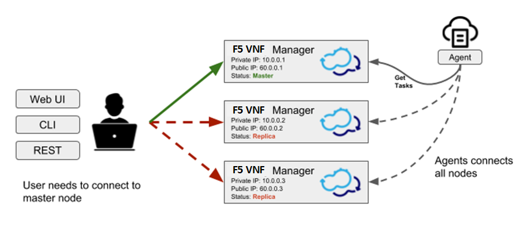
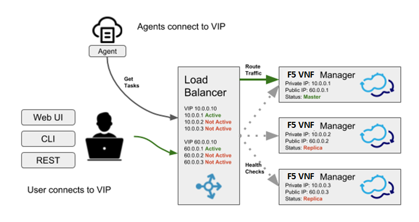

Using Clusters to Provide High Availability
===========================================

If you have a Premium version of F5 VNF Manager, an ``admin`` user can
create a cluster of F5 VNF Managers to enable high availability.

It is recommended that you have three F5 VNF Managers in a cluster for
the following reasons:

-  To ensure resilience in the case of a failure
-  To reduce the probability of multiple hot standbys being activated as
   the active Manager in the event of a network failure (split-brain.)

A F5 VNF Manager cluster is dynamic, meaning that you do not need to
specify the size of the cluster in advance.

For more information about working with clusters, refer to the CLI cluster command.

How High Availability Works
---------------------------

One F5 VNF Manager is designated as the active F5 VNF Manager, and
the others are designated as hot standbys, that are constant mirrors of
the data of the active Manager. In the event that the active F5 VNF
Manager health check fails, an automatic failover switch activates one
of the hot standbys as the new active Manager. Both the CLI and the
F5 VNFM Agents will then start contacting the new active Manager. When
the previous active Manager is restored to a healthy state, it will
become a hot standby node, and will mirror the data of the new active
Manager.

**NOTE**: The leader election is using a majority-based
consensus algorithm, so it is recommended to use 3 Manager nodes for
creating a cluster. The leader election and failover mechanisms are
orchestrated using Consul. See the |consul_article| to learn more about the failure
tolerance for the given deployment size.

.. |consul_article| raw:: html

   <a href="https://www.consul.io/docs/internals/consensus.html#deployment-table" target="_blank">article in Consul docs</a>

Synchronized Data
`````````````````

All F5 VNFM database and filesystem data is mirrored on the cluster hot
standby nodes. This includes all objects that are managed using the REST
service, such as blueprints and deployments, and management data, such
as users and tenants.

**NOTE**:Policies are not synchronized between F5 VNF Managers in the cluster.

Health Checks
`````````````

To determine the health of the a F5 VNF Manager node, the following
are verifed:

-  The PostgreSQL database is up (listening on the port)
-  The PostgreSQL database responds to a simple ``select 1`` query
-  The PostgreSQL database follows correct active master (or if it’s a master on an active Manager)
-  All F5 VNFM services are running (with the exception of rabbitmq and mgmtworker, which only run on the active Manager, but not on the hot standby Managers)
-  A Consul internal health check
-  A simple heartbeat is sent every 15 seconds

A F5 VNF Manager that is down remains in the cluster unless you remove
it. To remove a F5 VNF Manager, run ``cfy cluster nodes remove``.

Failure of the Master F5 VNF Manager
``````````````````````````````````````

In the event that the active F5 VNF Manager fails, it is important to
investigate and fix the issues that caused the original master to fail,
or add another F5 VNF Manager to the cluster, so that high availability is maintained, and to avoid having a single point
of failure.

**NOTE**: Because operations cannot be performed on a non-active Manager, you will need to connect to that F5 VNF Manager using the SSH protocol.

.. _CM-ActiveMgr:

Finding the Active F5 VNF Manager
---------------------------------

To find the active manager in a F5 VNF Manager cluster, you can
either: - From the CLI: run ``cfy cluster nodes list``. The active
manager has the ‘leader’ value in the ‘state’ column. - If you have the
REST API credentials, get the status of each manager in the cluster. The
active manager returns a 200 response, and all other managers return a
400 response.

.. code-block:: console

   curl -u admin:admin https:///api/v3.1/status

Selecting a New Active Manager
``````````````````````````````

To manage the situation in which the active F5 VNF Manager fails one
or more health checks, all Managers in the cluster constantly monitor
the Consul ``next master`` function. When one of the standby Manager
instances in the cluster detects that ``next master`` is pointing to it,
it starts any services that are not running (RabbitMQ and mgmtworker)
and changes PostgreSQL to master state. When the ``active`` Manager
changes, the hot standby nodes begin to follow it with filesync and
database.

If the original active F5 VNF Manager was processing a workflow at the
time it fails, the newly active Manager does not resume and complete
that workflow.

Managing Network Failure
````````````````````````

If there is a loss of connection between the F5 VNF Managers in the
cluster, the cluster might become partitioned into several disconnected
parts. The partition that contains the majority will continue to operate
as normal, while the other part - containing the minority of the nodes,
so usually only one - will enter active minority mode. In this mode, the
node becomes active and responds to requests, but the writes aren’t
replicated to the majority of the cluster, and are at risk of being
lost. Therefore, it is not recommended to continue using the cluster if
the majority of the nodes are unreachable, as reported by
``cfy cluster nodes list``. When the connection is resumed, the F5 VNF
Manager with the most-recently updated database becomes the ``active``
Manager. Data that was accumulated on the other F5 VNF Manager cluster
nodes during the disconnection is not synchronized, so is lost.

Creating a Cluster
------------------

Create a cluster after you complete installing your F5 VNF Managers.
When you run the ``cfy cluster start`` command on a first F5 VNF
Manager, high availability is configured automatically. Use the
``cfy cluster join`` command, following installation, to add more
F5 VNF Managers to the cluster. The F5 VNF Managers that you join to
the cluster must be in an empty state, otherwise the operation will
fail.

The data on each F5 VNF Manager mirrors that of the active F5 VNF
Manager. Operations can only be performed on the active Manager in the
cluster, but are also reflected on the standby Managers. Similarly,
upload requests can only be sent to the active F5 VNF Manager.

Within the cluster, F5 VNFM uses the Consul utility and internal health
checks to detect when the active F5 VNF Manager is down, and which
standby will become active.

Create Cluster Process
``````````````````````

1. Complete installing a F5 VNF Manager.

2. Run ``cluster start`` on the installed Manager to designate this F5 VNF Manager instance as the active Manager.

3. Run ``cluster join`` on two other clean F5 VNF Manager instances.

4. (Optional) To remove a F5 VNF Manager from the cluster, run ``cfy cluster nodes remove <node-id>``.

    .. code-block:: console

       cfy profiles use
       cfy cluster start (on the
       Manager that you want to set active)
       cfy profiles use
       cfy cluster join [–cluster-host-ip ] –cluster-node-name (on a Manager that you want to add to the cluster)

**NOTE**: The cluster nodes will try to contact the new node using the IP passed to them by the CLI. By default, this is the IP that is the CLI profile name. Often this is not desirable, because the
CLI might be using an external IP, while it is preferred for the cluster to be using a private network. In that case, use the ``--cluster-host-ip`` parameter, which must be an IP that is visible by
other Managers in the cluster. Hostnames are not supported in
``--cluster-host-ip``.

Cluster node options
````````````````````

When starting the cluster, or joining a node to the cluster, the
``--options`` can be provided, to specify the following configuration
options:

-  ``check_ttl_multiplier`` (default: 1) - a multiplier for the health
   check timeout. If a health check’s status is not updated for the TTL
   period - which varies from check to check - the check will be
   considered failing. This option allows changing that time. For
   example, setting it to 2 will make health checks take twice as long
   to timeout, which means it will take longer to detect a node becoming
   unresponsive, but there will be less chance of short-lived network
   failures to cause an unnecessary failover.

-  ``check_fail_fast`` (default: True) - if this setting is True, an
   error thrown by a health check will immediately mark it as failing,
   and the failure will be detected immediately, without waiting for the
   check TTL period

-  ``consul_raft_multiplier`` - controls the |consul_raft|.

**NOTE:**  If the network is unstable, increasing ``check_ttl_multiplier`` to 3 and setting ``check_fail_fast`` to False will help avoid unnecessary failovers, at the cost of taking longer to detect a real failure.

.. |consul_raft| raw:: html

   <a href="https://www.consul.io/docs/agent/options.html#raft_multiplier" target="_blank">consul raft_multiplier setting</a>


Upgrading Clusters
------------------

F5 VNF Manager snapshots do not include clusters. If you restore the
snapshot of a F5 VNF Manager that was the active Manager in a cluster
to a new version, you must join the other F5 VNF Managers to recreate the cluster. Managers in a
cluster must all be the same F5 VNFM version.

Upgrade Cluster Process
```````````````````````

**Upgrading via Snapshot Restore on a New VM**\  In this process you
create new VMs for all F5 VNF Managers that will be part of the
cluster.

**Note**: This procedure essentially creates a new cluster, with the data from the existing cluster.

1. Create a snapshot of the active F5 VNF Manager.

2. Boostrap three F5 VNF Managers with the upgraded version.

3. Restore the snapshot to one of the F5 VNF Manager instances.

4. Run ``cluster start`` on the Manager with the restored snapshot, to designate this F5 VNF Manager instance as the active Manager.

5. Run ``cluster join`` on the two other installed F5 VNF Manager instances to designate them as hot standbys.

**Upgrading via Snapshot Restore on an Existing VM**\  In this process
you teardown the active F5 VNF Manager and install a new one on the
same VM. You create new VMs for the F5 VNF Managers that will become
the hot standbys in the cluster.

1. Create a snapshot of the active F5 VNF Manager.

2. Uninstall F5 VNF Manager from the active machine. (run: ``sudo cfy_manager remove -f``).

3. :doc:`Install <deploy>` an updated Manager on the existing machine.

4. Restore the snapshot to the F5 VNF Manager instance.

5. Run ``cluster start`` to designate this F5 VNF Manager instance as the active Manager.

6. Boostrap two new F5 VNF Manager VMs with the upgraded version.

7. Run ``cluster join`` on the two new installed F5 VNF Manager instances to designate them as hot standbys.

Using a load balancer
---------------------

While using the F5 VNFM CLI with a cluster profile will automatically
find the active node, that mechanism is not available for the Web UI. To
allow users contacting a known static address to access the Web UI, a
load balancer such as eg. |HAProxy| can be
used. The load balancer should be configured with a health check that
contacts all the nodes in the cluster in order to find the current
active node, and forward all traffic to the active node. The load
balancer address can then be used for both accessing the Web UI, and for
creating a CLI profile.






.. |HAProxy| raw:: html

   <a href="http://www.haproxy.org/" target="_blank">HAProxy</a>

Implementing a load balancer health check
`````````````````````````````````````````

To configure the load balancer to pass traffic to the active node,
implement a health check which queries all nodes in the cluster and
examines the response code, as described in the :ref:`finding the active manager section<CM-ActiveMgr>`.

Example load balancer configuration
-----------------------------------

With |ha_proxy|, the health check can be implemented by using the ``http-check`` directive. To use it, first obtain the value for the ``Authorization`` HTTP header, by encoding the F5 VNFM Manager credentials:

.. code-block:: console

   echo -n “admin:admin” | base64

Use the resulting value in the HAProxy configuration, for example:

.. code-block:: console

   backend http_back balance roundrobin option
   httpchk GET /api/v3.1/status
   HTTP/1.0:raw-latex:`\r\nAuthorization`: Basic YWRtaW46YWRtaW4=
   http-check expect status 200 server server_name_1 192.168.0.1:80 check
   server server_name_2 192.168.0.2:80 check

In the example above, ``192.168.0.1`` and ``192.168.0.2`` are the public IP addresses of the two cluster nodes, and ``YWRtaW46YWRtaW4=`` are the encoded credentials.

.. |ha_proxy| raw:: html

   <a href="http://www.haproxy.org/" target="_blank">HAProxy</a>

Tearing down clusters
---------------------

If the active node is reachable and responding, we recommend that you to
remove all nodes from the cluster before you uninstall them. This
process avoids unnecessary failovers that put stress on the network and
on the nodes.

Cluster teardown process
````````````````````````

1. Run ``cluster nodes list`` and note the current active node and the
   non-active nodes.

2. For each non-active node, run: ``cluster nodes remove <node name>``

3. To remove each node from the cluster, from the command line of each
   non-active node run: ``cfy_manager remove -f``

4. To teardown the cluster, from the command line of the active node
   run: ``cfy_manager remove -f``

Additional Information
----------------------

Cluster Tools
`````````````

The following tools are used to facilitate clustering in F5 VNFM.

-  |consul| - Discovering and configuring services in the infrastructure
-  |PostgresSQL| Cluster mechanism (master/follow states) - the Streaming Replication mechanism is used for replicating the database
-  |Synchthing| - File system replication

.. |consul| raw:: html

   <a href="https://www.consul.io/docs/" target="_blank">Consul</a>

.. |PostgresSQL| raw:: html

   <a href="https://wiki.postgresql.org/wiki/Replication,_Clustering,_and_Connection_Pooling" target="_blank">PostgresSQL</a>

.. |Synchthing| raw:: html

   <a href="https://docs.syncthing.net/" target="_blank">Synchthing</a>


Services Run with Cluster
`````````````````````````

The cluster function runs the following services:

-  ``check-runner`` - the service which periodically runs the health checks, and updates their status in Consul
-  ``handler-runner`` - the service which reacts to cluster status changes as reported by Consul, and updates the state of the local machine accordingly
-  ``consul-watcher`` - the service which examines the state of the Consul servers on the other nodes in the cluster, and manages the active minority mode as required

Security
````````

The following security mechanisms are implemented.

-  SSL is used internally. All SSL certificates and keys for clustering are stored in ``/etc/VNFM/cluster-ssl``.
-  The only file that runs with ``sudo`` privileges is ``/opt/VNFM/sudo_trampoline.py``.
-  All other services are run with users: ``cfyuser``, ``cfyuser_consul``, ``postgres``, they belong to cluster group

Internal CA certificate
```````````````````````

The internal CA certificate, which is used by the agents to verify
manager connections, is replicated between all cluster nodes. When
joining the cluster, a new replica copies the internal CA certificate
(and the key) from the active node, and uses that to sign a new internal
certificate, which will be used by servers on that replica. This means
that the agents can continue using the same internal CA certificate to
access that replica, if it becomes the active node.

Troubleshooting
```````````````

The primary log file for troubleshooting is ``/var/log/VNFM/VNFM-cluster.log``. All services log to ``journald``. To view their logs, use ``journalctl``:

-  ``journalctl -u VNFM-handler-runner``
-  ``journalctl -u VNFM-check-runner``
-  ``journalctl -u VNFM-consul-watcher``

If required, direct access to Consul REST API is also possible from the
Manager machine: it is listening locally on port 8500, and
authentication requires passing the SSL client certificate which is
located at ``/etc/VNFM/cluster-ssl/consul_client.crt`` (with the key
located at ``/etc/VNFM/cluster-ssl/consul_client.key``).
