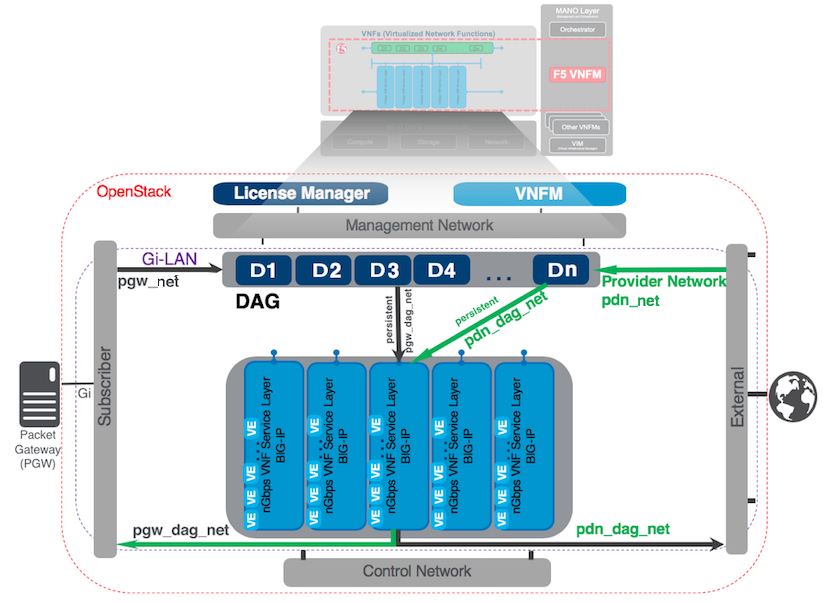

About F5 Virtual Network Function Manager (VNFM)
================================================

F5 utilizes a third-party orchestration framework to bring you the F5 Virtual Network Function Manager (VNFM).
This cloud orchestration tool uses |OASIS_about| blueprints and plugins to manage the processing resources between your packet gateway and the Internet (Gi-LAN), in a private cloud environment (such as, OpenStack), auto-scaling your
BIG-IP VE virtual machines, during high-volume periods. VNFM relies on BIG-IQ 6.0.1 and BIG-IP 13.1.1 images to provide services such as, scaling services and resources,
load-balancing, and high availability (HA).

When finished deploying your VNFM, you will have the following system:

F5 VNFM resides in the |MANO_about| layer. Once you upload BIG-IQ, BIG-IP, and the VNFM images
into OpenStack, and deploy the VNFM blueprint, the BIG-IQ license manager, BIG-IPs deployed by the blueprint, and your VNFM will comprise the management network.

Traffic will pass through the disaggregation (DAG) tier and the predefined-throughput service layers, connecting your subscriber packet gateway with the
Internet (Gi LAN). The service layers will auto-scale out or add virtual machine instances, depending on your traffic demands. BIG-IPs in the DAG tier load-balance the subscriber traffic
across BIG-IP VEs providing the virtualized network functions (VNF) inside the VNF service layer. This diagram depicts an |F5Blueprint_about| setting for the Gilan solution,
:guilabel:`auto_last_hop` set to *disabled* (default), routing the return traffic through the DAG tier. However, this is a configurable setting in the F5 blueprint, which you can *enable*, and
route return traffic directly back to the VNF service layer (bypassing the DAG tier).

Processes like, your policy engines, your subscriber service-charging functions, and signaling will occur on the control network.

What's Next?

:doc:`Review and Prepare UDF Blueprint <review>`

.. |OASIS_about| raw:: html

    <a href="https://www.oasis-open.org/committees/tc_home.php?wg_abbrev=tosca" target="_blank">OASIS TOSCA-compliant</a>

.. |MANO_about| raw:: html

    <a href="https://www.etsi.org/technologies-clusters/technologies/nfv/open-source-mano" target="_blank">MANO</a>

.. |F5Blueprint_about| raw:: html

    <a href="https://clouddocs.f5networks.net/cloud/nfv/latest/setup.html#f5-blueprint" target="_blank">F5 blueprint</a>

