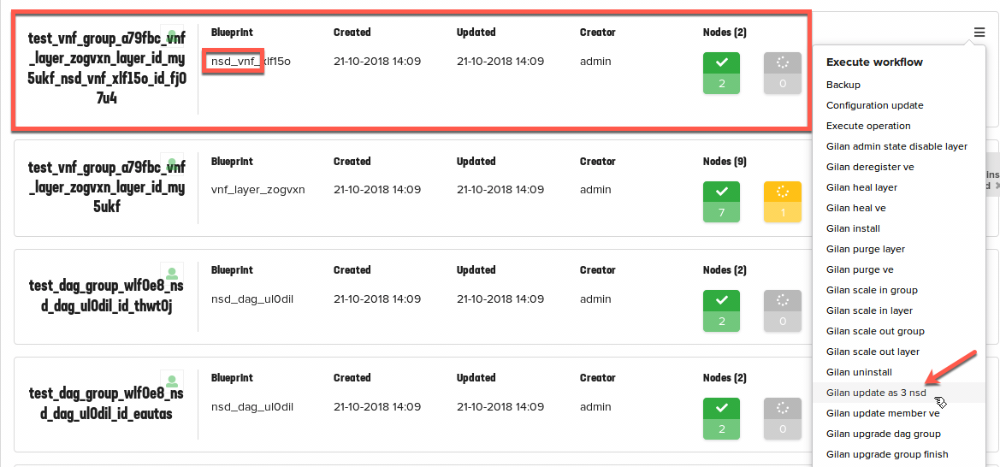

Part V. Configuration change
============================

VNF Manager allows users to perform BIG-IP configuration change by invoking `nsd_xxx` Workflow and passing corresponding AS3 payload.
This lab contains a modified AS3 payload that will provision AFM policy and rules for Firewall layer of Gilan blueprint.

To change the AFM configuration, select :guilabel:`Deployments` --> :guilabel:`nsd_vnf_xxxx` Blueprint 
Expand |menuIcon_deploy|, click :guilabel:`Gilan install`, paste the entire AS3 payload and then click :guilabel:`Execute`.

.. |menuIcon_deploy| image:: images/menuIcon.png

Use the YAML AS3 payload below to provision Firewall rules

.. code-block:: yaml

    class: AS3
    action: deploy
    persist: true
    declaration:
        class: ADC
        schemaVersion: 3.0.0
        id: cfy_vnf_01
        label: vnf
        remark: VNF
        f5vnf:
            class: Tenant
            Shared:
                class: Application
                template: shared
                fwAllowedAddressList:
                    addresses:
                        - 10.0.0.0/8
                        - 172.20.0.0/16
                        - 192.168.0.0/16
                    class: Firewall_Address_List
                fwAllowedPortList:
                    class: Firewall_Port_List
                    ports:
                        - 8080-8081
                        - 22
                        - 443
                        - 53
                        - 80
                fwDefaultDenyAddressList:
                    addresses:
                        - 0.0.0.0/0
                    class: Firewall_Address_List
                fwLogDestinationHsl:
                    class: Log_Destination
                    distribution: adaptive
                    pool:
                        use: poolHsl
                    protocol: tcp
                    type: remote-high-speed-log
                fwLogDestinationSyslog:
                    class: Log_Destination
                    format: rfc5424
                    remoteHighSpeedLog:
                        use: fwLogDestinationHsl
                    type: remote-syslog
                fwLogPublisher:
                    class: Log_Publisher
                    destinations:
                        - use: fwLogDestinationSyslog
                fwPolicy:
                    class: Firewall_Policy
                    rules:
                        -
                            use: fwRuleList
               fwRuleList:
                    class: Firewall_Rule_List
                    rules:
                        -
                            action: accept
                            destination:
                                portLists:
                                    -
                                        use: fwAllowedPortList
                            loggingEnabled: true
                            name: tcpAllow
                            protocol: tcp
                            source:
                                addressLists:
                                    - use: fwAllowedAddressList
                        -
                            action: accept
                            loggingEnabled: true
                            name: udpAllow
                            protocol: udp
                            source:
                                addressLists:
                                    - use: fwAllowedAddressList
                        -
                            action: drop
                            loggingEnabled: true
                            name: defaultDeny
                            protocol: any
                            source:
                                addressLists:
                                    - use: fwDefaultDenyAddressList
                fwSecurityLogProfile:
                    class: Security_Log_Profile
                    network:
                        logIpErrors: true
                        logRuleMatchAccepts: true
                        logRuleMatchDrops: true
                        logRuleMatchRejects: true
                        logTcpErrors: true
                        logTcpEvents: true
                        logTranslationFields: true
                        publisher:
                            use: fwLogPublisher
                        storageFormat:
                            fields:
                                - action
                                - bigip-hostname
                                - context-name
                                - context-type
                                - date-time
                                - dest-ip
                                - dest-port
                                - drop-reason
                                - protocol
                                - src-ip
                                - src-port
                poolHsl:
                    class: Pool
                    members:
                        -
                            enable: true
                            serverAddresses:
                                - 255.255.255.254
                            servicePort: 514
                    monitors:
                        -
                            bigip: /Common/udp
                lbSelectedRule:
                    class: iRule
                    iRule: when LB_SELECTED {log local0. "Selected server [LB::server]"}
                    remark: Log load balanced server
                profileL4:
                    class: L4_Profile
                serviceAddress:
                    class: Service_Address
                    arpEnabled: False
                    spanningEnabled: True
                    virtualAddress: 0.0.0.0
                firewall_any:
                    class: Application
                    template: generic
                serviceMain:
                    allowVlans:
                        - bigip: /Common/vnfs
                    class: Service_Generic
                    iRules:
                        - /f5vnf/Shared/lbSelectedRule
                    layer4: any
                    policyFirewallEnforced:
                        use: /f5vnf/Shared/fwPolicy
                    profileL4:
                        use: /f5vnf/Shared/profileL4
                    securityLogProfiles:
                        - use: /f5vnf/Shared/fwSecurityLogProfile
                    snat: auto
                    lastHop: disable
                    translateServerAddress: false
                    translateServerPort: false
                    virtualAddresses:
                        - use: /f5vnf/Shared/serviceAddress
                    virtualPort: 0
            firewall_fastL4:
                class: Application
                template: l4
                serviceMain:
                    class: Service_L4
                    layer4: tcp
                    allowVlans:
                        - bigip: /Common/vnf
                    profileL4:
                        use: /f5vnf/Shared/profileL4
                    virtualAddresses:
                        - use: /f5vnf/Shared/serviceAddress
                    virtualPort: 0
                    translateServerAddress: false
                    translateServerPort: false
                    snat: auto
                    lastHop: disable
                    iRules:
                        - /f5vnf/Shared/lbSelectedRule
                    policyFirewallEnforced:
                        use: /f5vnf/Shared/fwPolicy
                    securityLogProfiles:
                      - use: /f5vnf/Shared/fwSecurityLogProfile
            firewall_inbound:
              class: Application
              template: generic
              serviceMain:
                allowVlans:
                - bigip: /Common/vnfe
                class: Service_Generic
                iRules:
                - /f5vnf/Shared/lbSelectedRule
                layer4: any
                profileL4:
                  use: /f5vnf/Shared/profileL4
                snat: none
                translateServerAddress: false
                translateServerPort: false
                virtualAddresses:
                - use: /f5vnf/Shared/serviceAddress
                virtualPort: 0