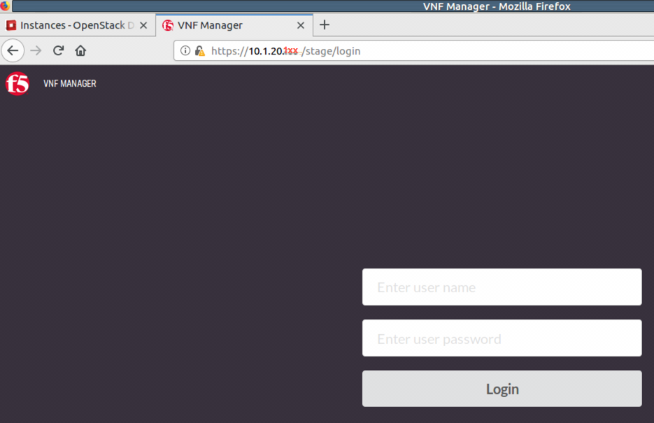

Part II: Deploy F5 VNF Manager
==============================

To deploy F5 VNFM, do the following:

1. :ref:`Launch an instance in OpenStack <launch>`

2. :ref:`Add a floating IP in OpenStack <fip>`

3. :ref:`Access F5 VNFM UI <secure>`

4. :ref:`Manage secrets <secrets>`

5. :ref:`Define parameters in the inputs.yaml file <yaml>`


.. _launch:

Step 1: Launch an instance in OpenStack
-------------------------------------------

**PREREQUISITE**: The following table lists the VNFM-required administrative OpenStack environment components and guidelines that must exist PRIOR to creating a VNFM instance in your OpenStack project. See previous step :doc:`Review and Prepare UDF Blueprint <review>` for details.

1.  Once the following components exist in your environment, |vnfmInst_deploy|, and then define the following parameters, clicking :guilabel:`Next` to complete the wizard.
    (Click the following links to learn more about using the latest version of OpenStack, or refer to the documentation specific to the version of OpenStack you are using.)

:menuselection:`Compute -> Instance`

============================================================ ======================================================================================================================================================================================================================================================================
Component                                                    Description
============================================================ ======================================================================================================================================================================================================================================================================
|source_deploy|                                              Expand :guilabel:`Select Boot Source`, and choose :guilabel:`Image`, under :guilabel:`Create New Volume`, click :guilabel:`No`, and then click :guilabel:`+` next to the latest VNFM image file to move it to the :guilabel:`Allocated` list.
                                                             
                                                             .. image:: images/novol.png

|flavors_deploy|                                             Select a flavor sized accordingly, to accommodate the VNFM component images you previously uploaded. The minimum flavor requirements for deploying the F5 VNF Manager include:

                                                             -  vCPU: 4
                                                             -  RAM: 8GB
                                                             -  Root disk: 160GB

|networks_deploy|                                            Select :guilabel:`+` next to the following predefined network (and subnet), to add to the :guilabel:`Allocated` list:

                                                             -  :guilabel:`Management network (mgmt)` – The VNF Manager and BIG-IP VE management interfaces with one DNS server in the subnet configuration.

|sg_deploy|                                                  Select :guilabel:`+` next to the following, predefined security group to add to the :guilabel:`Allocated` list:

                                                             -  Select Default security group :guilabel:`default`

|kp_deploy|                                                  Select existing `jumphost.pem` key pair for accessing VNFM instance remotely from jumphost, using SSH.
============================================================ ======================================================================================================================================================================================================================================================================

2.	For all other Instance component definitions, use the default values provided by OpenStack. For details, see |OSLnchIn_deploy|.


.. |source_deploy| raw:: html

    <a href="https://docs.openstack.org/horizon/rocky/user/launch-instances.html" target="_blank">Source</a>

.. |flavors_deploy| raw:: html

    <a href="https://docs.openstack.org/horizon/rocky/admin/manage-flavors.html" target="_blank">Flavors</a>

.. |networks_deploy| raw:: html

    <a href="https://docs.openstack.org/horizon/rocky/user/create-networks.html" target="_blank">Networks</a>

.. |sg_deploy| raw:: html

    <a href="https://docs.openstack.org/horizon/rocky/user/configure-access-and-security-for-instances.html" target="_blank">Security Groups</a>

.. |kp_deploy| raw:: html

    <a href="https://docs.openstack.org/horizon/rocky/user/configure-access-and-security-for-instances.html#keypair-add" target="_blank">Key Pair</a>

.. |bigiqdwnld_deploy| raw:: html

    <a href="https://downloads.f5.com/esd/product.jsp?sw=BIG-IQ&pro=big-iq_CM&ver=6.0.1" target="_blank">BIG-IQ 6.0.1 downloads site</a>

.. |bigipdwnld_deploy| raw:: html

    <a href="https://downloads.f5.com/esd/product.jsp?sw=BIG-IP&pro=big-ip_v13.x&ver=13.1.1" target="_blank">BIG-IP 13.1.1 download site</a>

.. |OSMgIm_deploy| raw:: html

    <a href="https://docs.openstack.org/horizon/rocky/user/manage-images.html" target="_blank">Upload and manage images on docs.openstack.org</a>

.. |vnfmInst_deploy| raw:: html

    <a href="https://docs.openstack.org/horizon/rocky/user/launch-instances.html" target="_blank">create and name a VNFM instance</a>

.. |OSLnchIn_deploy| raw:: html

    <a href="https://docs.openstack.org/horizon/rocky/user/launch-instances.html" target="_blank">Upload and manage instances on the docs.openstack.org</a>


.. _fip:

Step 2: Add a floating IP
-------------------------------------------

Once you launch your instance in OpenStack, expand the :guilabel:`Creat Snapshot` drop-down next to your instance in the table, and select |FlIPAd_deploy| from the list. Choose an IP address from the list. If none, click :guilabel:`+` to add one.
This allocates the floating `extnet` IP on the management network. Do this to access the VNFM externally from a browser, using https.


.. |FlIPAd_deploy| raw:: html

    <a href="https://docs.openstack.org/horizon/rocky/user/configure-access-and-security-for-instances.html#allocate-a-floating-ip-address-to-an-instance" target="_blank">Associate a Floating IP</a>

.. _secure:

Step 3: Access F5 VNFM UI
------------------------------------------

To acces your VNFM, point your browser to the public floating `10.1.20.x` IP address you created and assigned in the previous steps, using https.




.. _secrets:

Step 4: Manage secrets
------------------------------------------

In F5 VNFM UI, click :menuselection:`System Settings -> Secret Store Management`, click |edit_deploy| next to each of the
following secrets to edit the values for your project. Doing so enables your blueprint to access these values as needed,
during orchestration, without exposing the plain text values:

:menuselection:`System Resources -> Secret Store Management`

======================== =================================================================================================================================================================
BIG-IP                   Notes
======================== =================================================================================================================================================================
bigip_admin_password     Set to the desired password for the default BIG-IP admin account. See :ref:`Credentials <credentials>`

bigip_root_password      Set to the desired password for the default BIG-IP root account. See :ref:`Credentials <credentials>`

bigip_username           See :ref:`Credentials <credentials>`

agent_key_private        The private SSH key for connecting to BIG-IP instances. Open :guilabel:`MATE Terminal` in :guilabel:`System Tools` and copy content of `~/Downloads/jumphost.pem`
======================== =================================================================================================================================================================


======================== =================================================================================================================================================================
BIG-IQ                   Notes
======================== =================================================================================================================================================================
bigiq_password           Set to the password for the BIG-IQ system used for licensing BIG-IP VEs in the deployment. See :ref:`Credentials <credentials>`

bigiq_username           Set to the user name for the BIG-IQ system used for licensing BIG-IP VEs in the deployment. See :ref:`Credentials <credentials>`
======================== =================================================================================================================================================================


======================== =================================================================================================================================================================
VNF Manager              Notes
======================== =================================================================================================================================================================
cm_cert                  Located in /etc/cloudify/ssl/cloudify_external_cert.pem

cm_host                  Set to the internal IP address (`10.1.40` subnet) of the VNF Manager.

cm_password              Set to the password for the VNF Manager. See :ref:`Credentials <credentials>`

cm_port                  Set to the TCP port for connecting to the VNF Manager. Set to *443*.

cm_protocol              Set to the protocol for connecting to the VNF Manager.  Set to *https*.

cm_tenant                Set to the VNF Manager tenant name. Set to default value *default_tenant*.

cm_user                  Set to the user name of the VNF Manager. See :ref:`Credentials <credentials>`
======================== ============================================================================================================================================================


======================== ============================================================================================================================================================
Keystone                 Notes
======================== ============================================================================================================================================================
keystone_password        Set to the password for the account with access to the OpenStack tenant where you will deploy blueprint resources. See :ref:`Credentials <credentials>`

keystone_tenant_name     Set to the OpenStack tenant name where you will deploy blueprint resources. In this lab tenant name is **vnfmanager**

keystone_url             Set to the v2 authentication URL of the OpenStack environment where you will deploy blueprint resources;In this lab it is ``http://10.1.20.4:5000/v2.0``.

keystone_username        Set to the user name of the account with access to the OpenStack tenant where you will deploy blueprint resources. See :ref:`Credentials <credentials>`
======================== ============================================================================================================================================================

**IMPORTANT**: If you are allowing VNFM to create **keystone** resources, then you must configure the **keystone** account with the required OpenStack permissions. Learn more at |keystone_deploy|.

======================== ============================================================================================================================================================
Nagiorest                Notes
======================== ============================================================================================================================================================
nagiosrest_pass          Set to the desired password for the Nagios monitoring instance. Set to *testuser*.

nagiosrest_user          Set to the desired user name for the Nagios monitoring instance. Set to *testpass*.
======================== ============================================================================================================================================================


======================== ============================================================================================================================================================
Region                   Notes
======================== ============================================================================================================================================================
Region                   Set to the OpenStack region where you will deploy blueprint resources. Set to *nova*.


======================== ============================================================================================================================================================

For more information, see :doc:`using the secret store <CM-UseSecrets>`.


.. |keystone_deploy| raw:: html

    <a href="https://docs.openstack.org/keystone/latest/configuration.html" target="_blank">docs.openstack.org</a>


.. _yaml:

Step 5: Define parameters in the inputs.yaml file
-------------------------------------------------

The F5 blueprint uses an inputs.yaml file that you edit, adding your system definitions:

1.	Open this :doc:`sample gi_inputs.yaml file <gi-inputs>`.

2.	Open SSH session to jumphost and paste the contents of this sample inputs yaml file into a new file in `~/Desktop` directory, then use vi/vim to change the **<changeMe>** parameter values according to your network implementation. See the following tables for parameter descriptions that you will define in the inputs.YAML file.

3.	Save the .yaml file. You will upload this file into VNFM in the next step, deploy F5 Gilan blueprint_.


Gi LAN blueprint
````````````````

**Gilan inputs**

============================================================ ================= =================================================================================================================================================================
Parameter                                                    Required          Description
============================================================ ================= =================================================================================================================================================================
pgw_dag_subnet_mask                                          Yes               The network mask of the pgw_dag subnet.

big_ip_root_user                                             Yes               Root user name of the BIG-IP (redundant it's also a secret may go away).

default_gateway                                              Yes               The next hop IP address for outbound traffic egressing the VNF.
============================================================ ================= =================================================================================================================================================================

**VNF Resource Information Collector inputs**

+-----------------------+-----------------+---------------------------------------------------------------+
| Parameter             | Required        | Description                                                   |
+=======================+=================+===============================================================+
| ric_throughput        | Yes             | Desired throughput for the VNF layer, in Gbps                 |
|                       |                 | (options include: 5, 10, 50 Gbps).                            |
+-----------------------+-----------------+---------------------------------------------------------------+
| ric_purchasing_model  | Yes             | The purchasing model for licensing (options                   |
|                       |                 | include: subscription or perpetual).                          |
+-----------------------+-----------------+---------------------------------------------------------------+
| ric_licensing         | Yes             | The solution you are deploying (options include:              |
|                       |                 | gilan or firewall)                                            |
+-----------------------+-----------------+---------------------------------------------------------------+
| ric_vnfm_license      | Yes             | The VNFM license key provided in your email                   |
|                       |                 | from F5 (used for support purposes only).                     |
+-----------------------+-----------------+---------------------------------------------------------------+
| auto_last_hop         | Yes             | Controls how the DAG receives return traffic from the         |
|                       |                 | internet. Enable this input, if you are using an F5 device to |
|                       |                 | NAT outbound connections; otherwise, disable.                 |
+-----------------------+-----------------+---------------------------------------------------------------+


**VNF inputs**

+-----------------------+-----------------+---------------------------------------------------------------+
| Parameter             | Required        | Description                                                   |
+=======================+=================+===============================================================+
| ctrl_net              | Yes             | The name of the control network.                              |
+-----------------------+-----------------+---------------------------------------------------------------+
| ctrl_subnet           | Yes             | The name of the control network subnet.                       |
+-----------------------+-----------------+---------------------------------------------------------------+
| ha_net                | Yes             | The name of the high availability network (for                |
|                       |                 | config. sync and network failover purposes).                  |
+-----------------------+-----------------+---------------------------------------------------------------+
| ha_subnet             | Yes             | Name of the high availability network subnet.                 |
+-----------------------+-----------------+---------------------------------------------------------------+


**Nagios inputs**

============================================================ ================= =============================================================================================================================================================================================
Parameter                                                    Required          Description
============================================================ ================= =============================================================================================================================================================================================
floating_network_id                                          Yes               The OpenStack ID or name of the network where you assigned a floating IP addresses. In this lab network is **extnet**

centos_image_id                                              Yes               The OpenStack ID of the CentOS image to use when creating the monitoring nodes.

nagios_flavor_id                                             Yes               The OpenStack ID of the flavor to use when creating the monitoring nodes.

nagios_web_username                                          Yes               The username to use when creating the monitoring nodes (redundant secret now).

nagios_web_password                                          Yes               The username to use when creating the monitoring nodes (redundant secret now)

vnf_scale_out_threshold_for_sysStatClientServerBytesInOut    Yes               The average aggregate throughput of all BIG-IP VE instances in a layer, in bytes. Instances are added when the observed throughput exceeds this value.

dag_scale_out_threshold_for_sysGlobalTmmStatTmUsageRatio1m   Yes               The threshold (in percent) of average aggregate TMM CPU usage, above which the DAG group will add more BIG-IP VE instances.

vnf_scale_out_threshold_for_sysGlobalTmmStatTmUsageRatio1m   Yes               The threshold (in percent) of average aggregate TMM CPU usage, above which the VNF layer will add more BIG-IP VE instances.

vnf_check_interval_for_sysStatClientServerBytesInOut         Yes               The interval, in minutes, at which the monitoring nodes will check throughput.

vnf_check_interval_for_sysGlobalTmmStatTmUsageRatio1m        Yes               The interval (in minutes) at which the VNF instances will be polled for TMM CPU statistics.

dag_check_interval_for_sysGlobalTmmStatTmUsageRatio1m        Yes               The interval (in minutes) at which the DAG instances will be polled for TMM CPU statistics.
============================================================ ================= =============================================================================================================================================================================================


**Common inputs**

+-----------------------+-----------------+---------------------------------------------------------------+
| Parameter             | Required        | Description                                                   |
+=======================+=================+===============================================================+
| cm_ip                 | Yes             | The internal `10.1.40.x` IP address of the VNF Manager        |
|                       |                 | instance.                                                     |
+-----------------------+-----------------+---------------------------------------------------------------+
| sw_ref_dag            | Yes             | A dictionary that defines the OpenStack image                 |
|                       |                 | and flavor to use for the BIG-IP VE                           |
|                       |                 | disaggregation instances.                                     |
+-----------------------+-----------------+---------------------------------------------------------------+
|sw_ref_vnf             | Yes             | A dictionary that defines the OpenStack image                 |
|                       |                 | and flavor to use for the BIG-IP VE virtual                   |
|                       |                 | network functions instances.                                  |
|-----------------------+-----------------+---------------------------------------------------------------+
|bigip_os_ssh_key       | Yes             | The name of the OpenStack SSH key that you will               |
|                       |                 | import into the BIG-IP VE instances.                          |
+-----------------------+-----------------+---------------------------------------------------------------+
| big_iq_host           | Yes             | The IP address of the BIG-IQ VE instance that                 |
|                       |                 | will assign licenses to the BIG-IP VE instances.              |
+-----------------------+-----------------+---------------------------------------------------------------+
| big_iq_lic_pool       | Yes             | The name of the BIG-IQ key or pool that will be               |
|                       |                 | used to assign licenses to the BIG-IP VE                      |
|                       |                 | instances.                                                    |
+-----------------------+-----------------+---------------------------------------------------------------+
| ctrl_sg_name          | Yes             | The name of the pre-existing control security                 |
|                       |                 | group.                                                        |
+-----------------------+-----------------+---------------------------------------------------------------+
| mgmt_sg_name          | Yes             | The name of the pre-existing management security              |
|                       |                 | group.                                                        |
+-----------------------+-----------------+---------------------------------------------------------------+
| pgw_sg_name           | Yes             | The name of the pre-existing packet gateway                   |
|                       |                 | (PGW) security group.                                         |
+-----------------------+-----------------+---------------------------------------------------------------+
| pdn_sg_name           | Yes             | The name of the pre-existing provider data                    |
|                       |                 | network (PDN) security group.                                 |
+-----------------------+-----------------+---------------------------------------------------------------+
| snmp_sg_name          | Yes             | The name of the pre-existing SNMP security                    |
|                       |                 | group.                                                        |
+-----------------------+-----------------+---------------------------------------------------------------+
| mgmt_net              | Yes             | The name of the pre-existing management network.              |
+-----------------------+-----------------+---------------------------------------------------------------+
| mgmt_subnet           | Yes             | The name of the pre-existing management network               |
|                       |                 | subnet.                                                       |
+-----------------------+-----------------+---------------------------------------------------------------+
| mgmt_port             | Yes             | The TCP port to use for management of the                     |
|                       |                 | BIG-IP VEs (default value: 443).                              |
+-----------------------+-----------------+---------------------------------------------------------------+
| pgw_net               | Yes             | The name of the pre-existing PGW network.                     |
+-----------------------+-----------------+---------------------------------------------------------------+
| pgw_subnet            | Yes             | The name of the pre-existing PGW subnetwork.                  |
+-----------------------+-----------------+---------------------------------------------------------------+
| pdn_net               | Yes             | The name of the pre-existing PDN network.                     |
+-----------------------+-----------------+---------------------------------------------------------------+
| pdn_subnet            | Yes             | The name of the pre-existing PDN network subnet.              |
+-----------------------+-----------------+---------------------------------------------------------------+
| pgw_dag_net           | Yes             | The name of the pre-existing PGW-DAG (VNF                     |
|                       |                 | ingress) network.                                             |
+-----------------------+-----------------+---------------------------------------------------------------+
| pgw_dag_subnet        | Yes             | The name of the pre-existing PGW-DAG network                  |
|                       |                 | subnet.                                                       |
+-----------------------+-----------------+---------------------------------------------------------------+
| pgw_dag_subnet_cidr   | Yes             | The CIDR of the pre-existing PGW-DAG network                  |
|                       |                 | subnet (for example, 192.168.1.0/24).                         |
+-----------------------+-----------------+---------------------------------------------------------------+
| pdn_dag_net           | Yes             | The name of the pre-existing PDN-DAG (VNF                     |
|                       |                 | egress) network.                                              |
+-----------------------+-----------------+---------------------------------------------------------------+
| pdn_dag_subnet        | Yes             | The name of the pre-existing PDN-DAG network                  |
|                       |                 | subnet.                                                       |
+-----------------------+-----------------+---------------------------------------------------------------+
| pdn_dag_subnet_cidr   | Yes             | The CIDR of the pre-existing PDN-DAG network                  |
|                       |                 | subnet (for example, 192.168.2.0/24).                         |
+-----------------------+-----------------+---------------------------------------------------------------+
| vnf_as3_nsd_payload   | Yes             | The F5 AS3 declaration, in YAML format, that defines the      |
|                       |                 | service configuration of the VNF instances. **NOTE**: You may |
|                       |                 | edit this declaration as appropriate for your solution;       |
|                       |                 | however, the VLAN names used in the allowVlans property for   |
|                       |                 | each service must correspond to the values of the pgw_dag_net |
|                       |                 | (for outbound traffic) and pdn_dag_net inputs (for inbound    |
|                       |                 | traffic).                                                     |
+-----------------------+-----------------+---------------------------------------------------------------+

What’s Next?

:doc:`Deploy Gilan blueprint <deploy_gilan>`