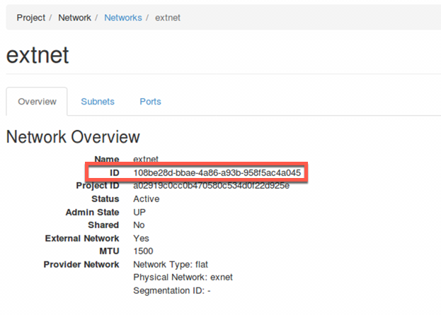

Part II: Deploy F5 VNF Manager
==============================

To deploy F5 VNFM, do the following:

1. :ref:`Launch an instance in OpenStack <launch>`

2. :ref:`Add a floating IP in OpenStack <fip>`

3. :ref:`Access F5 VNFM UI <secure>`

4. :ref:`Manage secrets <secrets>`

5. :ref:`Define parameters in the inputs.yaml file <yaml>`


.. _launch:

Step 1: Launch an instance in OpenStack
-------------------------------------------

**PREREQUISITE**: The following table lists the VNFM-required administrative OpenStack environment components and guidelines that must exist PRIOR to creating a VNFM instance in your OpenStack project. See previous step :doc:`Review and Prepare UDF Blueprint <review>` for details.

1.  Once the following components exist in your environment, |vnfmInst_deploy|, and then define the following parameters, clicking :guilabel:`Next` to complete the wizard.
    (Click the following links to learn more about using the latest version of OpenStack, or refer to the documentation specific to the version of OpenStack you are using.)

:menuselection:`Project -> Compute -> Instances -> Launch Instance`

============================================================ ======================================================================================================================================================================================================================================================================
Component                                                    Description
============================================================ ======================================================================================================================================================================================================================================================================
|source_deploy|                                              Expand :guilabel:`Select Boot Source`, and choose :guilabel:`Image`, under :guilabel:`Create New Volume`, click :guilabel:`No`, and then click :guilabel:`+` next to the latest VNFM image file to move it to the :guilabel:`Allocated` list.
                                                             
                                                             .. image:: images/novol3.png

|flavors_deploy|                                             Select :guilabel:`m1.medium` flavor

|networks_deploy|                                            Select :guilabel:`+` next to the following predefined network (and subnet), to add to the :guilabel:`Allocated` list:

                                                             -  :guilabel:`Management network (mgmt)` – The VNF Manager and BIG-IP VE management interfaces with one DNS server in the subnet configuration.

|sg_deploy|                                                  Select :guilabel:`+` next to the following, predefined security group to add to the :guilabel:`Allocated` list:

                                                             -  Select Default security group :guilabel:`default`

|kp_deploy|                                                  Select existing `jumphost.pem` key pair for accessing VNFM instance remotely from jumphost, using SSH.
============================================================ ======================================================================================================================================================================================================================================================================

2.	For all other Instance component definitions, use the default values provided by OpenStack. For details, see |OSLnchIn_deploy|.


.. |source_deploy| raw:: html

    <a href="https://docs.openstack.org/horizon/rocky/user/launch-instances.html" target="_blank">Source</a>

.. |flavors_deploy| raw:: html

    <a href="https://docs.openstack.org/horizon/rocky/admin/manage-flavors.html" target="_blank">Flavors</a>

.. |networks_deploy| raw:: html

    <a href="https://docs.openstack.org/horizon/rocky/user/create-networks.html" target="_blank">Networks</a>

.. |sg_deploy| raw:: html

    <a href="https://docs.openstack.org/horizon/rocky/user/configure-access-and-security-for-instances.html" target="_blank">Security Groups</a>

.. |kp_deploy| raw:: html

    <a href="https://docs.openstack.org/horizon/rocky/user/configure-access-and-security-for-instances.html#keypair-add" target="_blank">Key Pair</a>

.. |bigiqdwnld_deploy| raw:: html

    <a href="https://downloads.f5.com/esd/product.jsp?sw=BIG-IQ&pro=big-iq_CM&ver=6.0.1" target="_blank">BIG-IQ 6.0.1 downloads site</a>

.. |bigipdwnld_deploy| raw:: html

    <a href="https://downloads.f5.com/esd/product.jsp?sw=BIG-IP&pro=big-ip_v13.x&ver=13.1.1" target="_blank">BIG-IP 13.1.1 download site</a>

.. |OSMgIm_deploy| raw:: html

    <a href="https://docs.openstack.org/horizon/rocky/user/manage-images.html" target="_blank">Upload and manage images on docs.openstack.org</a>

.. |vnfmInst_deploy| raw:: html

    <a href="https://docs.openstack.org/horizon/rocky/user/launch-instances.html" target="_blank">create and name a VNFM instance</a>

.. |OSLnchIn_deploy| raw:: html

    <a href="https://docs.openstack.org/horizon/rocky/user/launch-instances.html" target="_blank">Upload and manage instances on the docs.openstack.org</a>


.. _fip:

Step 2: Add a floating IP
-------------------------------------------

Once you launch your instance in OpenStack, expand the :guilabel:`Create Snapshot` drop-down next to your instance in the table, and select |FlIPAd_deploy| from the list. Choose an IP address from the list. If none, click :guilabel:`+` to add one.
This allocates the floating `extnet` IP on the management network. Do this to access the VNFM externally from a browser, using https.


.. |FlIPAd_deploy| raw:: html

    <a href="https://docs.openstack.org/horizon/rocky/user/configure-access-and-security-for-instances.html#allocate-a-floating-ip-address-to-an-instance" target="_blank">Associate a Floating IP</a>

.. _secure:

Step 3: Access F5 VNFM UI
------------------------------------------

To acces your VNFM, point your browser to the public floating `10.1.20.x` IP address you created and assigned in the previous steps, using https.

.. image:: images/vnfm-ip.png


.. _secrets:

Step 4: Manage secrets
------------------------------------------

In F5 VNFM UI, click :menuselection:`System Resources -> Secret Store Management`, click |edit_deploy| next to each of the
following secrets to edit the values for your project. Doing so enables your blueprint to access these values as needed,
during orchestration, without exposing the plain text values.

1. Change the following credentials:

======================== =================================================================================================================================================================
BIG-IP                   Notes
======================== =================================================================================================================================================================
bigip_admin_password     Set to the desired password for the default BIG-IP admin account. See :ref:`Credentials <credentials>`

bigip_root_password      Set to the desired password for the default BIG-IP root account. See :ref:`Credentials <credentials>`

bigip_username           Set bigip admin user to the desired value. See :ref:`Credentials <credentials>`
======================== =================================================================================================================================================================

For more information, see :doc:`using the secret store <CM-UseSecrets>`.

2. A special jumphost script `vnfm-secrets.sh` should be used to update Secret Store
    
    Open jumphost MATE terminal and run the following command:

    .. code-block:: console

        $sudo ~/Downloads/vnfm-secrets.sh <vnfmanager .40 net IP>


For list of credentials updated by script, see |secretstore|


.. |edit_deploy| image:: images/edit.png

.. |keystone_deploy| raw:: html

    <a href="https://docs.openstack.org/keystone/latest/configuration.html" target="_blank">docs.openstack.org</a>

.. |secretstore| raw:: html

    <a href="https://clouddocs.f5.com/cloud/nfv/latest/deploy.html#step-5-manage-secrets" target="_blank">Manage Secrets</a>


.. _yaml:

Step 5: Define parameters in the inputs.yaml file
-------------------------------------------------

The F5 blueprint uses an inputs.yaml file that you edit, adding your system definitions:

1.	Open `inputs_gilan_udf-v3.yaml` on the :guilabel:`Desktop` and change the **<changeMe>** parameter values according to your network implementation. See the following tables for parameter descriptions that you will define in the inputs.YAML file.

.. note:: The 2 parameters that need to be changed are: cm_ip, floating_network_id

cm_ip: :menuselection:`Horizon UI: Project -> Compute -> Instances -> vnfmanager` `10.1.40.x` IP address of the VNF Manager instance

floating_network_id: :menuselection:`Horizon UI: Project -> Networks -> Network -> extnet`




2.	Save the .yaml file. You will upload this file into VNFM in the next step, deploy F5 Gilan blueprint.


Gi LAN blueprint
````````````````

For up-to-date gilan inputs YAML content see |inputs_yaml|

.. |inputs_yaml| raw:: html

    <a href="https://clouddocs.f5.com/cloud/nfv/latest/deploy.html#step-6-define-parameters-in-the-inputs-yaml-file">inputs.yaml</a>


What’s Next?

:doc:`Deploy Gilan blueprint <deploy_gilan>`