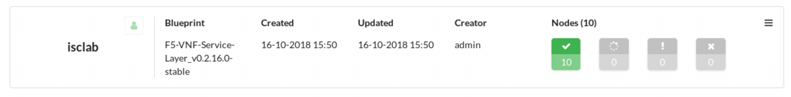

Part III. Deploy local F5 Gilan blueprint and create traffic server VM
======================================================================

1. :ref:`Deploy Gilan blueprint <gilan>`
2. :ref:`Stand up traffic server VM <servervm>`
3. :ref:`Add static route <statroute>`
4. :ref:`Run test traffic <test>`

.. _gilan:

Step 1. Deploy Gilan blueprint
------------------------------

Once you change all the values in the Gi LAN inputs file and save it locally, upload the file in F5 VNF Manager. It will
define all required parameters for the F5 Gilan yaml blueprint.

1.	Open F5 VNFM, click :guilabel:`Local Blueprints`. The :guilabel:`F5-VNF-Service-Layer_v0.2.24.2-devel` main blueprint file appears.

2.  Click :guilabel:`Deploy`.

3.	Enter a name, under :guilabel:`Deployment Inputs`, click |clip_deploy| browse for the :guilabel:`gi_inputs.yaml` file you edited, and then click :guilabel:`Open`. The Deploy blueprint form is completed automatically with the values you entered in the gilan_inputs.yaml file. Click :guilabel:`Deploy`

4.  On the left-side menu click the :guilabel:`Deployments` blade, in the list next to blueprint you created in the preivous step, expand |menuIcon_deploy|, click :guilabel:`Gilan install`, and then click :guilabel:`Execute`. VNFM starts creating BIG-IP VEs according to the parameters you defined for your network. Also installed includes additional, sub-blueprints packaged with the F5 gilan blueprint.

6.	Once your blueprint install finishes executing, to view a model of your VNF installation, on the :guilabel:`Deployments` blade, click a **name** from the list. A model of your VNF topology appears, along with a list of all the nodes, and event logs.

7.	To view the list of Gilan workflows (for example, scale out group, deregister VE, etc.) that you can run, on the :guilabel:`Deployments` blade, click |menuIcon_deploy| next to your Gilan deployment in the list. A list of applicable workflows for your solution appears. Learn more about :ref:`workflows <workflows>`.

8.	To view the multiple BIP-IP VEs created by installing your F5 Gilan blueprint, open your OpenStack project and navigate to :menuselection:`Compute -> Instances`.

.. |menuIcon_deploy| image:: images/menuIcon.png

.. note:: Deployment will take 35-40 minutes to complete. Monitor the process by viewing :guilabel:`Deployments` screen until all nodes are **green**

Resulting Gilan deployment architecture includes 2 DAG and 3 ( master + 2 slaves) VNF instances:

.. image:: images/arch_depl.png

For more information about Install Workflow see:
:doc:`Install Workflow <CM-install-wf>`

.. _servervm:

Step 2. Stand up traffic server VM
----------------------------------

Server VM can be launched from CLI or using Horizon UI.

1. To launch traffic server VM from CLI SSH to `controller_neutron VM` and run:

.. code-block:: console

    $sudo -i
    #source keystonerc_f5admin
    #openstack server create --flavor 3 --image traffic_server_centos7 --key-name jumphost --security-group default --availability-zone nova --nic net-id=a2f1d633-73a3-4ef9-ac03-7687be16463e --user-data /home/cloud-user/userdata.sh traffic_server

2. To launch traffic server VM from Horizon UI: |srvInst_deploy|, and then define the following parameters, clicking :guilabel:`Next` to complete the wizard.

:menuselection:`Project -> Compute -> Instance`

============================================================ ======================================================================================================================================================================================================================================================================
Component                                                    Description
============================================================ ======================================================================================================================================================================================================================================================================
|source_deploy|                                              Expand :guilabel:`Select Boot Source`, and choose :guilabel:`Image`, under :guilabel:`Create New Volume`, click :guilabel:`No`, and then click :guilabel:`+` next to the `lamp-server-turnkey-15.0-stretch` image file to move it to the :guilabel:`Allocated` list.
                                                             
                                                             .. image:: images/server.png

|flavors_deploy|                                             Select :guilabel:`small` flavor

                                                             -  vCPU: 1
                                                             -  RAM: 2GB
                                                             -  Root disk: 20GB

|networks_deploy|                                            Select :guilabel:`+` next to the following predefined network (and subnet), to add to the :guilabel:`Allocated` list:

                                                             -  :guilabel:`PDN DAG Network (pdn_dag_net)` – Traffic Server will only communicate with BIG-IP FW instance.

|sg_deploy|                                                  Select :guilabel:`+` next to the following, predefined security group to add to the :guilabel:`Allocated` list:

                                                             -  Select Default security group :guilabel:`default`

|kp_deploy|                                                  Select existing `jumphost.pem` key pair for accessing VNFM instance remotely from jumphost, using SSH.

|conf|                                                       Click `Browse...` button under `Load from file` and select `~/Downloads/userdata.sh` script. `Customization script` field will be populated with script contents.
                                                            
                                                             .. image:: images/userscript.png

============================================================ ======================================================================================================================================================================================================================================================================

3.	For all other Instance component definitions, use the default values provided by OpenStack. For details, see |OSLnchIn_deploy|.

.. _statroute:

Step 3. Add static route to Openstack router
--------------------------------------------

1. Note DAG layer BIG-IP `pgw_net`  

2. Select :guilabel:`Project` --> :guilabel:`Network` --> :guilabel:`Routers` and click on :guilabel:`router1`
    Open :guilabel:`Static Routes` tab and click on :guilabel:`Add Static Route`
    Add the following route: 
    `<Server VM IP>/32` Next Hop `<DAG layer BIG-IP pgw_net IP>`

    .. image:: images/static.png

3. Review target traffic flows

    .. note:: This lab uses SNAT Automap in VNF/FW BIG-IP for simplicity. Traffic from the server returned back to VNF instance, bypassing DAG layer 
    
    .. image:: images/networking.png

    Three-way TCP handshake flow:

    .. image:: images/tcp_3_way.png

    Apache Bench HTTP request flow:

    .. image:: images/ab_flow.png
    

.. _test:

Step 4. Run test traffic to validate connectivity
-------------------------------------------------

1. SSH to UDF `traffic_gen` VM and run Apache Bench command

    .. code-block:: console

        sudo ab -n 10 -c 1 -b 1400 -B 10.1.20.2[0-4] http://<Server IP>/

2. Output should contain statisticcal information on average RTT and # of bytes sent/received, among other data. Ensure Apache Bench received data back from the server.

    .. code-block:: console

        Benchmarking 10.1.52.13 (be patient).....done

        Server Software:        Apache/2.4.6
        Server Hostname:        10.1.52.13
        Server Port:            80

        Document Path:          /
        Document Length:        4897 bytes

        Concurrency Level:      1
        Time taken for tests:   0.067 seconds
        Complete requests:      10
        Failed requests:        0
        Non-2xx responses:      10
        Total transferred:      51680 bytes
        HTML transferred:       48970 bytes
        Requests per second:    150.03 [#/sec] (mean)
        Time per request:       6.665 [ms] (mean)
        Time per request:       6.665 [ms] (mean, across all concurrent requests)
        Transfer rate:          757.16 [Kbytes/sec] received

        Connection Times (ms)
                    min  mean[+/-sd] median   max
        Connect:        1    2   1.2      1       5
        Processing:     4    5   0.4      5       6
        Waiting:        1    2   0.3      2       2
        Total:          6    7   1.4      6      10
        
        Percentage of the requests served within a certain time (ms)
        50%      6
        66%      6
        75%      6
        80%      7
        90%     10
        95%     10
        98%     10
        99%     10
        100%     10 (longest request)

.. |source_deploy| raw:: html

    <a href="https://docs.openstack.org/horizon/rocky/user/launch-instances.html" target="_blank">Source</a>

.. |flavors_deploy| raw:: html

    <a href="https://docs.openstack.org/horizon/rocky/admin/manage-flavors.html" target="_blank">Flavors</a>

.. |networks_deploy| raw:: html

    <a href="https://docs.openstack.org/horizon/rocky/user/create-networks.html" target="_blank">Networks</a>

.. |sg_deploy| raw:: html

    <a href="https://docs.openstack.org/horizon/rocky/user/configure-access-and-security-for-instances.html" target="_blank">Security Groups</a>

.. |kp_deploy| raw:: html

    <a href="https://docs.openstack.org/horizon/rocky/user/configure-access-and-security-for-instances.html#keypair-add" target="_blank">Key Pair</a>

.. |srvInst_deploy| raw:: html

    <a href="https://docs.openstack.org/horizon/rocky/user/launch-instances.html" target="_blank">Create and name a Traffic Server instance</a>

.. |conf| raw:: html

    <a href="https://docs.openstack.org/horizon/latest/user/launch-instances.html" target="_blank">Configuration</a>

What’s Next?

:doc:`Trigger Auto-scaleout <auto_scaleout>`