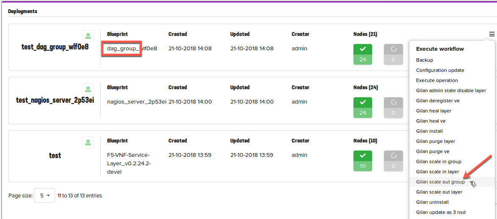

Part IV. Initiate manual scale-out
==================================

1. :ref:`Execute scale-out workflow <scaleout>`
2. :ref:`Modify Openstack route to new DAG instance <newdag>`
3. :ref:`Run test traffic <test_dag>`

.. _scaleout:

Step 1. Execute Scale-out workflow
----------------------------------

VNF Manager can scale-out/in both DAG and Firewall layers. THis lab focuses on manual scale-out procedure for scaling out DAG layer.

To manually scale-out DAG layer, select :guilabel:`Deployments` --> :guilabel:`dag_group_xxx` Blueprint 
Expand |menuIcon_deploy|, click :guilabel:`Gilan scale out group`. Keep `add_instances` value of `1`, and then click :guilabel:`Execute`.

.. |menuIcon_deploy| image:: images/menuIcon.png

.. _newdag:

Step 2. Modify openstack route
------------------------------

1. Note newly created DAG layer BIG-IP `pgw_net`  

2. Select :guilabel:`Project` --> :guilabel:`Network` --> :guilabel:`Routers` and click on :guilabel:`router1`
    Open :guilabel:`Static Routes` tab and click on :guilabel:`Delete Static Route` to delete previously provisioned route.
    Click on :guilabel:`Add Static Route`
    Add the following route: 
    `<Server VM IP>/32` Next Hop `<DAG layer BIG-IP pgw_net IP>`

    .. image:: images/static.png

.. _test_dag:

Step 3. Run test traffic
------------------------

For more information about Scale Workflow see:
:doc:`The Scale Workflow <CM-scale-wf>`