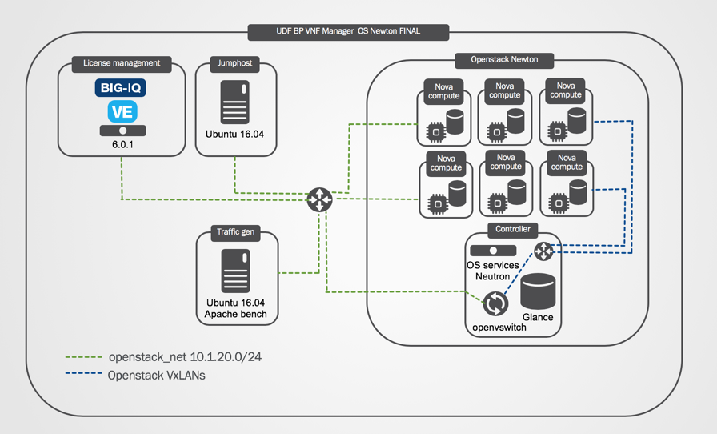
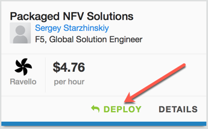
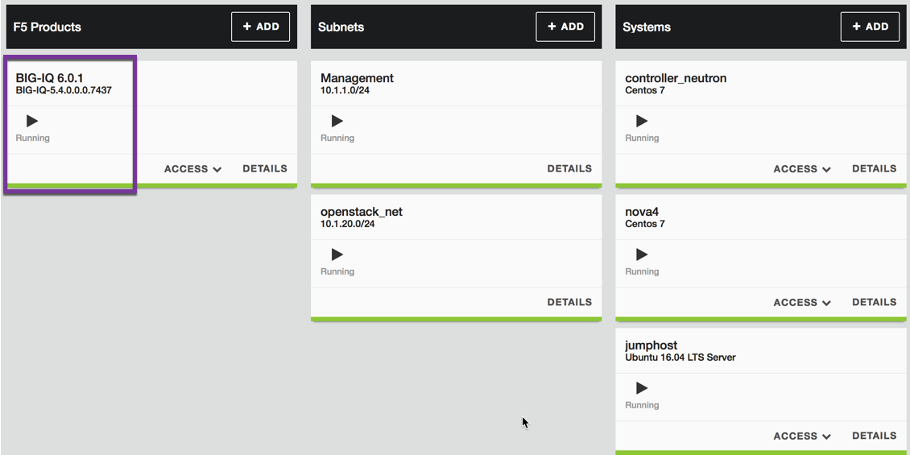
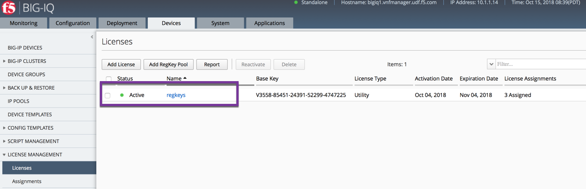
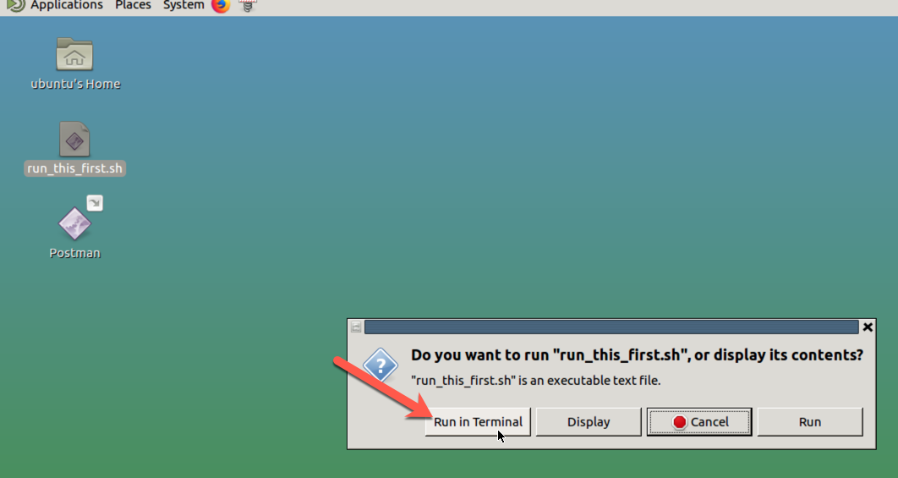
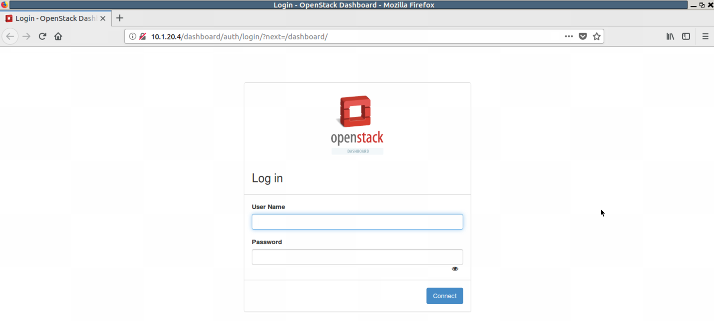
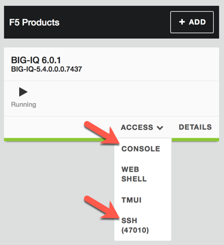

Part I. Review and prepare UDF Openstack environment
====================================================

UDF blueprint for VNF manager lab has been created with Openstack Newton ( community equivalent of RH OSP 10). Due to UDF specifics, parts of networking config need to be re-created for each deployment.
In order to successfully use VNF manager lab you will need to run the specified script and review network configuration inside the Openstack

1. :ref:`Blueprint setup <setup>`
2. :ref:`Credentials <credentials>`
3. :ref:`Start UDF Environment <start>`
4. :ref:`Review Openstack configuration <review>`
5. :ref:`Verify BIG-IQ route <route>`

.. _setup:

Blueprint setup
---------------

.. _credentials:

Credentials
-----------

=============================================== =====================================================
Blueprint component                             username/password
=============================================== =====================================================
BIG-IQ TMUI                                     admin/admin
BIG-IQ SSH                                      root/default
jumphost xRDP                                   ubuntu/ravelloCloud
Openstack Horizon UI                            f5admin/f5admin
VNFmanager VM                                   admin/admin
BIG-IP VMs TMUI                                 admin/admin
BIG-IP VMs SSH                                  root/default
Openstack CLI(controller)                       sudo -i;source keystonerc_f5admin
keystone                                        f5admin/f5admin
=============================================== =====================================================

.. _start:

Start UDF environment
---------------------

1. **Deploy "Packaged NFV Solutions" blueprint and start it Southwest(Arizona) or East(Virginia) Ravello region**
    

2. **Wait until all components are in "Running" state. BIG-IQ usually boots last**
    

3. **Login to BIG-IQ TMUI and ensure "regkeys" licenses are present and unexpired**
    

.. warning:: 
    Wait at least 5 minutes to allow Openstack Services to come up before running the script

4. **xRDP to jumphost and run "run_this_first.sh" script**
    
.. note:: When prompted, choose to run the script in Terminal 
    

.. note:: Script performs the following: 
    Creates extnet Openstack network and 2 Routers with corresponding interfaces; starts rabbitmq-server on controller node; forces Nova service to register compute nodes with new hostnames and creates necessary routes on jumphost and BIG-IQ VMs

5. **Point Firefox browser to Openstack Horizon Dashboard at http://10.1.20.4/**

6. **Login with f5admin user**

.. _review:

Review Openstack configuration
------------------------------

The private cloud environment (for example, OpenStack) must have the following administrative components defined PRIOR to deploying F5 VNFM.
(Click the following links to learn more about using the latest version of OpenStack, or refer to the documentation specific to the version you are using.)

.. note:: Openstack in this blueprint has been pre-configured and no action is required. Review table below and compare it to components found in Openstack Horizon Dashboard. 

============================================================ =============================================================================================================================================================================
Component                                                    Description
============================================================ =============================================================================================================================================================================
|flavors_setup| (Admin->Flavors)                             Defined flavors sized to accommodate the VNFM component images. BIG-IP VEs use m1.large flavor:

                                                             -  vCPU: 4
                                                             -  RAM: 8GB
                                                             -  Root disk: 160GB

|networks_setup| (Project->Network)                          The following networks and one subnet for each, defined with sufficient IP address space in each network have been created:

                                                             -  Management network (mgmt) – VNF Manager and BIG-IP VE management interfaces are on this network.
                                                             -  Provider gateway network (pgw_net) – Network used for the internal-facing DAG data plane interfaces.
                                                             -  Provider data network (pdn_net) – Network used for the external-facing DAG data plane interfaces.
                                                             -  DAG to provider gateway network (pgw_dag_net) – Network used for the internal-facing VNF data plane interfaces.
                                                             -  DAG to provider data network (pdn_dag_net) – Network used for the external-facing VNF data plane interfaces.
                                                             -  Control network (control_net) – Network fused or communication with control and value-added services.
                                                             -  HA network (ha_net) – Network used for internal HA communication between clustered VNF BIG-IP VE instances.

|secGrps_setup| (Project->Access and Security)               The following security groups created:

                                                             -  SNMP security group (snmp_sg) – Allow UDP ports 161/162.
                                                             -  Control security group (control_sg) – Configure as needed for your envronment.
                                                             -  Management security group (mgmt_sg) – Allow TCP port 443.
                                                             -  Provider data network security group (pdn_sg) – Configure as needed for your envronment.
                                                             -  Provider gateway security group (pgw_sg) – Configure as needed for your envronment.

|keyPr_setup| (Project->Access and Security)                 Defined key pairs for accessing VNFM instance remotely, using SSH.

|router_setup| (Project->Network->Routers)                   Created 2 routers with interfaces into VxLANs (router1 is connected to extnet)
============================================================ =============================================================================================================================================================================

.. _route:

Verify BIG-IQ route
-------------------

Open UDF :guilabel:`Console` or :guilabel:`SSH(47010)` to BIG-IQ and confirm that route to 10.1.40.0/24 network is present and network is reachable. Gateway IP is unique for each deployment and depends on Openstack Router interface extnet IP

.. code-block:: console
    
    [root@bigiq1:Active:Standalone] config # tmsh list net route
    net route openstack {
    gw 10.1.20.105
    network 10.1.40.0/24
    }
    [root@bigiq1:Active:Standalone] config # ping 10.1.40.1
    PING 10.1.40.1 (10.1.40.1) 56(84) bytes of data.
    64 bytes from 10.1.40.1: icmp_seq=1 ttl=64 time=7.18 ms
    64 bytes from 10.1.40.1: icmp_seq=2 ttl=64 time=3.53 ms
    64 bytes from 10.1.40.1: icmp_seq=3 ttl=64 time=3.66 ms
    64 bytes from 10.1.40.1: icmp_seq=4 ttl=64 time=3.05 ms
    ^C
    --- 10.1.40.1 ping statistics ---
    4 packets transmitted, 4 received, 0% packet loss, time 3558ms
    rtt min/avg/max/mdev = 3.056/4.359/7.180/1.644 ms

.. note:: If BIG-IQ doesn't show a valid route into .40 subnet, run the "run_this_first.sh" script again and seek assistance before proceeding further

What's Next?

:doc:`Set up VNFM <setup>`

.. |flavors_setup| raw:: html

    <a href="https://docs.openstack.org/horizon/rocky/admin/manage-flavors.html" target="_blank">Flavors</a>

.. |networks_setup| raw:: html

    <a href="https://docs.openstack.org/horizon/rocky/user/create-networks.html" target="_blank">Networks</a>

.. |secGrps_setup| raw:: html

    <a href="https://docs.openstack.org/horizon/rocky/user/configure-access-and-security-for-instances.html" target="_blank">Security Groups</a>

.. |keyPr_setup| raw:: html

    <a href="https://docs.openstack.org/horizon/rocky/user/configure-access-and-security-for-instances.html#keypair-add" target="_blank">Key Pair</a>

.. |router_setup| raw:: html

    <a href="https://docs.openstack.org/horizon/rocky/user/create-networks.html" target="_blank">Router</a>