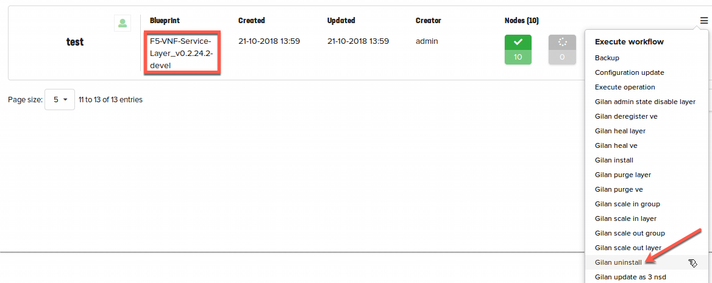

Part VI. (Optional) Uninstall workflow
======================================

This step will force VNF Manager to remove all BIG-IP and Nagios VMs and corresponding configuration. 

.. note:: It is recommended to skip this step if current UDF deployment will be used later for customer PoCs and/or demos

To uninstall the entire deployment, select :guilabel:`Deployments` --> :guilabel:`F5-VNF-Service-Layer_v0.2.24.2-devel` Blueprint 
Expand |menuIcon_deploy|, click :guilabel:`Gilan uninstall` and then click :guilabel:`Execute`.

.. |menuIcon_deploy| image:: images/menuIcon.png

For more information about Uninstall Workflow see:
:doc:`Uninstall Workflow <CM-uninstall-wf>`