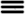

Part III. Run  workflows
========================

Workflows are automation process algorithms. They describe the flow of the automation by determining the tasks to run
and when to run. A task is an operation (implemented by a plugin), or other actions including running arbitrary
code. Workflows are written in Python, using a dedicated framework and APIs.

1. Click :guilabel:`Deployments`, and next to a :guilabel:`Gilan` deployment for which you want to run a workflow, click |menuIcon_use|.

2. Select one of the following F5 Gilan workflows, and then click :guilabel:`Execute`:

======================================== ==============================================================================================================================================
 Workflow                                Used for
======================================== ==============================================================================================================================================
 Admin state disable layer               [enter content].

 Deregister VE                           [enter content].

 :doc:`Heal Layer <CM-heal-wf>`          Creating a new copy of the reported, dysfunctional VNF layer.

 :doc:`Heal VE <CM-heal-wf>`             Creating a new copy of the reported, dysfunctional VE and related objects.

 :doc:`Install <CM-install-wf>`          Installing the target deployment, and lifecycle operations on instances (for example, create and configure start).

 Purge Layer                             Uninstalling and removing dysfunctional VNF layer instances. Start this workflow manually, after the heal layer workflow runs and the problem
                                         investigation is finished. Parameter includes **ignore failure** passed to lifecycle uninstall process (see the following Uninstall workflow).

 Purge VE                                Uninstalling and removing dysfunctional VNF VE instances, and related objects. Start this workflow manually, after the heal layer workflow
                                         runs and the problem investigation is finished. Parameter includes **ignore failure** passed to lifecycle uninstall process (see the following
                                         Uninstall workflow).

 :doc:`Scale In Group <CM-scale-wf>`     Removing and uninstalling DAG VE and VNF layer instances. Parameters include:
                                         **deployment ids**-DAG VE and VNF layer deployment IDs to remove.
                                         **ignore failure**-passed to the lifecycle uninstall process (see the following Uninstall workflow).

 :doc:`Scale In Layer <CM-scale-wf>`     Uninstalling and removing VNF VE slave instances. Parameters include:
                                         **deployment ids**-VNF slave VE deployment IDs to remove.
                                         **ignore failure**-passed to the lifecycle uninstall process (see the following Uninstall workflow).

 :doc:`Scale Out Group <CM-scale-wf>`    Adding DAG VE instances and VNF layer instances. Parameter includes **add instances**, which is the number of new instance VEs to create.

 :doc:`Scale Out Layer <CM-scale-wf>`    Creating and installing new VNF slave instances. Parameter includes **add isntances**, which is the number of VNF slave VEs to add.

 :doc:`Uninstall <CM-uninstall-wf>`      Uninstalling the target deployment, freeing allocated resources, and performing uninstall lifecycle operations
                                         (for example, stop and delete). This workflow also removes deployments and blueprints created during the install workflow.
                                         Parameter includes **ignore_failure**, which does not fail the workflow upon a failed lifecycle operation.

 Update as 3 nsd                         Updating the AS3 declaration pushed to the VE as a part of NSD definition.

 Update Member VE                        [enter content].

 Upgrade DAG Group                       Creating new DAG VEs using new software reference data. Workflow selects older VEs with lesser revision value and
                                         disables them. Parameter includes **instance count**, which is the number of instances (DAG VEs) to upgrade.

 Upgrade Group Finish                    Finishing the upgrade process, using the new software reference data to install scaled and healed VEs.

 Upgrade Group Start                     Starting the upgrade process and setting new software reference data. Parameters include:
                                         **image**-for new BIG-IP
                                         **flavor**-for new BIG IP
                                         **revision**-revision number that is incremented with every upgrade.

 Upgrade VNF Group                       Creating new VNF layer, using new software reference data, and maintaining the same number of slave VEs as in the selected layer.
                                         This workflow will also disable older layers (with lesser revision values). Parameter includes **layer deployment id** identifying
                                         the layer selected for upgrade.
======================================== ==============================================================================================================================================

